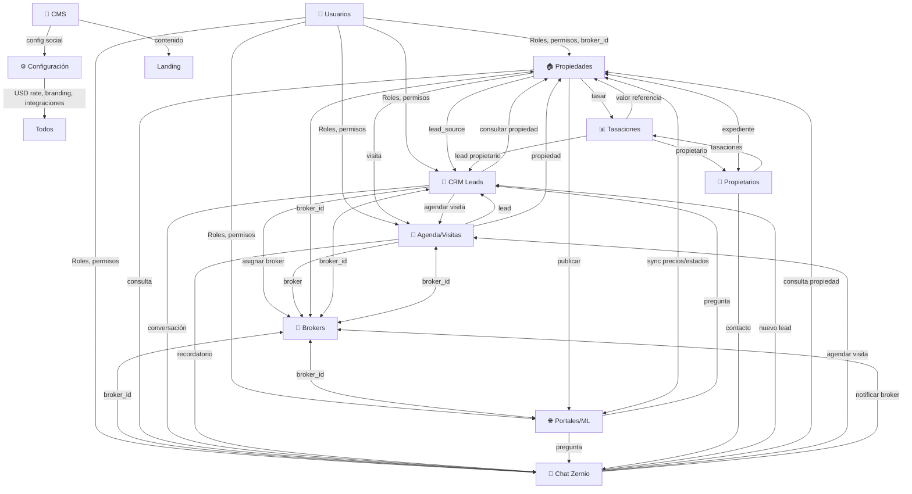

# Arquitectura Unificada de Módulos — BIENENHAUS CRM

> **Objetivo:** Cada módulo alimenta y consume datos de otros sin duplicar lógica. El "source of truth" vive en Supabase; el frontend solo orquesta vistas.

---

## 1. Grafo de Relaciones (Resumen)



---

## 2. Entidades Compartidas (Claves de Unión)

| Entidad | Tabla Supabase | Módulos que la usan | Propósito |
|---------|----------------|---------------------|-----------|
| **User/Profile** | `profiles` | Todos | Auth + rol + `broker_id` opcional |
| **Broker** | `agents` | Propiedades, CRM, Agenda, Portales, Chat | Asesor responsable |
| **Property** | `properties` | Propiedades, CRM, Agenda, Portales, Chat, Tasaciones | Núcleo del negocio |
| **Lead** | `leads` | CRM, Agenda, Chat, Portales, Propiedades | Pipeline comercial |
| **Visit** | `visits` | Agenda, CRM, Propiedades, Brokers | Calendario accionable |
| **Conversation** | `zernio_conversations` | Chat, CRM, Propiedades, Agenda | Omnicanal |
| **Owner** | `owners` | Propietarios, Propiedades, Tasaciones | Titularidad |
| **Valuation** | `tasaciones` | Tasaciones, Propiedades, Propietarios | Precio de referencia |
| **ML Listing** | `ml_listings` | Portales, Propiedades | Publicación externa |
| **Settings** | `app_settings`, `site_content` | Config, CMS, todos (USD rate) | Parámetros globales |

---

## 3. Flujos Transversales (End-to-End)

### 3.1 Lead → Visita → Cierre (Happy Path)
```
Landing (formulario/WhatsApp/ML)
    ↓
Chat Zernio (recibe, califica, etiqueta)
    ↓
CRM Lead (stage: nuevo → contactado)
    ↓
Agenda (broker agenda visita en propiedad)
    ↓
Visita completada → CRM (stage: visita → oferta → cerrado)
    ↓
Propiedad (status: vendida/alquilada) → Portales (despublicar)
    ↓
Tasación (si aplica) → Propietario (liquidación)
```

### 3.2 Publicación en Portales (ML)
```
Propiedad (crear/editar) → "Publicar en ML"
    ↓
Portales: validar campos obligatorios + fotos
    ↓
ML API → ml_listings (ml_item_id, status: active)
    ↓
Webhook ML (preguntas/ordenes) → Chat Zernio (hilo por propiedad)
    ↓
Broker responde en Chat → ML API (auto-reply si config)
    ↓
Sync cron (precio/stock) → Propiedad ↔ ml_listings
```

### 3.3 Tasación → Captación
```
Propietario solicita tasación (landing / chat / broker)
    ↓
Tasaciones: broker carga datos + ACM → RPC valoración
    ↓
Resultado → Propiedad (price_usd sugerido) + Owner (expediente)
    ↓
CRM: lead tipo "propietario" + tag "tasación"
    ↓
Broker agenda visita de captación (Agenda)
    ↓
Firma contrato → Propiedad (draft → published) → Portales
```

---

## 4. Reglas de Negocio Compartidas (Single Source)

| Regla | Dónde se define | Módulos afectados |
|-------|-----------------|-------------------|
| **USD rate** | `app_settings.preferences.usd_rate` | Propiedades (precio ARS), Tasaciones, CMS, Portales |
| **Roles/Permisos** | `profiles.role` + RLS | Todos (UI condicional + API guard) |
| **Broker assignment** | `properties.broker_id`, `leads.broker_id`, `visits.broker_id` | Propiedades, CRM, Agenda, Chat |
| **Estados propiedad** | `properties.status` (draft/publicada/vendida/alquilada/pausada) | Propiedades, Portales, CRM, Landing, CMS |
| **Pipeline stages** | `leads.stage` (nuevo/contactado/visita/oferta/cerrado/perdido) | CRM, Agenda, Chat, Dashboard |
| **Visita status** | `visits.status` (pendiente/confirmada/completada/cancelada) | Agenda, CRM, Brokers, Chat (recordatorios) |
| **Config social** | `site_content.social` | CMS, Config, Landing, Chat (botones WhatsApp/IG) |

---

## 5. Mejoras por Módulo (Coherentes con el Grafo)

### 5.1 Dashboard — "Centro de Comando"
- **KPIs cruzados**: leads por origen (landing/ML/chat), conversión por broker, días promedio visita→cierre, propiedades publicadas vs vendidas.
- **Alertas**: leads sin respuesta > 2h, visitas sin confirmar, publicaciones ML con error, conversaciones sin responder.
- **Accesos rápidos**: "Nueva visita", "Responder chat", "Publicar propiedad", "Nueva tasación".

### 5.2 Propiedades — "Corazón Operativo"
- **Vista unificada**: ficha propiedad = datos + leads relacionados + visitas + publicaciones ML + hilos chat + tasaciones + propietario.
- **Acciones masivas**: republicar, pausar, cambiar broker, recalcular precio USD→ARS.
- **Validación pre-publicación**: checklist obligatorio (fotos, descripción, zona, precio, broker).

### 5.3 CRM Leads — "Pipeline Inteligente"
- **Origen automático**: tag `landing` / `ml` / `chat` / `referido` / `tasacion` (seteado al crear).
- **Scoring**: pondera origen + interacciones chat + visitas agendadas + días en stage.
- **Automatizaciones**: mover stage al agendar visita, al responder chat, al recibir pregunta ML.
- **Vista propiedad**: botón "Ver en Propiedades" salta a ficha completa.

### 5.4 Agenda/Visitas — "Calendario Accionable"
- **Drag & drop** entre brokers (re-asigna visita + notifica chat/email).
- **Recordatorios automáticos**: 24h y 1h antes → push Chat + email (Brevo).
- **Check-in/out**: broker marca "llegada" y "salida" → genera nota en CRM + duración real.
- **Conflictos**: alerta si broker tiene solape o propiedad en otra visita.

### 5.5 Brokers — "Perfil Comercial"
- **Dashboard individual**: mis propiedades, mis leads, mis visitas, mis conversaciones chat, mis publicaciones ML.
- **Permisos granulares**: `ver_todo` / `ver_propias` / `editar_propias` / `publicar_ml` / `gestionar_usuarios`.
- **Comisiones**: regla configurable por tipo operación (venta/alquiler) + split si co-broker.

### 5.6 Propietarios — "Expediente Único"
- **Timeline**: propiedades + tasaciones + contratos + liquidaciones + comunicaciones (chat/email).
- **Portal propietario** (futuro): link mágico para ver estado de sus propiedades + visitas + ofertas.
- **Documentos**: subida a Storage (contratos, escrituras, planos) vinculados a propiedad.

### 5.7 Tasaciones — "Motor de Captación"
- **RPC valoración** usa: zona, m², antigüedad, amenities, comps recientes (properties vendidas últimos 6m).
- **Versionado**: cada tasación guarda snapshot de comps usados → auditoría.
- **Lead gen**: botón "Quiero vender/alquilar" → crea lead en CRM + notifica broker de zona.

### 5.8 Portales/ML — "Sync Confiable"
- **Health monitor**: dashboard con % sync ok, items con error, last sync, rate limit remaining.
- **Dead-letter queue** visible: reprocesar 1 click, ver payload + error.
- **Auto-reply plantillas** por tipo pregunta (precio, ubicación, disponible, visita) + variables `{{property}} {{broker}}`.
- **Bidireccional real**: precio/stock/status en ML ↔ Propiedades en < 5 min.

### 5.9 CMS — "Contenido Vivo"
- **Preview en vivo** (iframe landing) al editar hero/servicios/stats/testimonios.
- **Versiones + rollback** 1 click (historial en `site_content.version`).
- **i18n real**: ES/EN/PT con fallback a ES; detecta `Accept-Language` en landing.
- **Tokens dinámicos**: `{{usd_rate}}`, `{{whatsapp}}`, `{{broker_count}}` resueltos en render.

### 5.10 Usuarios — "Gobernanza"
- **Invitación por email** → magic link setea password + rol + broker_id opcional.
- **Auditoría**: `audit_log` registra login, cambio rol, cambio password, export CSV.
- **2FA opcional** (TOTP) para `super_admin`.

### 5.11 Configuración — "Panel de Control"
- **Feature flags**: habilitar/deshabilitar módulos (Chat, Tasaciones, Portal Propietario).
- **Integraciones health**: chips Supabase/Cloudinary/Brevo/ML/Zernio con latency real.
- **Preferencias globales**: USD rate, zona horaria, formato moneda, idioma default.
- **Branding**: logo, colores, watermark → inyectados en CMS + landing + emails + PDF tasaciones.

### 5.12 Chat Zernio — "Omnicanal Central"
- **Unified Inbox**: WhatsApp + Instagram + Facebook + Web chat en una cola.
- **Contexto automático**: al abrir conversación, sidebar muestra propiedad/lead/visita/propietario relacionados.
- **Acciones 1-click**: "Crear lead", "Agendar visita", "Ver propiedad", "Asignar broker", "Enviar ficha PDF".
- **Bot/IA**: responde FAQ (precio, ubicación, horarios) y escala a broker si `intent != faq`.
- **Métricas**: tiempo primera respuesta, resolución, CSAT, volumen por canal/broker.

---

## 6. Implementación Técnica (Patrones Comunes)

### 6.1 Event Bus Ligero (Frontend)
```js
// assets/js/event-bus.js — pub/sub simple sin deps
export const Bus = {
  on(event, fn) { ... },
  emit(event, payload) { ... },
  off(event, fn) { ... }
};

// Uso cruzado:
Bus.emit('lead:created', { leadId, source: 'chat', propertyId });
Bus.emit('visit:scheduled', { visitId, leadId, propertyId, brokerId });
Bus.emit('property:published', { propertyId, portals: ['ml'] });
Bus.emit('chat:message', { conversationId, propertyId, leadId });
```
**Módulos suscritos:** CRM (recarga pipeline), Agenda (muestra badge), Dashboard (actualiza KPIs), Notificaciones (toast/push).

### 6.2 Reactividad Supabase (Realtime)
```js
// Suscripciones canónicas por módulo
supabase.channel('properties').on('postgres_changes', { filter: 'status=eq.publicada' }, handlePropertyChange).subscribe();
supabase.channel('leads').on('postgres_changes', { filter: 'stage=in.(nuevo,contactado)' }, handleLeadChange).subscribe();
supabase.channel('visits').on('postgres_changes', { filter: 'status=eq.pendiente' }, handleVisitChange).subscribe();
supabase.channel('zernio_conversations').on('postgres_changes', { filter: 'unread_count>0' }, handleChatChange).subscribe();
```
**Ventaja:** UI siempre consistente sin polling; funciona multi-pestaña.

### 6.3 Helpers Compartidos (`utils.js`)
```js
// Formato moneda usando USD rate global
export const fmtARS = (usd) => `$${(usd * BH_CONFIG.USD_RATE).toLocaleString('es-AR')} USD ${usd.toLocaleString('en-US')}`;

// Sanitización única
export const esc = (str) => String(str).replace(/[&<>"']/g, m => ({'&':'&','<':'<','>':'>','"':'"',"'":'''}[m]));

// Genera link WhatsApp con mensaje prellenado
export const waLink = (phone, msg) => `https://wa.me/${phone}?text=${encodeURIComponent(msg)}`;

// Debounce para búsquedas/autoguardado
export const debounce = (fn, ms) => { let t; return (...a) => { clearTimeout(t); t = setTimeout(() => fn(...a), ms); }; };
```

### 6.4 Tipos TypeScript (Shared)
```ts
// types/domain.ts — source of truth para frontend + edge functions
export type PropertyStatus = 'draft'|'publicada'|'vendida'|'alquilada'|'pausada';
export type LeadStage = 'nuevo'|'contactado'|'visita'|'oferta'|'cerrado'|'perdido';
export type VisitStatus = 'pendiente'|'confirmada'|'completada'|'cancelada';
export type UserRole = 'super_admin'|'admin'|'broker'|'viewer';

export interface Property { id: string; code: string; title: string; price_usd: number; status: PropertyStatus; broker_id: string; zone: string; ... }
export interface Lead { id: string; property_id: string|null; broker_id: string; stage: LeadStage; source: 'landing'|'ml'|'chat'|'referido'|'tasacion'; tags: string[]; score: number; ... }
export interface Visit { id: string; lead_id: string; property_id: string; broker_id: string; visit_date: string; status: VisitStatus; check_in?: string; check_out?: string; ... }
export interface Conversation { id: string; account_id: string; contact_name: string; contact_handle: string; property_id: string|null; lead_id: string|null; unread_count: number; status: 'open'|'closed'; ... }
```

---

## 7. Priorización de Trabajo (Roadmap)

| Fase | Foco | Entregable | Dependencias |
|------|------|------------|--------------|
| **0** | **Base** | Event Bus + Tipos TS + Realtime canónico | — |
| **1** | **Propiedades ↔ CRM ↔ Agenda** | Ficha propiedad unificada + drag-drop visita + lead scoring | Fase 0 |
| **2** | **Portales/ML ↔ Chat** | Sync bidireccional robusto + hilo chat por propiedad + auto-reply | Fase 1 (property_id en chat) |
| **3** | **Tasaciones ↔ Propietarios ↔ Captación** | RPC valoración + lead gen + portal propietario (link mágico) | Fase 1 |
| **4** | **Chat Zernio** | Unified Inbox + contexto lateral + bot/IA + métricas | Fase 2 (API key) |
| **5** | **CMS + Config + Usuarios** | Preview live + feature flags + 2FA + auditoría | Fase 0 |
| **6** | **Dashboard Inteligente** | KPIs cruzados + alertas + accesos rápidos | Fases 1-5 (datos listos) |

---

## 8. Decisiones de Arquitectura (ADR)

| ADR | Decisión | Razón |
|-----|----------|-------|
| **ADR-001** | Vanilla JS + ES Modules (sin bundler) | Deploy simple, sin build, cache busters nativos |
| **ADR-002** | Supabase como backend único (Auth+DB+Realtime+Edge) | Reduce superficie, RLS nativo, DX unificada |
| **ADR-003** | `broker_id` en todas las entidades operativas | Trazabilidad, comisiones, permisos, reportes |
| **ADR-004** | `source` + `tags` en leads (no stage fijo por origen) | Flexibilidad: un lead de ML puede entrar por chat |
| **ADR-005** | Event Bus frontend + Realtime DB (dual sync) | UI instantánea + consistencia multi-tab |
| **ADR-006** | Config centralizada en `app_settings` + `site_content` | Single source para USD, branding, feature flags |
| **ADR-007** | Edge Functions para secretos (ML token, Cloudinary, Brevo, Zernio) | Nunca exponer secrets en frontend |
| **ADR-008** | Chat Zernio como módulo opcional (feature flag) | No bloquea release si no hay API key |

---

## 9. Métricas de Salud (Observabilidad)

| Métrica | Origen | Alerta si |
|---------|--------|-----------|
| **Lead response time** (p50/p95) | `leads.created_at` → primer mensaje chat/email | p95 > 2h |
| **Visit show rate** | `visits.status=completada / visits.status≠cancelada` | < 70% |
| **ML sync error rate** | `ml_listings.last_sync_error` | > 5% items |
| **Chat unread > 0** | `zernio_conversations.unread_count` | > 10 min sin asignar |
| **Property publish time** | `properties.published_at - properties.created_at` | > 24h (draft stuck) |
| **Valuation accuracy** | `tasaciones.valor_estimado vs properties.final_price` | Desviación > 15% |

---

## 10. Checklist de Consistencia (Pre-Release)

- [ ] **Event Bus** emitido en cada acción mutante (create/update/delete)
- [ ] **Realtime** suscrito en cada vista de lista/kanban/calendario
- [ ] **Tipos TS** importados desde `types/domain.ts` (no duplicados)
- [ ] **USD rate** leído de `BH_CONFIG.USD_RATE` (seteado por Config al cargar)
- [ ] **Permisos** chequeados en UI (`canEdit`, `canPublish`, `canManageUsers`) + RLS en DB
- [ ] **Broker_id** propagado en cascada (propiedad → lead → visita → chat)
- [ ] **Audit log** en escrituras sensibles (usuarios, settings, precios, publicaciones)
- [ ] **Error boundaries** por módulo (fallo en Chat no rompe Dashboard)
- [ ] **Cache busters** actualizados en `admin.html` / `index.html` tras cambios JS/CSS

---

## 11. Próximos Pasos Inmediatos

1. **Crear `types/domain.ts`** y migrar `admin-app.js` a JSDoc `@typedef` o TS gradual.
2. **Implementar `assets/js/event-bus.js`** y emitir en 5 puntos clave (lead, visita, propiedad, chat, publicación).
3. **Agregar `property_id` + `lead_id`** a `zernio_conversations` (migración) → une Chat con CRM/Propiedades.
4. **Dashboard**: reemplazar KPIs estáticos por queries cruzadas (leads/origen, conversión/broker, días/cierre).
5. **Config**: agregar feature flag `chat_enabled` + health check Zernio.

---

*Documento vivo — actualizar con cada ADR nuevo o cambio de flujo.*  
*Mantenedor: facuherrera23 · Última versión: 2026-08-23*