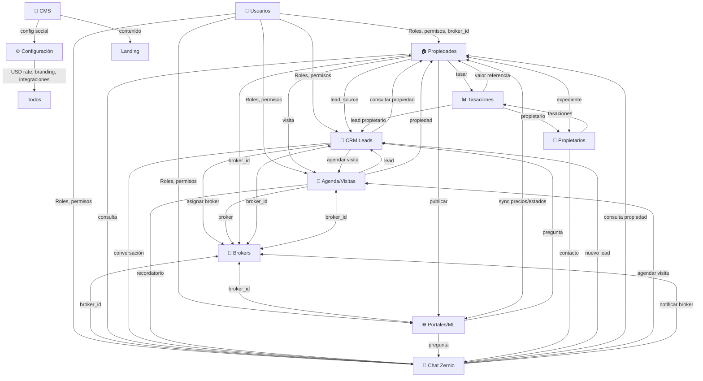

# BIENENHAUS PROPIEDADES

Landing page pública + panel administrativo (CRM) para inmobiliaria premium de Buenos Aires.
Sin framework ni build step: Vanilla JS sobre **Supabase** (PostgreSQL + Auth + RLS + Edge Functions), imágenes vía **Cloudinary** y publicación a portales con **Mercado Libre**.

---

## Índice

1. [URLs](#urls)
2. [Stack](#stack)
3. [Arquitectura General](#arquitectura-general)
4. [Estructura del proyecto](#estructura-del-proyecto)
5. [Puesta en marcha local](#puesta-en-marcha-local)
6. [Configuración frontend](#configuración-frontend)
7. [Base de datos](#base-de-datos)
8. [Seguridad](#seguridad)
9. [Panel administrativo](#panel-administrativo)
10. [Módulo Configuración](#módulo-configuración)
11. [Landing pública](#landing-pública)
12. [Mercado Libre](#mercado-libre)
13. [Chat Zernio (Omnicanal)](#chat-zernio-omnicanal)
14. [Edge Functions](#edge-functions)
15. [Deploy](#deploy)
16. [Convenciones de desarrollo](#convenciones-de-desarrollo)
17. [QA / Verificación](#qa--verificación)
18. [Notas técnicas y deudas conocidas](#notas-técnicas-y-deudas-conocidas)
19. [Integración entre módulos](#integración-entre-módulos)
20. [Flujos End-to-End](#flujos-end-to-end)
21. [Patrones técnicos compartidos](#patrones-técnicos-compartidos)
22. [Roadmap y ADRs](#roadmap-y-adrs)

---

## URLs

| Entorno | URL |
|---|---|
| Landing | https://bienenhaus.com.ar |
| Panel admin | https://bienenhaus.com.ar/admin |
| Proyecto Supabase | `rnldqiwwzhjnurkguihu` |
| Repo | https://github.com/facuherrera23/BH-OFICIAL |

Las tasaciones (ACM) se abren vía `iframe` dentro del panel admin (`tasacion.html`).

---

## Stack

- **Frontend**: Vanilla JS (ES Modules), CSS custom properties, Font Awesome 6.5.1
- **Backend**: Supabase — PostgreSQL + Auth (GoTrue email/contraseña) + Row Level Security + Realtime + Edge Functions (Deno)
- **Imágenes**: Cloudinary (compresión automática a WebP, firma server-side)
- **Portales**: Mercado Libre (OAuth 2.0, sync, webhooks, auto-reply)
- **Email**: Brevo SMTP (límite 30 envíos/hora)
- **Chat**: Zernio (WhatsApp, Instagram, Facebook, Web chat) — *pendiente API key*
- **Deploy**: Cloudflare Pages (estático)

---

## Arquitectura General

### Principios

1. **Vanilla JS + ES Modules** — sin bundler, deploy directo, cache busters nativos
2. **Supabase como backend único** — Auth, DB, Realtime, Edge Functions, Storage
3. **RLS como seguridad principal** — políticas en DB, no en frontend
4. **Event Bus + Realtime** — UI reactiva sin polling, consistencia multi-pestaña
5. **Config centralizada** — `app_settings` + `site_content` como source of truth
6. **Edge Functions para secretos** — ML tokens, Cloudinary, Brevo, Zernio nunca en frontend
7. **Feature flags** — módulos opcionales (Chat, Tasaciones, Portal Propietario)

### Grafo de Módulos



### Entidades Compartidas (Claves de Unión)

| Entidad | Tabla Supabase | Módulos que la usan | Propósito |
|---------|----------------|---------------------|-----------|
| **User/Profile** | `profiles` | Todos | Auth + rol + `broker_id` opcional |
| **Broker** | `agents` | Propiedades, CRM, Agenda, Portales, Chat | Asesor responsable |
| **Property** | `properties` | Propiedades, CRM, Agenda, Portales, Chat, Tasaciones | Núcleo del negocio |
| **Lead** | `leads` | CRM, Agenda, Chat, Portales, Propiedades | Pipeline comercial |
| **Visit** | `visits` | Agenda, CRM, Propiedades, Brokers | Calendario accionable |
| **Conversation** | `zernio_conversations` | Chat, CRM, Propiedades, Agenda | Omnicanal |
| **Owner** | `owners` | Propietarios, Propiedades, Tasaciones | Titularidad |
| **Valuation** | `tasaciones` | Tasaciones, Propiedades, Propietarios | Precio de referencia |
| **ML Listing** | `ml_listings` | Portales, Propiedades | Publicación externa |
| **Settings** | `app_settings`, `site_content` | Config, CMS, todos (USD rate) | Parámetros globales |

---

## Estructura del proyecto

```
BH-OFICIAL/
├── index.html                  # Landing page pública
├── admin.html                  # Panel administrativo (SPA por tabs)
├── tasacion.html               # Réplica TAI para tasaciones (iframe autenticado)
├── CNAME                       # Dominio custom (Cloudflare Pages)
├── robots.txt / sitemap.xml / .nojekyll
├── react-doctor.config.json    # Config react-doctor (deslop/unused-file off)
├── package.json / package-lock.json  # Solo tooling (acorn, react-doctor)
├── assets/
│   ├── css/
│   │   ├── landing.css         # Design system del landing
│   │   └── admin.css           # Estilos del panel (calendario incluido)
│   ├── js/
│   │   ├── config.js           # window.BH_CONFIG (Supabase URL + anon key)
│   │   ├── supabase-client.js  # Init cliente Supabase + fallback CDN
│   │   ├── utils.js            # Helpers compartidos (fmtARS, esc, waLink, debounce)
│   │   ├── cloudinary.js       # Upload helper con compresión WebP
│   │   ├── landing-app.js      # Landing: catálogo, filtros, CMS, contacto
│   │   └── admin-app.js        # Admin: auth, CRUD, dashboard, CRM, portales…
│   ├── images/                 # favicon.ico, hero-bg.webp, pwa-512x512.png
│   └── img/                    # logo-bh.png
└── supabase/
    ├── functions/              # Edge Functions (ver sección propia)
    └── migrations/             # Migraciones SQL
```

Carpetas de tooling que **nunca** se commitean: `.codegraph/`, `.omo/`, `.playwright-mcp/`, `supabase/.temp/`.

---

## Puesta en marcha local

```bash
# 1. Clonar e ingresar
git clone https://github.com/facuherrera23/BH-OFICIAL.git
cd BH-OFICIAL

# 2. Servir estáticamente (cualquier server sirve; este es el usado en QA)
python -m http.server 8788

# 3. Abrir
#    Landing: http://localhost:8788/index.html
#    Admin:   http://localhost:8788/admin.html
```

No hay build step ni dependencias npm de runtime. El JS se edita directo y se invalida caché con **cache busters** (`?v=N`) en los `<link>`/`<script>` de `index.html` y `admin.html`.

> Los usuarios se crean desde el propio panel (tab **Usuarios**) o vía Auth de Supabase; el rol se asigna en `profiles.role`.

---

## Configuración frontend

Todo vive en `assets/js/config.js`:

```js
window.BH_CONFIG = {
  SUPABASE_URL: 'https://<project-ref>.supabase.co',
  SUPABASE_ANON_KEY: '<anon-key>'   // clave pública por diseño: la seguridad la da RLS
};
```

La presencia de `window.BH_Cloudinary` habilita el chip de estado de Cloudinary en el panel.

---

## Base de datos

### Esquema Completo

Esquema verificado en producción (todas las tablas con **RLS activada**):

| Tabla | Descripción |
|---|---|
| `properties` | Propiedades publicadas (código secuencial vía `property_sequences`, drafts, soft-delete, video_url, orden RPC) |
| `property_sequences` | Secuencias de códigos de propiedad (RLS restringida, solo service_role) |
| `agents` | Asesores/brokers (matrícula, fotos en Storage, comisiones, horarios, permisos) |
| `owners` | Propietarios y expedientes/contratos |
| `leads` | Consultas y prospectos del pipeline CRM (tags, scoring, origen: landing, ml, chat, referido, tasacion, walkin) |
| `visits` | Visitas agendadas (estados: pendiente/confirmada/completada/cancelada, calendario) |
| `tasaciones` | ACM / tasaciones (datos JSONB, RPCs de valoración) |
| `site_content` | Contenido por sección del landing: `hero`, `services`, `team`, `process`, `stats`, `contact`, `footer`, `social` |
| `portal_settings` | CMS en vivo del landing (hero, servicios, stats, testimonios) + versiones/i18n |
| `app_settings` | Ajustes globales key/value JSONB — hoy: `preferences.usd_rate` |
| `profiles` | Perfiles de usuario vinculados a `auth.users` (campo `role`) |
| `ml_listings` | Publicaciones en Mercado Libre (sync, webhooks dedup, dead-letter queue) |
| `zernio_config` | API key Zernio (encriptada) |
| `zernio_accounts` | Cuentas conectadas (WhatsApp, Instagram, Facebook) |
| `zernio_conversations` | Conversaciones unificadas cross-platform |
| `zernio_messages` | Mensajes normalizados por conversación |

Complementos en DB: `audit_log`, `newsletter_subscribers`, chat interno + asistente IA, rate limiting, papelera con retención.

### Esquema Detallado por Tabla

#### `properties`
```sql
CREATE TABLE properties (
  id uuid PRIMARY KEY DEFAULT gen_random_uuid(),
  code text UNIQUE NOT NULL,           -- ej: BH-0001 (secuencia property_sequences)
  title text NOT NULL,
  description text,
  property_type text NOT NULL,         -- 'venta' | 'alquiler' | 'tasacion'
  status text NOT NULL DEFAULT 'draft',-- 'draft' | 'publicada' | 'vendida' | 'alquilada' | 'pausada'
  price_usd numeric(12,2) NOT NULL,
  price_ars numeric(14,2) GENERATED ALWAYS AS (price_usd * (SELECT value->>'usd_rate' FROM app_settings WHERE key='preferences')) STORED,
  zone text NOT NULL,
  neighborhood text,
  address text,
  lat numeric(10,7),
  lng numeric(10,7),
  surface_total numeric(10,2),
  surface_covered numeric(10,2),
  rooms integer,
  bedrooms integer,
  bathrooms integer,
  garage boolean DEFAULT false,
  amenities jsonb DEFAULT '[]'::jsonb,
  images jsonb DEFAULT '[]'::jsonb,    -- [{url, public_id, order, is_cover}]
  video_url text,
  brochure_url text,
  broker_id uuid REFERENCES agents(id),
  owner_id uuid REFERENCES owners(id),
  portal_settings jsonb DEFAULT '{}'::jsonb,  -- config por portal (ML, ZP, AP, IC)
  published_at timestamptz,
  created_at timestamptz DEFAULT now(),
  updated_at timestamptz DEFAULT now(),
  deleted_at timestamptz               -- soft delete
);
```

#### `agents` (Brokers)
```sql
CREATE TABLE agents (
  id uuid PRIMARY KEY DEFAULT gen_random_uuid(),
  user_id uuid UNIQUE REFERENCES auth.users(id),  -- opcional: link a auth
  full_name text NOT NULL,
  email text UNIQUE,
  phone text,
  license_number text UNIQUE,          -- matrícula profesional
  license_expiry date,
  photo_url text,                      -- Cloudinary/Storage
  commission_sale numeric(5,2) DEFAULT 3.00,   -- % comisión venta
  commission_rent numeric(5,2) DEFAULT 4.00,   -- % comisión alquiler
  commission_split jsonb DEFAULT '{}'::jsonb,  -- splits con co-brokers
  schedule jsonb DEFAULT '{}'::jsonb,  -- horarios disponibles
  permissions jsonb DEFAULT '{}'::jsonb, -- {ver_todo, editar_propias, publicar_ml, gestionar_usuarios}
  status text DEFAULT 'activo',        -- 'activo' | 'inactivo' | 'vacaciones'
  created_at timestamptz DEFAULT now(),
  updated_at timestamptz DEFAULT now()
);
```

#### `leads`
```sql
CREATE TABLE leads (
  id uuid PRIMARY KEY DEFAULT gen_random_uuid(),
  property_id uuid REFERENCES properties(id),
  broker_id uuid REFERENCES agents(id),
  source text NOT NULL,                -- 'landing' | 'ml' | 'chat' | 'referido' | 'tasacion' | 'walkin'
  stage text NOT NULL DEFAULT 'nuevo', -- 'nuevo' | 'contactado' | 'visita' | 'oferta' | 'cerrado' | 'perdido'
  tags text[] DEFAULT '{}',
  score integer DEFAULT 0,             -- 0-100 calculado automáticamente
  contact_name text NOT NULL,
  contact_phone text,
  contact_email text,
  contact_preference text,             -- 'whatsapp' | 'email' | 'call' | 'chat'
  notes text,
  utm_source text,
  utm_medium text,
  utm_campaign text,
  assigned_at timestamptz,
  last_contact_at timestamptz,
  next_action_at timestamptz,
  next_action_note text,
  closed_at timestamptz,
  lost_reason text,
  created_at timestamptz DEFAULT now(),
  updated_at timestamptz DEFAULT now()
);
```

#### `visits`
```sql
CREATE TABLE visits (
  id uuid PRIMARY KEY DEFAULT gen_random_uuid(),
  lead_id uuid REFERENCES leads(id),
  property_id uuid REFERENCES properties(id),
  broker_id uuid REFERENCES agents(id),
  client_name text NOT NULL,
  client_phone text,
  client_email text,
  visit_date timestamptz NOT NULL,
  duration_minutes integer DEFAULT 60,
  status text NOT NULL DEFAULT 'pendiente', -- 'pendiente' | 'confirmada' | 'completada' | 'cancelada'
  confirmation_token text UNIQUE,      -- para confirmación por email/link
  confirmed_at timestamptz,
  check_in timestamptz,                -- broker marca llegada
  check_out timestamptz,               -- broker marca salida
  notes text,                          -- notas post-visita
  cancel_reason text,
  created_at timestamptz DEFAULT now(),
  updated_at timestamptz DEFAULT now()
);
```

#### `tasaciones`
```sql
CREATE TABLE tasaciones (
  id uuid PRIMARY KEY DEFAULT gen_random_uuid(),
  property_id uuid REFERENCES properties(id),
  owner_id uuid REFERENCES owners(id),
  broker_id uuid REFERENCES agents(id),
  type text NOT NULL,                  -- 'venta' | 'alquiler' | 'hipotecario' | 'judicial'
  status text DEFAULT 'borrador',      -- 'borrador' | 'en_revision' | 'entregada' | 'vencida'
  data jsonb NOT NULL,                 -- ACM completo: comparables, ajustes, conclusiones
  valuation_usd numeric(12,2),         -- valor estimado USD
  valuation_ars numeric(14,2),         -- valor estimado ARS (usd_rate al momento)
  report_url text,                     -- PDF generado en Storage
  expires_at timestamptz,
  delivered_at timestamptz,
  created_at timestamptz DEFAULT now(),
  updated_at timestamptz DEFAULT now()
);
```

#### `owners`
```sql
CREATE TABLE owners (
  id uuid PRIMARY KEY DEFAULT gen_random_uuid(),
  full_name text NOT NULL,
  dni_cuit text UNIQUE,
  email text,
  phone text,
  address text,
  documents jsonb DEFAULT '[]'::jsonb, -- [{type, url, expiry, verified}]
  notes text,
  created_at timestamptz DEFAULT now(),
  updated_at timestamptz DEFAULT now()
);
```

#### `zernio_conversations`
```sql
CREATE TABLE zernio_conversations (
  id uuid PRIMARY KEY DEFAULT gen_random_uuid(),
  account_id uuid REFERENCES zernio_accounts(id),
  contact_name text,
  contact_handle text,                 -- phone/@handle
  platform text NOT NULL,              -- 'whatsapp' | 'instagram' | 'facebook' | 'web'
  property_id uuid REFERENCES properties(id),
  lead_id uuid REFERENCES leads(id),
  broker_id uuid REFERENCES agents(id),
  unread_count integer DEFAULT 0,
  last_message_at timestamptz,
  last_message_preview text,
  status text DEFAULT 'open',          -- 'open' | 'closed' | 'archived'
  tags text[] DEFAULT '{}',
  assigned_at timestamptz,
  created_at timestamptz DEFAULT now(),
  updated_at timestamptz DEFAULT now()
);
```

#### `site_content` (CMS)
```sql
CREATE TABLE site_content (
  id uuid PRIMARY KEY DEFAULT gen_random_uuid(),
  section_key text UNIQUE NOT NULL,    -- 'hero' | 'services' | 'team' | 'process' | 'stats' | 'contact' | 'footer' | 'social'
  content jsonb NOT NULL,              -- estructura flexible por sección
  version integer DEFAULT 1,
  locale text DEFAULT 'es',            -- 'es' | 'en' | 'pt'
  is_published boolean DEFAULT true,
  published_at timestamptz,
  created_at timestamptz DEFAULT now(),
  updated_at timestamptz DEFAULT now()
);
```

#### `app_settings`
```sql
CREATE TABLE app_settings (
  key text PRIMARY KEY,                -- 'preferences' | 'features' | 'integrations'
  value jsonb NOT NULL,
  updated_at timestamptz DEFAULT now()
);
-- preferences: {usd_rate: 1000, timezone: 'America/Argentina/Buenos_Aires', currency_format: 'es-AR'}
-- features: {chat_enabled: true, tasaciones_enabled: true, owner_portal_enabled: false}
-- integrations: {ml_connected: true, cloudinary_configured: true, brevo_configured: true}
```

### Roles y Permisos

El permiso se resuelve con `profiles.role`. Roles definidos:

| Rol | Descripción | Acceso |
|-----|-------------|--------|
| `super_admin` | Acceso total + gestión usuarios + settings sensibles | Todo |
| `admin` | Gestión operativa completa, sin gestión usuarios | Propiedades, CRM, Agenda, Portales, CMS, Config (lectura) |
| `broker` | Solo sus asignaciones | Mis propiedades, mis leads, mis visitas, mis chats |
| `viewer` | Solo lectura | Dashboard, reportes |

Trigger `guard_profiles_self_update` impide auto-elevación de rol.

### Políticas RLS Clave

```sql
-- Properties: lectura pública solo publicadas, escritura autenticados
CREATE POLICY "public_read_published" ON properties FOR SELECT USING (status = 'publicada' AND deleted_at IS NULL);
CREATE POLICY "auth_write" ON properties FOR ALL TO authenticated USING (true) WITH CHECK (true);

-- Leads: solo brokers asignados o admins
CREATE POLICY "lead_access" ON leads FOR ALL TO authenticated USING (
  broker_id IN (SELECT id FROM agents WHERE user_id = auth.uid())
  OR EXISTS (SELECT 1 FROM profiles WHERE id = auth.uid() AND role IN ('super_admin','admin'))
);

-- App settings: solo super_admin escribe
CREATE POLICY "settings_admin_write" ON app_settings FOR ALL TO authenticated USING (
  EXISTS (SELECT 1 FROM profiles WHERE id = auth.uid() AND role = 'super_admin')
);
```

---

## Seguridad

Capas aplicadas y verificadas:

- **RLS en todas las tablas operativas**. Lectura pública solo donde corresponde (`properties` publicadas, `agents` activos, `site_content` publicado); escritura solo autenticados, operaciones sensibles restringidas a `super_admin`.
- **Hardening de funciones** (migraciones 20260823): `search_path` fijo en triggers/functions, `EXECUTE` revocado al público con grants explícitos a `postgres`/`service_role`, definer restringido.
- **XSS**: helper `esc()` en todo sink `innerHTML`; sin `let` mutables en sinks (regla react-doctor).
- **Auth**: validación de sesión en `tasacion.html` (postMessage), cambio de contraseña vía RPC seguro, hardening de gestión de usuarios.
- **Infra**: rate limiting en endpoints públicos, webhook ML firmado + deduplicación, audit log de escrituras, detección de caída de CDN (Supabase / Font Awesome).
- **Secrets**: solo en Edge Functions (Deno.env.get), nunca en frontend ni repo.

---

## Panel administrativo

`admin.html` organiza los módulos en tabs (búsqueda global con `Ctrl+K`):

| Módulo | Tab ID | Funcionalidad |
|---|---|---|
| **Dashboard** | `tab-dashboard` | KPIs cruzados, gráfico ventas, zonas, leads calientes, ranking brokers, alertas |
| **Propiedades** | `tab-propiedades` | CRUD completo, drafts, reordenamiento, soft-delete, publicación individual/masiva a ML, sync precios/estados |
| **CRM Leads** | `tab-crm` | Pipeline Kanban `nuevo → contactado → visita → oferta → cerrado/perdido`, tags, scoring, export CSV, agendado directo visitas |
| **Agenda / Visitas** | `tab-agenda` | Calendario mensual navegable + filtro estado + lista clásica, drag-drop, check-in/out, recordatorios |
| **Brokers** | `tab-brokers` | Gestión asesores: matrícula, fotos Storage, comisiones, horarios, permisos granulares |
| **Propietarios** | `tab-propietarios` | Expedientes, contratos, documentos, timeline comunicaciones |
| **Tasaciones** | `tab-tasaciones` | ACM completo (iframe TAI) + tabla `tasaciones` con RPCs valoración |
| **Portales / ML** | `tab-portales` | OAuth ML, config ZonaProp/Argenprop/ML/InmueblesCL, sync, auto-reply, dead-letter queue |
| **CMS** | `tab-cms` | Editor en vivo consolidado: **Sitio Web (CMS)** con 11 sub-tabs internos (Hero, Catálogo, Servicios, Equipo, Stats, Proceso, Contacto, Formulario, Navbar, Footer, SEO) |
| **Usuarios** | `tab-usuarios` | Alta/edición usuarios, roles, cambio password (propia y terceros) vía Edge Function |
| **Configuración** | `tab-configuracion` | Identidad, contacto, redes, preferencias (USD rate), health integrations, sesión |
| **Chat Zernio** | `tab-chat-redes` | Unified Inbox WhatsApp/IG/FB/Web, contexto lateral, acciones 1-click, bot/IA |
| **Ficha HTML** | `tab-ficha-html` | Generador/exportador de ficha visual por propiedad: autocompletado desde CRM, fotos Cloudinary + subida manual, compartir texto, PDF vía impresión y HTML autocontenido. Responsive 1200/1024/680, print solo sheet grid 3-col. |

### Navegación y Estado

- **Tabs**: hash-based routing (`#tab-dashboard`) + localStorage persistencia
- **Búsqueda global**: `Ctrl+K` abre modal con búsqueda en propiedades, leads, brokers, propietarios, conversaciones
- **Notificaciones**: toast + badge en tabs + contador en favicon
- **Responsive**: sidebar colapsable < 1024px, tabs scrollables horizontal
- **Sidebar**: categorías "Gestión", "Red & Difusión" (Sitio Web CMS, Portales, Agentes, Chat, Ficha HTML), "Sistema"

---

## Módulo Ficha HTML (Red & Difusión)

Generador y exportador de fichas visuales de propiedades con diseño profesional.

### Características
- **Shell two-col**: panel izquierdo (formulario, tema oscuro) + panel derecho (preview 1:1)
- **Breakpoints**: 1200px (side-by-side) → 1024px (stacked) → 680px (mobile)
- **Autocompletar CRM** (debounce 250ms) + drag&drop fotos + limpieza individual
- **3 acciones**: Compartir texto (`navigator.share`), PDF (`window.print`), HTML autocontenido descargable
- **Footer rotativo** 3800ms/350ms (4 mensajes: vender/comprar/alquilar/tasar)
- **Cache busters**: `admin.css?v=30`, `admin-app.js?v=61`

---

## Módulo Configuración

Tab `tab-configuracion` — implementado y verificado E2E:

### Secciones

1. **Identidad Corporativa** → `site_content.footer` (razón social, matrícula, watermark, CUIT)
2. **Contacto Digital** → `site_content.contact` (WhatsApp, email, teléfono, dirección, horario)
3. **Redes Sociales** → `site_content.social` (Instagram, Facebook, LinkedIn, YouTube — URL vacía = icono oculto)
4. **Preferencias** → `app_settings.preferences.usd_rate` (validación antes de escribir)
5. **Sistema e Integraciones** — chips de estado (Supabase, Cloudinary, Brevo, ML, Zernio)
6. **Sesión Activa** — Usuario + rol + botón cierre sesión global

### Semántica de Guardado
1. Validación USD **antes** de escribir
2. Merge profundo preserva claves no editadas
3. UPDATE si fila existe, INSERT si no (crea `social` automáticamente)
4. Upsert `preferences` con `onConflict: 'key'`
5. Guard por rol: sin `super_admin` → campos disabled + aviso

---

## Landing pública

Secciones consumidas por `landing-app.js` (`applySectionContent`) desde `site_content`: `hero`, `services`, `team`, `process`, `stats`, `contact`, `footer`, `social`.

### Funcionalidades
- **Catálogo dinámico**: filtros server-side (tipo, zona, precio, dormitorios) + paginación + orden
- **WhatsApp flotante**: botón fijo + formulario contacto (Brevo)
- **SEO completo**: meta tags, Open Graph, `schema.org/RealEstateAgent`, sitemap.xml, robots.txt
- **Responsive mobile-first**: breakpoints 480/768/1024/1440px
- **Imágenes**: Cloudinary WebP automático + `f_auto,q_auto` + lazy loading nativo
- **i18n**: ES/EN/PT con detección `Accept-Language` + fallback ES
- **Tokens dinámicos**: `{{usd_rate}}`, `{{whatsapp}}`, `{{broker_count}}` resueltos en render

### Estructura HTML Principal
```html
<header class="header">...</header>
<main>
  <section id="hero" class="hero">...</section>
  <section id="services" class="services">...</section>
  <section id="properties" class="properties">...</section>
  <section id="team" class="team">...</section>
  <section id="process" class="process">...</section>
  <section id="stats" class="stats">...</section>
  <section id="contact" class="contact">...</section>
</main>
<footer class="footer">...</footer>
<div id="whatsapp-float">...</div>
```

---

## Mercado Libre

### Flujo Completo
1. **Conexión OAuth 2.0** → panel Portales → redirect a ML → callback guarda tokens encriptados
2. **Publicación** → individual/masiva desde Propiedades → valida campos + fotos mínimas (3)
3. **Sincronización** → cron cada 5 min + batch (50 items) → precio/stock/status bidireccional
4. **Auto-reply** → plantillas por tipo pregunta + variables `{{property}} {{broker}}`
5. **Webhook entrante** → firmado + deduplicación (idempotency key) → dead-letter queue visible
6. **Despublicación** → 1 click desde propiedad o masiva → ML API + update local

---

## Chat Zernio (Omnicanal)

### Estado Actual
**Código completo, listo para activar**. Falta solo API key de Zernio.

### Componentes Implementados
| Componente | Archivo | Estado |
|---|---|---|
| Webhook receptor | `supabase/functions/zernio-webhook/index.ts` | ✅ Listo |
| Proxy API | `supabase/functions/zernio-proxy/index.ts` | ✅ Listo |
| Frontend Chat | `admin-app.js` (sección Chat) | ✅ Listo |
| Base de datos | `zernio_config`, `zernio_accounts`, `zernio_conversations`, `zernio_messages` | ✅ Listo |
| Guía activación | `CONECTAR_ZERNIO_CHAT.md` | ✅ Documentado |

### Arquitectura
```
Zernio Platform (WhatsApp/IG/FB/Web)
    ↓ Webhook HTTPS
Supabase Edge Function: zernio-webhook
    ↓ Valida firma + deduplica
    ↓ Normaliza payload
    ↓ Upsert conversation + insert message
    ↓ Realtime broadcast → admin-app.js
    ↓ Si nuevo contacto + property_id → crea lead en CRM
    ↓ Si intención "agendar" → sugiere visita en Agenda
```

---

## Edge Functions

En `supabase/functions/`:

| Función | Propósito |
|---|---|
| `_shared/auth.ts` | JWT verification, role check, rate limit |
| `_shared/crypto.ts` | AES-GCM encrypt/decrypt para tokens ML, Zernio |
| `_shared/http.ts` | Fetch wrapper con retry, timeout, error handling |
| `_shared/ml.schemas.ts` | Zod schemas para ML API |
| `_shared/ml.ts` | ML API client (OAuth, items, questions, orders) |
| `_shared/rate-limit.ts` | Sliding window rate limiter (Redis/Upstash) |
| `cloudinary-sign/index.ts` | Firma server-side uploads Cloudinary |
| `manage-users/index.ts` | Create/update users con service_role, setea rol + broker_id |
| `ml-sync/index.ts` | Cron sync precios/stock/status + batch 50 |
| `zernio-proxy/index.ts` | Proxy API Zernio (oculta api_key, rate limit, cache) |
| `zernio-webhook/index.ts` | Recibe webhooks Zernio, valida, normaliza, persiste |
| `zernio-webhook-test/index.ts` | Endpoint test para validar configuración webhook |

---

## Deploy

### Cloudflare Pages
- **Build command**: (vacío — sin build)
- **Output directory**: `/` (raíz del repo)
- **Custom domain**: `CNAME` → `bienenhaus.com.ar`

### Invalidación de Caché
| Archivo | Cache Buster | Ubicación |
|---|---|---|
| `landing-app.js` | `?v=N` | `index.html` |
| `admin-app.js` | `?v=N` | `admin.html` |
| `admin.css` | `?v=N` | `admin.html` |
| `landing.css` | `?v=N` | `index.html` |
| `utils.js` | `?v=N` | `index.html`, `admin.html` |
| `supabase-client.js` | `?v=N` | `index.html`, `admin.html` |

---

## Convenciones de Desarrollo

- **Vanilla JS ES Modules** — `import`/`export` nativos, sin bundler
- **Tipos**: JSDoc `@typedef` en `admin-app.js` + `types/domain.ts`
- **Sanitización**: **siempre** `esc()` antes de `innerHTML`
- **Async/await** — sin `.then()` chains innecesarios
- **Error handling**: try/catch en todas las llamadas Supabase/Edge Functions
- **Reactividad**: Event Bus + Supabase Realtime (dual sync)

### Archivos No Versionar
```
.codegraph/
.omo/
.playwright-mcp/
supabase/.temp/
node_modules/
*.log
.env.local
```

---

## QA / Verificación

### Comandos
```bash
# Sintaxis JS
node --check assets/js/admin-app.js
node --check assets/js/landing-app.js

# Linting / calidad
npx react-doctor@latest --verbose

# Tests E2E
npx playwright test

# Verificar migraciones
supabase migration list
```

---

## Notas Técnicas y Deudas Conocidas

| Item | Impacto | Estado |
|---|---|---|
| Favicon 404 | Cosmético | `favicon.ico` en `assets/images/`, link en `<head>` ✅ |
| Encoding legacy admin.html | Solo DX | Navegadores renderizan OK |
| `usd_rate` sin consumo en property cards | Feature pendiente | Hook listo en `utils.js:fmtARS()` |
| Supabase Advisor: `rls_enabled_no_policy` en `property_sequences` | INFO | Intencional: solo service_role |
| Supabase Advisor: extensión `pg_net` en `public` | INFO | Requerida por Edge Functions |
| Leaked Password Protection | Seguridad | Activar manual en Dashboard Auth → Settings |
| Chat Zernio sin API key | Bloqueado | Código listo, pendiente credenciales |
| Portal Propietario | Futuro | Link mágico + vista read-only |
| Notificaciones push reales | Futuro | Service Worker + Web Push (VAPID) |

---

## Integración entre Módulos

### Reglas de Negocio Compartidas
| Regla | Dónde se define | Módulos afectados |
|-------|-----------------|-------------------|
| **USD rate** | `app_settings.preferences.usd_rate` | Propiedades, Tasaciones, CMS, Portales, Landing |
| **Roles/Permisos** | `profiles.role` + RLS | Todos |
| **Broker assignment** | `properties.broker_id`, `leads.broker_id`, `visits.broker_id` | Propiedades, CRM, Agenda, Chat |
| **Estados propiedad** | `properties.status` | Propiedades, Portales, CRM, Landing, CMS |
| **Pipeline stages** | `leads.stage` | CRM, Agenda, Chat, Dashboard |
| **Visita status** | `visits.status` | Agenda, CRM, Brokers, Chat |
| **Config social** | `site_content.social` | CMS, Config, Landing, Chat |
| **Feature flags** | `app_settings.features` | Todos |

---

## Flujos End-to-End

### Flujo 1: Lead → Visita → Cierre
```
Landing (formulario/WhatsApp/ML/Chat) → lead (source: landing/ml/chat/referido)
    → CRM: stage=nuevo → score calculado
    → Broker asignado → lead.broker_id
    → Broker contacta → stage=contactado
    → Agenda visita → visita.lead_id + property_id + broker_id
    → Recordatorio 24h/1h → visita.confirmation_token
    → Visita: check_in → check_out → stage=visita
    → Oferta → stage=oferta
    → Cierre → stage=cerrado → propiedad.status=vendida/alquilada
    → Portales: despublicar automático
```

### Flujo 2: Publicación en Mercado Libre
```
Propiedad publicada → "Publicar en ML" → validación → Edge Function ml-sync
    → ML API → ml_listings insert
    → Cron 5 min → sync bidireccional precio/stock/status
    → Webhook ML → preguntas → Chat Zernio + notifica broker
    → Órdenes → lead en CRM + agenda visita
```

### Flujo 3: Tasación → Captación
```
Propietario solicita → Tab Tasaciones → ACM comparables → RPC calculate_valuation()
    → PDF (Storage) → report_url
    → CRM: lead tipo "propietario" + tag "tasación"
    → Broker agenda visita captación → firma contrato → propiedad publicada
```

### Flujo 4: Chat Omnicanal → Lead/Visita
```
Usuario escribe WhatsApp/IG/FB/Web → Zernio webhook → zernio-webhook
    → Valida HMAC + deduplica → Normaliza → Upsert conversation + message
    → Realtime → Unified Inbox
    → Sidebar contextual: propiedad, lead, visitas, propietario, broker
    → Acciones 1-click: crear lead, agendar visita, ver propiedad, asignar broker
```

---

## Patrones Técnicos Compartidos

### Event Bus (`assets/js/event-bus.js`)
```javascript
export const Bus = {
  _events: new Map(),
  on(event, fn) { ... },
  off(event, fn) { ... },
  emit(event, payload) { ... }
};
```

### Supabase Realtime (`assets/js/realtime.js`)
Suscripciones centralizadas: properties, leads, visits, conversations, ml_listings.

### Helpers (`assets/js/utils.js`)
`fmtARS`, `fmtUSD`, `fmtDate`, `esc`, `waLink`, `debounce`, `throttle`, `sleep`, `retry`, `deepMerge`, `uid`, `isValidEmail`, `isValidPhoneAR`, `isValidCUIT`, `$`, `$$`, `createEl`, `lsGet`, `lsSet`, `getQuery`, `setQuery`, `parseQuery`.

---

## Changelog Reciente

### v2.2.0 — 2026-08-25
- **Fix visuales landing**: iconos Servicios/Proceso/Stats visibles (prefijo `fas` auto), títulos con `<span class="highlight">` renderizados, badge "Destacada" ámbar
- **Footer**: logo `logo-bh.png` + favicon `favicon.ico` en ambos HTML
- **Contacto**: dirección "Av. Corrientes 1234" eliminada (HTML, schema.org, JS, CMS, DB)
- **Redes sociales**: Instagram/Facebook/YouTube con URLs reales, LinkedIn oculto, email `bienenhaus.propiedades@gmail.com`
- **CMS consolidado**: "Sitio Web (CMS)" único tab con 11 sub-tabs internos (sin duplicados en sidebar)

### v2.1.0 — 2026-08-24
- **Módulo Ficha HTML** (`tab-ficha-html`): formulario tema oscuro + preview 1:1, footer rotativo, 3 exportaciones
- **Cache busters**: `admin.css?v=29`, `admin-app.js?v=60`

### v2.0.0 — 2026-08
- Panel Admin unificado: Dashboard, Propiedades, CRM, Agenda, Brokers, Propietarios, Tasaciones, Portales, CMS, Usuarios, Config, Chat, Ficha HTML
- Edge Functions: 12 funciones (ML, Cloudinary, Users, Zernio, Rate limit, Crypto)
- Deploy: Cloudflare Pages (sin build, cache busters nativos)

---

## Roadmap (6 Fases)

| Fase | Foco | Entregable |
|------|------|------------|
| **0** | Base | Event Bus + Tipos TS + Realtime canónico |
| **1** | Propiedades ↔ CRM ↔ Agenda | Ficha unificada + drag-drop visita + lead scoring |
| **2** | Portales/ML ↔ Chat | Sync bidireccional + hilo chat por propiedad |
| **3** | Tasaciones ↔ Propietarios | RPC valoración + lead gen + portal propietario |
| **4** | Chat Zernio | Unified Inbox + bot/IA + métricas (requiere API key) |
| **5** | CMS + Config + Usuarios | Preview live + feature flags + 2FA + auditoría |
| **6** | Dashboard Inteligente | KPIs cruzados + alertas + accesos rápidos |

---

## ADRs (Architecture Decision Records)

| ADR | Decisión | Razón |
|-----|----------|-------|
| ADR-001 | Vanilla JS + ES Modules | Deploy simple, sin build |
| ADR-002 | Supabase backend único | RLS nativo, DX unificada |
| ADR-003 | `broker_id` en todas las entidades | Trazabilidad, comisiones, permisos |
| ADR-004 | `source` + `tags` en leads | Flexibilidad origen |
| ADR-005 | Event Bus + Realtime (dual sync) | UI instantánea + multi-tab |
| ADR-006 | Config centralizada | Single source USD, branding, flags |
| ADR-007 | Edge Functions para secretos | Nunca secrets en frontend |
| ADR-008 | Chat Zernio opcional (feature flag) | No bloquea release |
| ADR-009 | Soft delete en `properties` | Auditoría, recuperación |
| ADR-010 | `price_ars` generated column | Consistencia ARS/USD automática |
| ADR-011 | `confirmation_token` único en `visits` | Confirmación segura sin login |
| ADR-012 | Idempotency keys en webhooks | Exact-once processing |
| ADR-013 | Cache busters `?v=N` en HTML | Control total, sin stale caches |
| ADR-014 | JSDoc `@typedef` + `types/domain.ts` | Type safety gradual |
| ADR-015 | `deepMerge` para settings | Updates parciales seguros |

---

## Checklist Pre-Release

- [ ] `node --check` sobre `admin-app.js` y `landing-app.js`
- [ ] `npx react-doctor@latest` → Score 100/100
- [ ] E2E Playwright: tabs principales, formularios, CRUD, consola sin errores
- [ ] Cache busters actualizados en `admin.html` / `index.html`
- [ ] Migraciones Supabase aplicadas (`supabase db push`)

---

*Documento vivo — actualizar con cada release.*  
*Mantenedor: facuherrera23 · Última actualización: 2026-08-25*