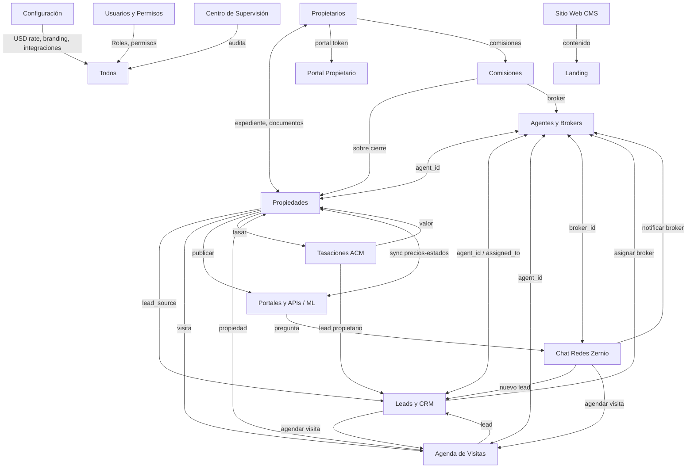

# BIENENHAUS PROPIEDADES

Landing page pública + panel administrativo (CRM) para inmobiliaria premium de Buenos Aires.
Sin framework ni build step: Vanilla JS (scripts clásicos) sobre **Supabase** (PostgreSQL + Auth + RLS + Realtime + Edge Functions), imágenes vía **Cloudinary** y publicación a portales con **Mercado Libre**.

> **Última actualización: 2026-08-30** — Hardening P0 aplicado: RLS tasaciones, REVOKEs de funciones SECURITY DEFINER, vistas security_invoker, policy leads anon INSERT, visits anon SELECT/UPDATE por token, portal_settings sin fuga de secretos. 9 edge functions huérfanas eliminadas. acorn removido. Migración 20260901000001 aplicada.

---

## Índice

1. [URLs](#urls)
2. [Stack](#stack)
3. [Arquitectura General](#arquitectura-general)
4. [Páginas del sistema](#páginas-del-sistema)
5. [Estructura del proyecto](#estructura-del-proyecto)
6. [Puesta en marcha local](#puesta-en-marcha-local)
7. [Configuración frontend](#configuración-frontend)
8. [Base de datos](#base-de-datos)
9. [Seguridad](#seguridad)
10. [Panel administrativo](#panel-administrativo)
11. [Módulo Sitio Web (CMS)](#módulo-sitio-web-cms)
12. [Módulo Ficha HTML](#módulo-ficha-html)
13. [Módulo Configuración](#módulo-configuración)
14. [Landing pública](#landing-pública)
15. [Portal Propietario](#portal-propietario)
16. [Confirmar Visita](#confirmar-visita)
17. [Tasaciones (ACM)](#tasaciones-acm)
18. [Comisiones y Liquidaciones](#comisiones-y-liquidaciones)
19. [Mercado Libre](#mercado-libre)
20. [Chat Zernio (Omnicanal)](#chat-zernio-omnicanal)
21. [Centro de Supervisión](#centro-de-supervisión)
22. [Edge Functions](#edge-functions)
23. [Migraciones](#migraciones)
24. [Deploy](#deploy)
25. [Convenciones de desarrollo](#convenciones-de-desarrollo)
26. [QA / Verificación](#qa--verificación)
27. [Notas técnicas y deudas conocidas](#notas-técnicas-y-deudas-conocidas)
28. [Integración entre módulos](#integración-entre-módulos)
29. [Flujos End-to-End](#flujos-end-to-end)
30. [Patrones técnicos compartidos](#patrones-técnicos-compartidos)
31. [Changelog](#changelog)
32. [ADRs (Architecture Decision Records)](#adrs-architecture-decision-records)
33. [Checklist Pre-Release](#checklist-pre-release)

---

## URLs

| Entorno | URL |
|---|---|
| Landing pública | https://bienenhaus.com.ar (`index.html`) |
| Panel admin + CRM | `admin.html` |
| Portal Propietario | `portal-propietario.html?token=<uuid>` |
| Confirmar visita | `confirmar-visita.html?token=<uuid>` |
| Tasación (ACM) | `tasacion.html?id=<uuid>` (se abre embebida vía iframe desde `tab-tasaciones`) |
| Proyecto Supabase | `rnldqiwwzhjnurkguihu` (API: `https://rnldqiwwzhjnurkguihu.supabase.co`) |
| Repo | https://github.com/facuherrera23/BH-OFICIAL |

---

## Stack

- **Frontend**: Vanilla JS (scripts clásicos con IIFE y `window.*` globales, **sin ES Modules ni bundler**), CSS custom properties, Font Awesome 6.5.1, Zod (`assets/js/zod.umd.js`, solo admin)
- **Backend**: Supabase — PostgreSQL + Auth (GoTrue email/contraseña) + Row Level Security + Realtime + Edge Functions (Deno)
- **Imágenes**: Cloudinary (uploads firmados server-side, compresión automática `f_auto,q_auto`, transformación WebP)
- **Portales**: Mercado Libre (OAuth 2.0, sync cron, webhooks, auto-reply)
- **Mapas y charts (tasaciones)**: Leaflet 1.9.4 + Chart.js 4.4.0 (vía CDN en `tasacion.html`)
- **Email**: Brevo (SMTP, usado por `supervision-digest` para resúmenes)
- **Chat**: Zernio (WhatsApp, Instagram, Facebook, Web) — recepción validada, envío pendiente de API key
- **Deploy**: Cloudflare Pages (estático, sin build) + Edge Functions en Supabase

---

## Arquitectura General

### Principios

1. **Vanilla JS sin build step** — deploy directo de archivos estáticos, cache busters `?v=N` en HTML
2. **Supabase como backend único** — Auth, DB, Realtime, Edge Functions
3. **RLS como seguridad principal** — todas las tablas operativas tienen RLS activada; el frontend nunca ve secretos
4. **Realtime para reactividad** — `setupCoreRealtime` en admin suscribe tablas core (properties, leads, visits, agents, owners, tasaciones, commissions, zernio) para multi-tab sin polling
5. **Config centralizada** — `app_settings` + `site_content` como source of truth (USD rate, branding, contenido landing)
6. **Edge Functions para secretos** — tokens ML/Zernio, Cloudinary, Brevo y service role nunca tocan el frontend
7. **IDs de responsable unificados** — `properties.agent_id`, `leads.assigned_to` y `visits.agent_id` apuntan todos a `agents.id` (migración `20260827_unify_agent_ids`)
8. **Auditoría y supervisión integradas** — `audit_log`, reglas de supervisión, scoring de riesgo, anomalías ML (paquete 20260824)

### Grafo de Módulos



### Entidades Compartidas (Claves de Unión)

| Entidad | Tabla Supabase | Módulos que la usan |
|---|---|---|
| User/Profile | `profiles` | Todos (rol + identidad) |
| Broker | `agents` | Propiedades, CRM, Agenda, Chat, Comisiones |
| Property | `properties` | Propiedades, CRM, Agenda, Portales, Tasaciones, Portal Propietario |
| Lead | `leads` | CRM, Agenda, Chat, Landing |
| Visit | `visits` | Agenda, CRM, Confirmar Visita |
| Conversation | `zernio_conversations` | Chat, CRM |
| Owner | `owners` | Propietarios, Portal Propietario, Comisiones |
| Valuation | `tasaciones` | Tasaciones, Portal Propietario |
| Commission | `commissions` / `commission_liquidations` | Comisiones, Portal Propietario |
| ML Listing | `ml_listings` | Portales, Propiedades |
| Settings/Content | `app_settings`, `site_content` | Config, CMS, Landing |

---

## Páginas del sistema

| Archivo | Propósito | Cliente Supabase |
|---|---|---|
| `index.html` | Landing pública: hero, catálogo, servicios, equipo, proceso, stats, contacto | `window.supabaseClient` (CDN) |
| `admin.html` | Panel administrativo SPA (14 tabs) | `window.supabaseClient` (CDN) + Zod |
| `tasacion.html` | ACM (Análisis Comparativo de Mercado): comparables, mapa, coeficientes, guardado en `tasaciones` | Cliente propio (CDN) + token de sesión por `postMessage` desde admin |
| `portal-propietario.html` | Portal autenticado por token: propiedades, documentos (requisitos), comisiones/liquidaciones | Cliente propio (CDN) + token URL |
| `confirmar-visita.html` | Confirmación/cancelación de visita por token (`visits.confirmation_token`) | Cliente propio (CDN) |

---

## Estructura del proyecto

```
BH-OFICIAL/
├── index.html                  # Landing page pública
├── admin.html                  # Panel administrativo (SPA por tabs)
├── tasacion.html               # ACM de tasación (autónomo, embebible vía iframe)
├── portal-propietario.html     # Portal del propietario (token-based)
├── confirmar-visita.html       # Confirmación de visita por token
├── CNAME                       # Dominio custom (Cloudflare Pages)
├── favicon.ico / robots.txt / sitemap.xml / .nojekyll
├── AUDITORIA_MODULOS.md        # Auditoría módulo a módulo (P0/P1/P2)
├── CONECTAR_ZERNIO_CHAT.md     # Guía de activación del chat Zernio
├── package.json / package-lock.json  # Solo tooling (Playwright y supabase-js como devDeps; acorn removido 2026-08-30)
├── assets/
│   ├── css/
│   │   ├── landing.css         # Design system del landing
│   │   └── admin.css           # Estilos del panel (incluye calendario)
│   ├── js/
│   │   ├── config.js           # window.BH_CONFIG (Supabase URL + anon key)
│   │   ├── supabase-client.js  # Init de window.supabaseClient (usa el global del CDN)
│   │   ├── utils.js            # Helpers de seguridad: esc, escAttr, safeUrl, safeImageUrl, safeCssUrl
│   │   ├── cloudinary.js       # Upload firmado a Cloudinary (window.BH_Cloudinary)
│   │   ├── zod.umd.js          # Zod 3 (solo admin)
│   │   ├── landing-app.js      # Landing: catálogo, filtros, CMS (site_content), contacto → leads
│   │   └── admin-app.js        # Admin completo (~14k líneas): auth, CRUD, dashboard, CRM, portales, chat, supervisión…
│   ├── images/                 # favicon.ico, hero-bg.webp, pwa-512x512.png
│   └── img/                    # logo-bh.png
└── supabase/
    ├── functions/              # Edge Functions (ver sección propia)
    └── migrations/             # Migraciones SQL (ver sección propia)
```

Carpetas de tooling que **nunca** se commitean: `.codegraph/`, `.omo/`, `.playwright-mcp/`, `supabase/.temp/`, `node_modules/`, `*.log`, `.env.local`.

> **Nota**: `supabase/.temp/*` está trackeado en el repo (artefactos del CLI Supabase). No son configuración sensible; contiene `linked-project.json`, `project-ref`, versiones de runtime.

---

## Puesta en marcha local

```bash
# 1. Clonar e ingresar
git clone https://github.com/facuherrera23/BH-OFICIAL.git
cd BH-OFICIAL

# 2. Servir estáticamente (cualquier server sirve)
python -m http.server 8788

# 3. Abrir
#    Landing: http://localhost:8788/index.html
#    Admin:   http://localhost:8788/admin.html
```

- No hay build step ni dependencias npm de runtime.
- El JS se edita directo y se invalida caché con **cache busters** (`?v=N`) en los `<link>`/`<script>`.
- Los usuarios se crean desde el propio panel (tab **Usuarios y Permisos**) vía Edge Function `manage-users`; el rol se asigna en `profiles.role`.

---

## Configuración frontend

`assets/js/config.js`:

```js
window.BH_CONFIG = {
  SUPABASE_URL: 'https://rnldqiwwzhjnurkguihu.supabase.co',
  SUPABASE_ANON_KEY: '<anon-key>'   // clave pública por diseño: la seguridad la da RLS
};
```

`supabase-client.js` crea `window.supabaseClient` usando el global `supabase` del CDN (`https://cdn.jsdelivr.net/npm/@supabase/supabase-js@2`). Sin el CDN o sin `BH_CONFIG`, loguea error y no expone el cliente (fail-closed).

`utils.js` expone `window.BHUtils` con helpers **solo de seguridad/URLs**: `esc`, `escAttr`, `safeUrl`, `safeImageUrl`, `safeCssUrl`. Se carga **antes** que landing-app/admin-app y del JS inline de tasacion.html.

`cloudinary.js` expone `window.BH_Cloudinary = { uploadImage, uploadImages }` (firma vía edge function `cloudinary-sign`).

---

## Base de datos

### Esquema verificado en producción (2026-08-28, vía API)

**37 tablas en `public`, todas con RLS activada** (consulta directa al proyecto `rnldqiwwzhjnurkguihu`).

#### Núcleo de negocio

| Tabla | Filas aprox. | Descripción |
|---|---|---|
| `properties` | 18 | Propiedades (draft/publicada/vendida/alquilada/pausada), imágenes JSONB, `agent_id` FK a `agents`, `owner_id`, portal_settings |
| `agents` | 2 | Asesores/brokers: matrícula, comisiones `commission_sale`/`commission_rent`, `profile_id` (link auth), soft-delete `deleted_at` |
| `owners` | 1 | Propietarios: DNI/CUIT, documentos JSONB (expiración y verificación) |
| `leads` | 0 | Pipeline CRM: source, stage, tags, score, `assigned_to` FK a `agents` |
| `visits` | 0 | Visitas: estados pendiente/confirmada/completada/cancelada, `agent_id`, `confirmation_token` |
| `tasaciones` | 1 | ACM: `data` JSONB, valoración USD/ARS, estatus borrador/en_revision/entregada/vencida |
| `commission_*` | 0 | `commissions`, `commission_liquidations`, `commission_payments` (módulo comisiones) |
| `ml_listings` | 1 | Publicaciones Mercado Libre (sync, dedup) |
| `property_sequences` | 3 | Secuencia de códigos de propiedad (solo service_role) |

#### CMS / configuración

| Tabla | Filas aprox. | Descripción |
|---|---|---|
| `site_content` | 12 | Contenido por sección del landing: hero, services, team, process, stats, contact, footer, social |
| `portal_settings` | 6 | CMS en vivo del landing (hero, servicios, stats, testimonios) |
| `app_settings` | 2 | Ajustes globales key/value JSONB (`preferences`, `features`, `integrations`) |
| `profiles` | 4 | Perfiles vinculados a `auth.users`, campo `role` |

#### Chat Zernio

| Tabla | Filas aprox. | Descripción |
|---|---|---|
| `zernio_config` | 1 | Secretos módulo Zernio (API key, webhook secret). RLS sin políticas: solo service_role |
| `zernio_accounts` | 2 | Espejo de cuentas sociales conectadas |
| `zernio_conversations` | 2 | Hilos DM unificados (IG/FB/WA/Web), `broker_id` auto-asignado por trigger |
| `zernio_messages` | 2 | Mensajes del inbox; escritura solo vía Edge Functions |
| `zernio_webhook_events` | 3 | Dedup de eventos webhook (payload.id único) |

#### Supervisión / auditoría (paquete 20260824)

| Tabla | Filas aprox. | Descripción |
|---|---|---|
| `audit_log` | 278 | Registro de auditoría de escrituras/acciones sensibles |
| `supervision_rules` | 9 | Reglas configurables de detección de anomalías (solo super_admin) |
| `supervision_alerts` | 4 | Alertas operativas generadas por reglas |
| `supervision_baselines` | 8720 | Baselines estadísticos para detección de anomalías |
| `supervision_anomalies` | 68 | Anomalías detectadas (ML/estadística) |
| `supervision_anomaly_config` | 4 | Config del detector de anomalías |
| `user_risk_scores` | 0 | Scores de riesgo por usuario (factores explicables) |
| `user_sessions` | 0 | Sesiones de usuario registradas |
| `api_key_audit` | 0 | Auditoría de uso de API keys |
| `usage_events` | 1 | Métricas de utilización (append-only) |
| `ml_model_metrics` | 0 | Métricas del modelo ML (precision, recall, F1) |
| `ml_predictions_log` | 0 | Log de predicciones individuales del modelo |
| `rate_limit_logs` | 1190 | Sliding window log del rate limiter de Edge Functions |
| `notification_preferences` | 0 | Preferencias de notificación por usuario (email/push/slack) |

#### Portal propietario / documentos

| Tabla | Filas aprox. | Descripción |
|---|---|---|
| `owner_portal_tokens` | 1 | Tokens de acceso al portal (validate + expiry) |
| `document_requirements` | 21 | Requisitos documentales por tipo de operación |
| `owner_timeline_entries` | 2 | Timeline de comunicaciones/eventos del propietario |

### Roles y permisos

El permiso se resuelve con `profiles.role`:

| Rol | Descripción |
|---|---|
| `super_admin` | Acceso total + gestión usuarios + settings sensibles + supervisión |
| `admin` | Gestión operativa completa (sin gestión de usuarios) |
| `broker` | Solo sus asignaciones (via JOIN `agents.profile_id = auth.uid()`) |
| `viewer` | Solo lectura |

Mecanismos clave:
- Trigger `guard_profiles_self_update` impide auto-elevación de rol.
- Policies de `visits`/`properties`/`leads`/`owners` resuelven el responsable con `JOIN agents ON agents.profile_id = auth.uid()` (no comparan UUIDs directos).
- `chat_broker_access` (20260827): `super_admin` ve todo; `broker` solo conversaciones donde `broker_id` → su agent; triggers `BEFORE INSERT` auto-asignan `broker_id`.
- Triggers de visitas↔leads: crear visita → lead a `visita`; cancelar → revertir a `contactado`; completar → sugerir `oferta`.

---

## Seguridad

- **RLS en las 37 tablas**. Lectura pública solo donde corresponde (properties publicadas, agents activos, site_content publicado); escritura autenticada; operaciones sensibles restringidas a `super_admin`.
- **Hardening de funciones**: `search_path` fijo, `EXECUTE` revocado al público con grants explícitos, definer restringido (migraciones 20260824).
- **XSS**: helper `esc()` en todo sink `innerHTML` (compartido vía `BHUtils`).
- **Auth**: validación de sesión por `postMessage` en `tasacion.html` (con verificación de `event.origin`); `confirmar-visita.html` y `portal-propietario.html` autentican por token único en URL.
- **Edge Functions**: `verify_jwt` según función; chequeo interno de rol (admin/super_admin) vía service role; rate limiting por función.
- **Secrets**: solo en Edge Functions (`Deno.env.get`), nunca en frontend ni repo.
- **Auditoría**: `audit_log` + `api_key_audit` cubren escrituras, herramientas y accesos.

---

## Panel administrativo

`admin.html` es una SPA por tabs (hash routing `#tab-dashboard`). Sidebar con categorías **Principal** / **Gestión & CRM** / **Red & Difusión** / **Sistema**.

| Módulo | Tab ID (real) | Funcionalidad |
|---|---|---|
| **Dashboard** | `tab-dashboard` | KPI grid (volumen venta USD, volumen alquiler ARS, activas, leads, visitas) + gráficos + quick actions |
| **Propiedades** | `tab-propiedades` | CRUD completo, drafts, reordenamiento, soft-delete, publicación/sync ML, paginación server-side, validación Zod, ARS/USD, superficie cubierta/terreno |
| **Leads & CRM** | `tab-leads` | Pipeline Kanban, tags, scoring, export CSV, agendado directo de visitas, paginación server-side |
| **Agenda de Visitas** | `tab-agenda` | Calendario mensual + vista tabla, check-in/out, export Visits CSV/ICS, recordatorios, modal visita con brokers |
| **Tasaciones** | `tab-tasaciones` | iframe a `tasacion.html` (ACM) + tabla de tasaciones |
| **Propietarios** | `tab-propietarios` | CRUD expedientes, documentos, timeline, export CSV/PDF, generar link de portal |
| **Sitio Web (CMS)** | `tab-sitio-web` | Editor en vivo del landing (sub-tabs: Hero, Catálogo, Servicios, Equipo, Stats, Proceso, Contacto, Formulario, Navbar, Footer, SEO) |
| **Portales & APIs** | `tab-portales` | OAuth Mercado Libre, config por portal (ZonaProp, Argenprop, etc.), sync, dead-letter, `mlImportFromML` |
| **Agentes & Brokers** | `tab-agentes` | CRUD asesores, matrícula, comisiones `commission_sale`/`commission_rent`, soft-delete, link `profile_id` |
| **Chat Redes** | `tab-chat-redes` | Unified Inbox Zernio: contexto lateral, crear lead, agendar visita, asignar broker |
| **Ficha HTML** | `tab-ficha-html` | Generador de ficha visual por propiedad (HTML autocontenido, share, PDF) |
| **Usuarios & Permisos** | `tab-usuarios` | Alta/edición usuarios, roles, cambio de password vía Edge Function `manage-users` |
| **Configuración** | `tab-configuracion` | Identidad, contacto, redes, preferencias (USD rate), health integrations, sesión |
| **Centro de Supervisión** | `tab-supervision` | Reglas, alertas, anomalías, rankings con nombres resueltos, métricas ML |

### API global `window.adminApp`

El JS expone los handlers a HTML vía `window.adminApp` (39 métodos):
- Property/Lead/Owner/Visit/Agent: `edit*` / `delete*` / `openVisitModal` / `checkinVisit` / `checkoutVisit`
- Propietarios: `exportOwnersCSV`, `exportOwnersPDF`, `generateOwnerPortalLink`, `deleteOwnerDoc`, `deleteTimelineEntry`
- Visitas: `exportVisitsCSV`, `exportVisitsICS`
- Comisiones: `markCommissionPaid`, `markLiquidationPaid`, `deletePayment`, `viewCommissionLiquidation`, `viewLiquidationPDF`
- Portales/ML: `mlConnect`, `mlDisconnect`, `mlSaveCredentials`, `mlPublishProperty`, `mlRemoveProperty`, `mlUpdateProperty`, `mlToggleConfig`, `mlImportFromML`, `togglePortal`, `openPortalConfig`
- Chat: `openChatConversation`
- Supervisión: `loadSupervision`, `loadAnomaliesTable`

### Navegación y estado

- Tabs: hash-based routing + persistencia localStorage.
- Búsqueda global (`Ctrl+K` / input superior) con resaltado y navegación por teclado.
- Notificaciones: panel + badge en tabs + contador favicon.
- Sidebar: categorías + badges en vivo (RPC `get_sidebar_badge_counts` respeta RLS).

---

## Módulo Sitio Web (CMS)

Tab `tab-sitio-web` — editor consolidado del landing con 11 sub-tabs internos (Hero, Catálogo, Servicios, Equipo, Stats, Proceso, Contacto, Formulario, Navbar, Footer, SEO). Guarda en `site_content` (secciones) y `portal_settings`; el landing re-renderiza vía `applySectionContent()` con caché invalidable (`invalidateCmsCache`, `getCachedCMS`).

---

## Módulo Ficha HTML

Tab `tab-ficha-html` — generador y exportador de fichas visuales de propiedades:

- **Shell two-col**: formulario (izquierda) + preview 1:1 (derecha); responsive 1200/1024/680px.
- **Autocompletado CRM** (debounce 250ms, cache con invalidación) + drag&drop de fotos.
- **3 exportaciones**: `navigator.share` (texto), `window.print` (PDF), HTML autocontenido descargable.
- Footer rotativo 3800ms (4 mensajes) y print optimizado (grid 3-col).

---

## Módulo Configuración

Tab `tab-configuracion`:

1. **Identidad Corporativa** → `site_content.footer` (razón social, matrícula, watermark, CUIT)
2. **Contacto Digital** → `site_content.contact` (WhatsApp, email, teléfono, dirección, horario)
3. **Redes Sociales** → `site_content.social` (URL vacía = icono oculto)
4. **Preferencias** → `app_settings.preferences.usd_rate` (validación antes de escribir)
5. **Sistema e Integraciones** → chips de estado (Supabase, Cloudinary, ML, Zernio)
6. **Sesión Activa** → usuario + rol + cierre de sesión

Semántica de guardado: validación → merge profundo (preserva claves no editadas) → UPDATE o INSERT (`onConflict` para `preferences`) → guard por rol (sin `super_admin` los campos quedan disabled).

---

## Landing pública

Consume `site_content` (hero, services, team, process, stats, contact, footer, social) y `portal_settings` vía `landing-app.js` (`applySectionContent`, `getCachedCMS`).

### Funcionalidades (verificadas en código)

- **Catálogo dinámico**: filtros server-side (tipo, zona, precio, dormitorios), orden, paginación, virtual scroller para la grilla.
- **Galería** de imágenes por propiedad (thumbnails + navegación).
- **Contacto**: formulario → insert en `leads` (con pills de interés y validación de checkbox); enlaces WhatsApp desde `site_content.contact.whatsapp`.
- **Stats/team/services/process** renderizados desde CMS con tokens dinámicos del contenido.
- **SEO**: meta tags, Open Graph, `schema.org/RealEstateAgent`, `sitemap.xml`, `robots.txt`.
- **Imágenes**: Cloudinary con `f_auto,q_auto` (WebP automático) + lazy loading.
- **Responsive mobile-first**: navbar/menú móvil, botón float de WhatsApp.

---

## Portal Propietario

`portal-propietario.html` — acceso **sin login** mediante token único (`owner_portal_tokens`), formato `?token=<uuid>`:

- Valida token y expiración; muestra error si es inválido.
- **Propiedades** del propietario (via `owners`).
- **Documentos** (requisitos `document_requirements` + docs de `owners.documents`).
- **Comisiones** y **liquidaciones** (estado pendiente/liquidada/pagada).
- El admin genera el link desde Propietarios (`generateOwnerPortalLink`) y puede exportar CSV/PDF del expediente.

---

## Confirmar Visita

`confirmar-visita.html` — página pública por token para que el cliente confirme o cancele una visita (`visits.confirmation_token`):

- Carga la visita por token; muestra cliente, fecha/hora y estado.
- Acciones: **Confirmar** → `status='confirmada'`, `confirmed_at=now()`; **Cancelar** → `status='cancelada'`, `cancel_reason='Cancelado por cliente'`.
- Estados visuales: pendiente/confirmada/completada/cancelada.

---

## Tasaciones (ACM)

`tasacion.html` — herramienta de **Análisis Comparativo de Mercado** autónoma, embebible vía iframe desde el admin:

- **Comparables** (alta manual, extracción por URL, carga/renovación de fotos, numeración).
- **Mapa** (Leaflet) para ubicar y visualizar comparables + búsqueda por dirección (geocoding).
- **Características** de la propiedad (ambientes, uso de terreno) y **coeficientes** (condiciones, depreciación) con recálculo en vivo.
- **Chart.js** para análisis comparativo visual.
- **Guardado**: insert/update en `tasaciones` (filas `data` + estatus + valoración).
- **Autenticación**: recibe el token de sesión del admin por `postMessage` (con validación de `event.origin`) y notifica al padre (`tasaciones-finalized`, `tasaciones-back`).

---

## Comisiones y Liquidaciones

Módulo de comisiones por cierre de operación:

- Tablas: `commissions` (con `status` pendiente/liquidada/pagada), `commission_liquidations` (mensual), `commission_payments`.
- Edge Functions: `trigger_commission_on_close` (crea la comisión al cerrar propiedad) y `monthly_commission_liquidation` (cierre mensual).
- Admin: `markCommissionPaid`, `markLiquidationPaid`, `viewLiquidationPDF`, `deletePayment`, filtros por broker/estado.
- Portal Propietario muestra el estado de comisiones y liquidaciones.

---

## Mercado Libre

### Flujo Completo (implementado en código admin + edge functions)

1. **Conexión OAuth 2.0** → `mlConnect` (panel Portales).
2. **Publicación** → `mlPublishProperty` (individual) desde Propiedades; valida campos y fotos.
3. **Sincronización** → edge function `ml-sync` (cron, batch 50) → bidireccional precio/stock/status.
4. **Auto-reply** → plantillas por tipo de pregunta con variables.
5. **Webhook ML** → firmado + deduplicación → dead-letter queue visible (`ml_listings`).
6. **Import desde ML** → `mlImportFromML` (listings que existen en ML pero no en el CRM).

> **Nota**: las funciones ML externas (`ml-oauth`, `ml-callback`, `ml-auth`, `ml-api`, `ml-config`, `ml-categories`, `ml-listing-types`, `ml-metrics`, `ml-answer-question`, `ml-bulk-enqueue`, `ml-revoke-tokens`, `ml-import-listings`, `ml-sync-import`, `ml-webhook`) siguen **desplegadas en producción** (endpoints Mercado Libre). **Eliminadas 2026-08-30** (huérfanas, sin consumidores): `qr-checkin`, `visits-process-reminders`, `admin-user-invite`, `audit-log`, `contact-submit`, `chat-ai`, `chat-upload`, `convert-image`, `process-retention-policies`. Ver [Notas técnicas](#notas-técnicas-y-deudas-conocidas).

---

## Chat Zernio (Omnicanal)

**Estado**: recepción validada en producción (firma HMAC, dedup, persistencia de `platform`, update de conversación, auditoría). Envío pendiente de API key real para activar respuestas salientes.

| Componente | Archivo | Estado |
|---|---|---|
| Webhook receptor | `supabase/functions/zernio-webhook/index.ts` | ✅ Deployado (verify_jwt OFF) |
| Proxy API | `supabase/functions/zernio-proxy/index.ts` | ✅ Deployado (verify_jwt ON) |
| Test webhook | `supabase/functions/zernio-webhook-test/index.ts` | ✅ Deployado |
| Frontend Chat | `admin-app.js` (tab Chat Redes) | ✅ Con acceso para `super_admin` y `broker` |
| Base de datos | `zernio_config`, `zernio_accounts`, `zernio_conversations`, `zernio_messages`, `zernio_webhook_events` | ✅ RLS + triggers de asignación `broker_id` |
| Guía de activación | `CONECTAR_ZERNIO_CHAT.md` | ✅ Documentado |

Acciones del inbox: contexto lateral de propiedad/lead/visitas, **crear lead**, **agendar visita**, **asignar broker** (modal mejorado), marcar leído, enviar mensaje (proxy).

---

## Centro de Supervisión

Tab `tab-supervision` + paquete de edge functions `supervision-*` (migraciones 20260824):

- **Reglas configurables** (`supervision_rules`): solo `super_admin` gestiona; se ejecutan vía `pg_cron`.
- **Alertas** (`supervision_alerts`) con severidad y asignación (`supervision_alert_assignment`).
- **Detección de anomalías** estadística/ML (`supervision-ml-anomaly`, baselines en `supervision_baselines`).
- **Risk scoring** por usuario (`user_risk_scores`, factores explicables).
- **Notificaciones** (`supervision-notify` vía cron, `supervision-notifications` para push/email, `supervision-digest` resumen diario vía Brevo).
- **API de consulta** (`supervision-api`, rate limited) + UI de rankings con nombres resueltos.
- **Métricas ML** (`ml_model_metrics`, `ml_predictions_log`) y métricas de uso (`usage_events`).
- **Purga y retención** (`process-retention-policies` / migración `purge_policy`).

---

## Edge Functions

### En este repo (`supabase/functions/`)

#### `_shared/` — helpers

| Archivo | Propósito |
|---|---|
| `_shared/auth.ts` | `requireAdmin`/`isAdmin`: valida Bearer JWT + rol (`admin_users`/is_active). Reemplaza patrón duplicado en 9 funciones |
| `_shared/cors.ts` | Headers CORS estándar |
| `_shared/http.ts` | `corsHeaders`, `jsonResponse`, `optionsResponse` + allowlist de origins con `Vary: Origin` |
| `_shared/crypto.ts` | AES-256-GCM para tokens ML (clave derivada PBKDF2 de `CRYPTO_SECRET`) |
| `_shared/ml.ts` | Cliente de la API ML (OAuth + items), credenciales encriptadas en DB |
| `_shared/ml.schemas.ts` | Schemas Zod para validar respuestas de la API ML (elimina `as unknown as`/`any`) |
| `_shared/rate-limit.ts` | Sliding window log en Supabase (`rate_limit_logs`), configurable por función |
| `_shared/audit.ts` | `auditEvent`, `auditSensitiveAction`, `trackToolUsage`, `auditError`, `getClientIp`, `getUserAgent` |

#### Funciones

| Función | Verify JWT | Propósito |
|---|---|---|
| `cloudinary-sign` | ON + rol admin | Firma uploads Cloudinary con allowlist de carpetas; el secret nunca sale del server |
| `cron_exclusivity_renewals` | — (cron) | Renovaciones de exclusividad por vencer (notifica) |
| `manage-users` | ON + super_admin | Acciones: `invite`, `create-direct`, `set-role`, `update-user`, `update-self` |
| `ml-sync` | — (cron) | Sync ML: precio/stock/status, batch 50, webhooks ML |
| `monthly_commission_liquidation` | — (cron) | Liquidación mensual de comisiones |
| `supervision-api` | ON | Consultas del Centro de Supervisión (auditoría, alertas, métricas), rate limit 60/min |
| `supervision-digest` | — (cron) | Resumen diario de supervisión vía Brevo |
| `supervision-ml-anomaly` | ON | Detección de anomalías estadística/ML |
| `supervision-notifications` | ON | Notificaciones push/email para alertas críticas |
| `supervision-notify` | — (cron) | Dispara notificaciones de alertas (payload) |
| `trigger_commission_on_close` | — (evento) | Crea la comisión al cerrarse una propiedad |
| `zernio-proxy` | ON | Proxy autenticado de la Inbox API Zernio (`send_message`, `mark_read`, `list_accounts`, `backfill_*`) |
| `zernio-webhook` | OFF | Recibe webhooks Zernio: valida HMAC, deduplica, normaliza, persiste, audita |
| `zernio-webhook-test` | OFF | Endpoint de test para validar la configuración del webhook |

### Desplegadas en producción sin fuente en el repo

`ml-oauth`, `ml-callback`, `ml-auth`, `ml-api`, `ml-config`, `ml-categories`, `ml-listing-types`, `ml-metrics`, `ml-answer-question`, `ml-bulk-enqueue`, `ml-revoke-tokens`, `ml-import-listings`, `ml-sync-import`, `ml-webhook`, `qr-checkin`, `visits-process-reminders`, `admin-user-invite`, `audit-log`, `contact-submit`, `chat-ai`, `chat-upload`, `convert-image`, `process-retention-policies`.

---

## Migraciones

`supabase/migrations/` (24 archivos):

| Migración | Contenido |
|---|---|
| `20260824000001_audit_system_foundation` | Base del sistema de auditoría (`audit_log`, usuarios, sesiones) |
| `20260824000002_supervision_rules_defaults` | Reglas de supervisión por defecto |
| `20260824000003_pg_cron_supervision_rules` | Cron de ejecución de reglas |
| `20260824000004_risk_scoring_system` | Scoring de riesgo (`user_risk_scores`) |
| `20260824000005_audit_integrity_chain` | Cadena de integridad del audit log |
| `20260824000006_notification_preferences` | Preferencias de notificación |
| `20260824000007_ml_metrics_dashboard` | Métricas ML (`ml_model_metrics`, `ml_predictions_log`) |
| `20260824000008_supervision_repair` | Reparaciones/ajustes del sistema de supervisión |
| `20260824000009_supervision_alert_assignment` | Asignación de alertas |
| `20260824000010_supervision_notify_integration` | Integración de notificaciones |
| `20260824000011_purge_policy` | Política de purga/retención |
| `20260824000012_supervision_digest` | Tablas del digest diario |
| `20260824000013_supervision_anomaly_detection` + `part1`/`part2` | Detección de anomalías (baselines, config) |
| `20260824000016_api_key_audit_sessions` | Auditoría API key + sesiones |
| `20260826_propietarios_100pct` | Módulo propietarios completo (owners, documentos, timeline, portal tokens, comisiones) |
| `20260826000001_cms_complete_landing` | CMS completo del landing (`site_content`, `portal_settings`) |
| `20260827_chat_broker_access` | Acceso brokers al chat: `broker_id` + triggers + RLS |
| `20260827_fix_visits_rls` | Fix RLS visitas (JOIN `agents.profile_id`) |
| `20260827_unify_agent_ids` | Unificación de IDs: `properties.agent_id`, `leads.assigned_to` → `agents.id` con data migration y FKs |
| `20260827_zernio_chat_completo` | Schema Zernio completo (platform, unique keys, RLS) |
| `20260828_fix_owners_rls` | RLS owners: SELECT super_admin/broker, INSERT/UPDATE/DELETE solo super_admin |
| `20260830_fix_properties_public_read` | RLS properties: lectura pública de publicadas (`TO public`) |

---

## Deploy

### Cloudflare Pages
- **Build command**: (vacío — sin build)
- **Output directory**: `/` (raíz del repo)
- **Custom domain**: `CNAME` → `bienenhaus.com.ar`

### Invalidación de Caché (cache busters actuales)

| Archivo | Cache Buster | Dónde |
|---|---|---|
| `assets/css/admin.css` | `v=30` | `admin.html` |
| `assets/css/landing.css` | `v=8` | `index.html` |
| `assets/css/landing.css` | `v=30` | `portal-propietario.html`, `confirmar-visita.html` |
| `assets/js/admin-app.js` | `v=218` | `admin.html` |
| `assets/js/landing-app.js` | `v=10` | `index.html` |
| `assets/js/utils.js` | `v=1` | `admin.html`, `index.html`, `tasacion.html` |
| `assets/js/config.js` | `v=5` | `admin.html`, `index.html`, `tasacion.html` |
| `assets/js/supabase-client.js` | `v=4` (admin) / `v=3` (index) | `admin.html`, `index.html` |
| `assets/js/cloudinary.js` | `v=6` | `admin.html`, `index.html` |
| `assets/js/zod.umd.js` | (sin versión) | `admin.html` |

### Edge Functions
```bash
supabase functions deploy <slug> --no-verify-jwt   # para webhooks/cron
supabase functions deploy <slug>                   # verify_jwt ON por defecto
```

---

## Convenciones de Desarrollo

- **Scripts clásicos IIFE** + globals (`window.BH_CONFIG`, `window.supabaseClient`, `window.BHUtils`, `window.BH_Cloudinary`, `window.adminApp`) — sin ES Modules ni bundler.
- **Sanitización**: **siempre** `esc()` de `BHUtils` antes de `innerHTML`; `safeUrl`/`safeImageUrl` para atributos `href`/`src`.
- **Async/await** con try/catch en todas las llamadas Supabase/Edge Functions.
- **Cache de búsqueda**: usar `mutate(table, fn)` para escrituras (invalida `_searchCache` y emite evento de cambio) en lugar de `.insert()/.update()/.delete()` directos.
- **Realtime**: suscripciones en `setupCoreRealtime` para tablas core.
- **Cache busters**: subir `?v=N` en el HTML tras tocar un JS/CSS.
- **JS válido**: `node --check` antes de commitear (script `npm run lint`).

### Archivos no versionar
```
.codegraph/  .omo/  .playwright-mcp/  supabase/.temp/  node_modules/
*.log  .env.local  dist/  build/  .vite/
```

---

## QA / Verificación

### Comandos
```bash
# Sintaxis JS (ambos archivos grandes)
npm run lint            # node --check admin-app.js && landing-app.js

# Verificar migraciones aplicadas
supabase migration list

# Inspección del esquema en vivo (MCP/psql)
supabase db psql -c "\dt"
```

### Estado de QA automatizado
- **Suite E2E Playwright recreada** (2026-08-30) en `tests/` — read-only contra producción (RLS protege escrituras), nunca envía datos.
- `npm test` corre 19 tests: catálogo renderiza propiedades publicadas, búsqueda, formulario de contacto presente, CSP de las 5 páginas, regresión de delegación `data-action`, smoke de tasaciones/portal/confirmar-visita, y admin **gated** por `BH_TEST_ADMIN_EMAIL`/`BH_TEST_ADMIN_PASSWORD` (sin credenciales se salta; con credenciales valida login + tabs + sesión persistente en reload).
- La suite detectó y permitió corregir **RLS `properties_public_read`** (era `FOR SELECT TO authenticated` → el anon key no veía propiedades y el landing mostraba "No se encontraron propiedades"; ahora `TO public`, migración `20260830_fix_properties_public_read`).
- `package.json`: `main: test_comment.js` eliminado; `"private": true`; `npm test` → `npx playwright test` (real).
- CI (`.github/workflows/deploy.yml`): gate real = `node --check` + `npm test` con Playwright headless chromium; `html-validate` quedó como best-effort informativo (el estilo vanilla genera cientos de avisos que no son bugs).
- Evidencia local: `.playwright-mcp/propiedades-2026-08-30.csv` (export real de CSV, no versiona).

---

## Notas Técnicas y Deudas Conocidas

| Item | Impacto | Estado |
|---|---|---|
| `assets/js/admin-app.js` modificado **sin commitear** (exports `loadAnomaliesTable` + fix `supNewRuleBtn` que abre el modal de reglas) | Entrega pendiente | Commitear + subir cache buster |
| Commit `ed9c75c` (remueve `module-by-module.md`) local, **no pusheado** (`main` ahead 1 de `origin/main`) | Repo desincronizado | `git push` cuando corresponda |
| Edge functions desplegadas sin fuente en repo (ML OAuth/callback/API, chat-ai, etc.) | Mantenibilidad / drift | Sincronizar código desde la copia local original (`.../landing/`) o re-crear |
| `supabase/.temp/*` trackeado en git | Higiene | **DONE**: `git rm --cached` ejecutado 2026-08-30 |
| `acorn` en `package.json` | Dependencia muerta | **DONE**: removido 2026-08-30 (0 usos) |
| Favicon: existe `favicon.ico` y `assets/images/favicon.ico` | OK | — |
| Supabase Advisor: `rls_enabled_no_policy` en `property_sequences` y `zernio_config` | INFO | Intencional: acceso solo service_role |
| Supabase Advisor: extensión `pg_net` en `public` | INFO | Requerida por Edge Functions |
| Leaked Password Protection (Supabase Auth) | Seguridad | Activar en Dashboard Auth → Settings (manual) |
| Chat Zernio sin API key para envíos | Bloqueado parcial | Recepción OK; falta credencial real |
| `usd_rate` sin consumo en property cards del landing (formato ARS actualizado) | Feature pendiente | Conectar `fmtARS`/token cuando el negocio lo pida |
| Notificaciones push reales (Web Push/VAPID) | Futuro | Service Worker pendiente |

---

## Integración entre Módulos

### Reglas de negocio compartidas
| Regla | Dónde se define | Módulos afectados |
|---|---|---|
| USD rate | `app_settings.preferences.usd_rate` | Propiedades, Tasaciones, CMS, Landing |
| Roles/Permisos | `profiles.role` + RLS | Todos |
| Responsable | `properties.agent_id`, `leads.assigned_to`, `visits.agent_id`, `zernio_conversations.broker_id` → `agents.id` | Propiedades, CRM, Agenda, Chat, Comisiones |
| Estados propiedad | `properties.status` | Propiedades, Portales, Landing, CRM |
| Pipeline | `leads.stage` | CRM, Agenda, Chat, Dashboard |
| Visita status | `visits.status` | Agenda, CRM, Confirmar Visita |
| Visit ↔ Lead | Triggers DB (`trg_visits_sync_lead_stage`, `trg_visits_lead_cancel_revert`, `trg_visits_lead_completed_auto`) | Agenda, CRM |
| Config social | `site_content.social` | CMS, Config, Landing |
| Feature flags | `app_settings.features` | Todos |

### Conexiones resueltas en auditoría 2026-08-27
- **Chat → Lead/Visita/Broker**: botones activos en el header de conversación.
- **Badges**: RPC `get_sidebar_badge_counts` (SECURITY DEFINER) respeta RLS.
- **Comisión → Cierre**: `trigger_commission_on_close` + liquidación mensual.
- **Propietario → Portal**: token + expediente + comisiones visibles.

---

## Flujos End-to-End

### Flujo 1: Lead → Visita → Cierre
```
Landing/ML/Chat → lead (source) → CRM (stage nuevo, score)
    → Broker asignado → contactado
    → Agenda: visita (lead_id + property_id + agent_id + confirmation_token)
    → Cliente recibe link → confirmar-visita.html (confirma/cancela)
    → check_in/check_out (admin) → completada → triggers → lead en 'visita' → 'oferta'
    → Cierre → propiedad vendida/alquilada → trigger comisión
```

### Flujo 2: Publicación en Mercado Libre
```
Propiedad → mlPublishProperty → validación → ml-sync (cron) → ML API
    → ml_listings insert → sync bidireccional precio/stock/status
    → Webhook ML → preguntas → chat/notificación broker
    → Import inverso: mlImportFromML
```

### Flujo 3: Tasación → Captación
```
tab-tasaciones → iframe tasacion.html?id= → ACM (comparables, mapa, coeficientes)
    → saveToSupabase (insert/update tasaciones) → finalize → postMessage al admin
    → Lead captación → visita → contrato → propiedad publicada
```

### Flujo 4: Chat Omnicanal → Lead/Visita/Broker
```
WhatsApp/IG/FB/Web → zernio-webhook (HMAC + dedup) → conversación + mensaje
    → Realtime → Unified Inbox → contexto lateral
    → Acciones: crear lead, agendar visita, asignar broker (SMS/proxy)
```

### Flujo 5: Portal Propietario
```
Admin genera token (Propietarios → generateOwnerPortalLink) → owner_portal_tokens
    → Propietario abre ?token= → propiedades, documentos, comisiones, liquidaciones
    → Expiración controlada → error si token inválido
```

### Flujo 6: Supervisión
```
pg_cron → supervision_rules + baselines + ml-anomaly → supervision_alerts/anomalies
    → supervision-notify (cron) → supervision-notifications (push/email)
    → supervision-digest (Brevo) → Centro de Supervisión (tab) / supervision-api
```

---

## Patrones Técnicos Compartidos

### `mutate(table, fn)` (admin-app.js)
Wrapper de escrituras que ejecuta la mutación, invalida la cache de búsqueda y emite evento de cambio (para Realtime cross-tab):
```js
await mutate('properties', async () => supabaseClient.from('properties').update(data).eq('id', id));
```

### Realtime (`setupCoreRealtime`)
Suscripciones a tablas core + chats; al recibir cambios actualiza la UI activa (multi-tab consistent).

### Helpers de seguridad (`assets/js/utils.js` → `window.BHUtils`)
`esc`, `escAttr`, `safeUrl` (http/https/mailto/tel/relativos), `safeImageUrl`, `safeCssUrl` (neutraliza `\ " ' ( )`).

### Zod (solo admin)
`assets/js/zod.umd.js` + schemas para validación de formularios (p.ej. Agente con `commission_sale`/`commission_rent`).

### Patrón de sesión cruzada (iframe)
`tasacion.html` usa `postMessage` con `targetOrigin` explícito y verificación de `event.origin` para recibir el token del admin; avisa al padre con `tasaciones-finalized` / `tasaciones-back`.

---

## Changelog

### 2026-08-30 — FASE 3: QA automatizado + fix RLS crítico
- Suite E2E Playwright recreada (`tests/`): catálogo, búsqueda, contacto, CSP de las 5 páginas, regresión `data-action`, smoke de tasaciones/portal/confirmar, + admin gated por `BH_TEST_ADMIN_*`.
- Corregido **RLS `properties_public_read`** (`TO authenticated` → `TO public`): el landing público no veía propiedades publicadas (migración `20260830_fix_properties_public_read.sql`).
- `package.json`: eliminado `main: test_comment.js`; `"private": true`; `npm test` real.
- CI `deploy.yml`: gate real `node --check` + `npm test` (Playwright chromium headless).
- `.gitignore`: + `test-results/`, `playwright-report/`.

### 2026-08-30 (noche) — Hardening P0 completo post-auditoría
- **RLS tasaciones**: `service_role_tasaciones` → `service_role`; `admin_full_access_tasaciones` → `authenticated` (antes PUBLIC con CRUD anon total).
- **Function EXECUTE lockdown**: REVOKE ALL FROM PUBLIC + anon en 44 funciones públicas; GRANT service_role en todas; authenticated solo en `get_sidebar_badge_counts`, `generate_property_code`, `count_pending_visits_for_lead`, `is_super_admin`, `set_property_code`, `set_property_code_on_insert` (respeta cadenas de triggers).
- **Vistas security_invoker**: 8 vistas `security definer` → `security_invoker=true` (`ml_model_performance`, `daily_user_activity`, `daily_module_activity`, `open_alerts_by_user`, `my_assigned_alerts`, `purge_audit_log`, `supervision_anomalies_recent`, `current_user_risk_scores`).
- **Leads anon INSERT**: policy `leads_anon_insert` (`source IN ('landing_page','newsletter')`) — form de contacto y newsletter funcionan.
- **Visitas público**: anon SELECT/UPDATE por `confirmation_token` (confirmar-visita.html funcional).
- **Portal settings**: eliminado leak `api_key`/`api_secret` — `portal_settings_public_read` → `portal_settings_authenticated_read` (solo authenticated).
- **Índices**: drop 5 sin uso en `audit_log` + 27 FK indexes faltantes creados.
- **Edge functions**: 9 huérfanas eliminadas de prod (`contact-submit`, `qr-checkin`, `visits-process-reminders`, `admin-user-invite`, `audit-log`, `chat-ai`, `chat-upload`, `convert-image`, `process-retention-policies`); fuente queda en repo.
- **acorn**: removido de `package.json` (0 usos).
- **supabase/.temp**: `git rm --cached` (trackeado pese a .gitignore).
- **Migración**: `20260901000001_fix_p0_security_and_functional.sql` aplicada a prod.

### 2026-08-28 — Limpieza y documentación
- Eliminados `.playwright-mcp/`, `test-results/` y la carpeta `tests/` (Playwright) por decisión del usuario.
- Eliminado `module-by-module.md` (commits `ed9c75c`, superseded por `AUDITORIA_MODULOS.md`).
- **README reescrito completo** contra el estado real del repo y del proyecto Supabase en vivo.

### 2026-08-27 — Auditoría P0/P1/P2 (ver `AUDITORIA_MODULOS.md`)
- **P0**: RLS `visits` (JOIN `agents.profile_id`), acceso `broker` al chat (RLS + guard UI + triggers `broker_id`).
- **P1**: unificación de IDs (`properties.agent_id`, `leads.assigned_to` → `agents.id`), Realtime en tablas core, fix dropdown brokers en visitas, robustez config Zernio, soft-delete agents, `mutate()` para invalidación centralizada de cache, split `commission_sale`/`commission_rent`.
- **P2**: triggers visit↔lead, botones chat (crear lead/agendar/asignar), RPC badges, rankings con nombres, config dinámica por portal.

### v2.3.0 — 2026-08-27
- Módulo Chat Zernio 100%: `20260827_zernio_chat_completo` (platform, UNIQUE, FKs CASCADE, RLS, api_key solo super_admin); fixes webhook/proxy; verify JWT ajustado.

### 2026-08-26 — Propietarios + CMS
- `20260826_propietarios_100pct` (CRUD owners, portal, comisiones, timeline) y `20260826000001_cms_complete_landing` (CMS del landing completo).

### v2.2.0 — 2026-08-25
- Fix visuales landing (iconos, highlight, badge Destacada), footer/favicon, limpieza dirección contacto, redes sociales, CMS consolidado (un solo tab Sitio Web).

### v2.1.0 — 2026-08-24
- Módulo Ficha HTML + Centro de Supervisión (reglas, alertas, ML anomaly, risk scoring, notificaciones) + paquete de migraciones 20260824.

---

## ADRs (Architecture Decision Records)

| ADR | Decisión | Razón |
|---|---|---|
| ADR-001 | Vanilla JS + scripts clásicos IIFE | Deploy simple, sin build |
| ADR-002 | Supabase backend único | RLS nativo, DX unificada |
| ADR-003 | `agent_id` en todas las entidades (→ `agents.id`) | Trazabilidad, comisiones, permisos (unificado 20260827) |
| ADR-004 | `source` + `tags` en leads | Flexibilidad de origen |
| ADR-005 | Realtime suscripciones centralizadas | UI instantánea multi-tab |
| ADR-006 | Config centralizada (`app_settings` + `site_content`) | Single source USD, branding, flags |
| ADR-007 | Edge Functions para secretos | Nunca secrets en frontend |
| ADR-008 | Chat Zernio opcional (feature flag) | No bloquea release |
| ADR-009 | Soft delete en `properties` y `agents` | Auditoría, recuperación |
| ADR-010 | `price_ars` generated column | Consistencia ARS/USD automática |
| ADR-011 | `confirmation_token` único en `visits` | Confirmación sin login |
| ADR-012 | Idempotency keys en webhooks | Exact-once processing |
| ADR-013 | Cache busters `?v=N` en HTML | Control total, sin stale caches |
| ADR-014 | `mutate()` wrapper para escrituras | Invalida cache + Realtime consistente |
| ADR-015 | Zod (UMD) solo en admin | Validación runtime de formularios |
| ADR-016 | Portal/Visita por token URL | Acceso público sin credenciales |

---

## Checklist Pre-Release

- [x] `npm test` → suite E2E Playwright verde (17 passed, 2 admin-gated skipped en CI)
- [ ] Commitear cambios FASE 1+2+3 (validación + suite + fix RLS) y subir cache busters
- [ ] Pushear commit `ed9c75c` pendiente
- [x] Corregir `package.json` (`main` inexistente removido; `private: true`)
- [ ] Decidir destino de las edge functions desplegadas sin fuente en repo
- [ ] Cache busters actualizados en los 5 HTML
- [ ] Migraciones Supabase aplicadas (`supabase migration list` / `db push`)
- [ ] Considerar `git rm --cached supabase/.temp/*` + `.gitignore`

---

*Documento vivo — actualizar con cada release.*  
*Mantenedor: facuherrera23 · Última actualización: 2026-08-30*