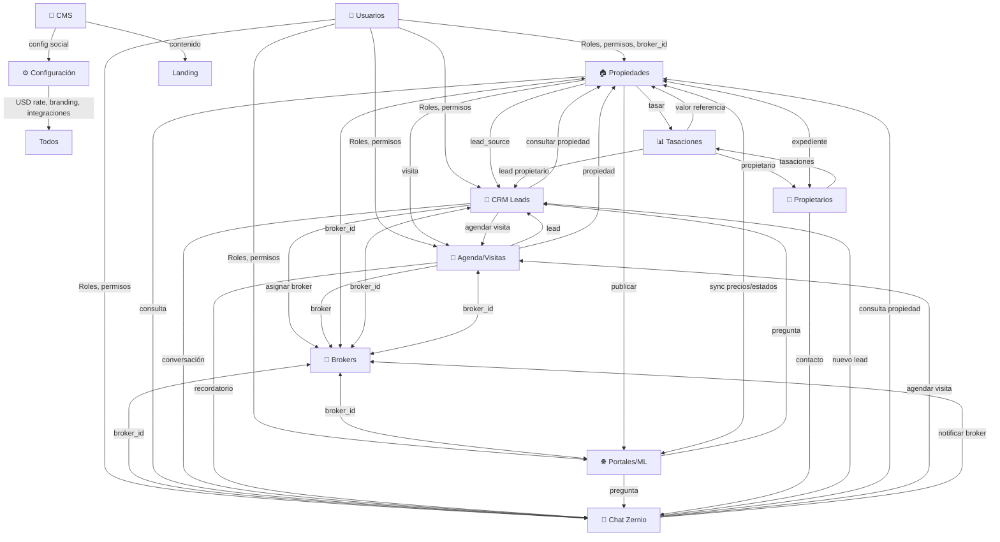

# BIENENHAUS PROPIEDADES

Landing page pública + panel administrativo (CRM) para inmobiliaria premium de Buenos Aires.
Sin framework ni build step: Vanilla JS sobre **Supabase** (PostgreSQL + Auth + RLS + Edge Functions), imágenes vía **Cloudinary** y publicación a portales con **Mercado Libre**.

---

## Índice

1. [URLs](#urls)
2. [Stack](#stack)
3. [Arquitectura General](#arquitectura-general)
4. [Estructura del proyecto](#estructura-del-proyecto)
5. [Puesta en marcha local](#puesta-en-marcha-local)
6. [Configuración frontend](#configuración-frontend)
7. [Base de datos](#base-de-datos)
8. [Seguridad](#seguridad)
9. [Panel administrativo](#panel-administrativo)
10. [Módulo Configuración](#módulo-configuración)
11. [Landing pública](#landing-pública)
12. [Mercado Libre](#mercado-libre)
13. [Chat Zernio (Omnicanal)](#chat-zernio-omnicanal)
14. [Edge Functions](#edge-functions)
15. [Deploy](#deploy)
16. [Convenciones de desarrollo](#convenciones-de-desarrollo)
17. [QA / Verificación](#qa--verificación)
18. [Notas técnicas y deudas conocidas](#notas-técnicas-y-deudas-conocidas)
19. [Integración entre módulos](#integración-entre-módulos)
20. [Flujos End-to-End](#flujos-end-to-end)
21. [Patrones técnicos compartidos](#patrones-técnicos-compartidos)
22. [Roadmap y ADRs](#roadmap-y-adrs)

---

## URLs

| Entorno | URL |
|---|---|
| Landing | https://bienenhaus.com.ar |
| Panel admin | https://bienenhaus.com.ar/admin |
| Proyecto Supabase | `rnldqiwwzhjnurkguihu` |
| Repo | https://github.com/facuherrera23/BH-OFICIAL |

Las tasaciones (ACM) se abren vía `iframe` dentro del panel admin (`tasacion.html`).

---

## Stack

- **Frontend**: Vanilla JS (ES Modules), CSS custom properties, Font Awesome 6.5.1
- **Backend**: Supabase — PostgreSQL + Auth (GoTrue email/contraseña) + Row Level Security + Realtime + Edge Functions (Deno)
- **Imágenes**: Cloudinary (compresión automática a WebP, firma server-side)
- **Portales**: Mercado Libre (OAuth 2.0, sync, webhooks, auto-reply)
- **Email**: Brevo SMTP (límite 30 envíos/hora)
- **Chat**: Zernio (WhatsApp, Instagram, Facebook, Web chat) — *pendiente API key*
- **Deploy**: Cloudflare Pages (estático)

---

## Arquitectura General

### Principios

1. **Vanilla JS + ES Modules** — sin bundler, deploy directo, cache busters nativos
2. **Supabase como backend único** — Auth, DB, Realtime, Edge Functions, Storage
3. **RLS como seguridad principal** — políticas en DB, no en frontend
4. **Event Bus + Realtime** — UI reactiva sin polling, consistencia multi-pestaña
5. **Config centralizada** — `app_settings` + `site_content` como source of truth
6. **Edge Functions para secretos** — ML tokens, Cloudinary, Brevo, Zernio nunca en frontend
7. **Feature flags** — módulos opcionales (Chat, Tasaciones, Portal Propietario)

### Grafo de Módulos



### Entidades Compartidas (Claves de Unión)

| Entidad | Tabla Supabase | Módulos que la usan | Propósito |
|---------|----------------|---------------------|-----------|
| **User/Profile** | `profiles` | Todos | Auth + rol + `broker_id` opcional |
| **Broker** | `agents` | Propiedades, CRM, Agenda, Portales, Chat | Asesor responsable |
| **Property** | `properties` | Propiedades, CRM, Agenda, Portales, Chat, Tasaciones | Núcleo del negocio |
| **Lead** | `leads` | CRM, Agenda, Chat, Portales, Propiedades | Pipeline comercial |
| **Visit** | `visits` | Agenda, CRM, Propiedades, Brokers | Calendario accionable |
| **Conversation** | `zernio_conversations` | Chat, CRM, Propiedades, Agenda | Omnicanal |
| **Owner** | `owners` | Propietarios, Propiedades, Tasaciones | Titularidad |
| **Valuation** | `tasaciones` | Tasaciones, Propiedades, Propietarios | Precio de referencia |
| **ML Listing** | `ml_listings` | Portales, Propiedades | Publicación externa |
| **Settings** | `app_settings`, `site_content` | Config, CMS, todos (USD rate) | Parámetros globales |

---

## Estructura del proyecto

```
BH-OFICIAL/
├── index.html                  # Landing page pública
├── admin.html                  # Panel administrativo (SPA por tabs)
├── tasacion.html               # Réplica TAI para tasaciones (iframe autenticado)
├── plan.md                     # Doc interno: plan CRM ↔ Agenda bidireccional
├── ARQUITECTURA_MODULOS.md     # Arquitectura unificada de módulos
├── CONECTAR_ZERNIO_CHAT.md     # Guía paso a paso para activar chat
├── CNAME                       # Dominio custom (Cloudflare Pages)
├── robots.txt / sitemap.xml / .nojekyll
├── react-doctor.config.json    # Config react-doctor (deslop/unused-file off)
├── package.json / package-lock.json / node_modules/  # Solo tooling (acorn, react-doctor)
├── assets/
│   ├── css/
│   │   ├── landing.css         # Design system del landing
│   │   └── admin.css           # Estilos del panel (calendario incluido)
│   ├── js/
│   │   ├── config.js           # window.BH_CONFIG (Supabase URL + anon key)
│   │   ├── supabase-client.js  # Init cliente Supabase + fallback CDN
│   │   ├── utils.js            # Helpers compartidos (fmtARS, esc, waLink, debounce)
│   │   ├── cloudinary.js       # Upload helper con compresión WebP
│   │   ├── landing-app.js      # Landing: catálogo, filtros, CMS, contacto
│   │   └── admin-app.js        # Admin: auth, CRUD, dashboard, CRM, portales…
│   ├── images/                 # favicon.ico, hero-bg.webp, pwa-512x512.png
│   └── img/                    # logo-bh.png
└── supabase/
    ├── functions/              # Edge Functions (ver sección propia)
    └── .temp/                  # Tooling CLI local — NO versionar
```

Carpetas de tooling que **nunca** se commitean: `.codegraph/`, `.omo/`, `.playwright-mcp/`, `supabase/.temp/`.

---

## Puesta en marcha local

```bash
# 1. Clonar e ingresar
git clone https://github.com/facuherrera23/BH-OFICIAL.git
cd BH-OFICIAL

# 2. Servir estáticamente (cualquier server sirve; este es el usado en QA)
python -m http.server 8788

# 3. Abrir
#    Landing: http://localhost:8788/index.html
#    Admin:   http://localhost:8788/admin.html
```

No hay build step ni dependencias npm de runtime. El JS se edita directo y se invalida caché con **cache busters** (`?v=N`) en los `<link>`/`<script>` de `index.html` y `admin.html`.

> Los usuarios se crean desde el propio panel (tab **Usuarios**) o vía Auth de Supabase; el rol se asigna en `profiles.role`.

---

## Configuración frontend

Todo vive en `assets/js/config.js`:

```js
window.BH_CONFIG = {
  SUPABASE_URL: 'https://<project-ref>.supabase.co',
  SUPABASE_ANON_KEY: '<anon-key>'   // clave pública por diseño: la seguridad la da RLS
};
```

La presencia de `window.BH_Cloudinary` habilita el chip de estado de Cloudinary en el panel.

---

## Base de datos

### Esquema Completo

Esquema verificado en producción (todas las tablas con **RLS activada**):

| Tabla | Filas | Descripción |
|---|---:|---|
| `properties` | 3 | Propiedades publicadas (código secuencial vía `property_sequences`, drafts, soft-delete, video_url, orden RPC) |
| `property_sequences` | 2 | Secuencias de códigos de propiedad (RLS restringida, solo service_role) |
| `agents` | 2 | Asesores/brokers (matrícula, fotos en Storage, comisiones, horarios, permisos) |
| `owners` | 0 | Propietarios y expedientes/contratos |
| `leads` | 0 | Consultas y prospectos del pipeline CRM (tags, scoring, origen) |
| `visits` | 0 | Visitas agendadas (estados: pendiente/confirmada/completada/cancelada, calendario) |
| `tasaciones` | 0 | ACM / tasaciones (datos JSONB, RPCs de valoración) |
| `site_content` | 8 | Contenido por sección del landing: `hero`, `services`, `team`, `process`, `stats`, `contact`, `footer`, `social` |
| `portal_settings` | 6 | CMS en vivo del landing (hero, servicios, stats, testimonios) + versiones/i18n |
| `app_settings` | 1 | Ajustes globales key/value JSONB — hoy: `preferences.usd_rate` |
| `profiles` | 3 | Perfiles de usuario vinculados a `auth.users` (campo `role`) |
| `ml_listings` | 1 | Publicaciones en Mercado Libre (sync, webhooks dedup, dead-letter queue) |
| `zernio_config` | 1 | API key Zernio (encriptada) |
| `zernio_accounts` | 0 | Cuentas conectadas (WhatsApp, Instagram, Facebook) |
| `zernio_conversations` | 0 | Conversaciones unificadas cross-platform |
| `zernio_messages` | 0 | Mensajes normalizados por conversación |

Complementos en DB: `audit_log`, `newsletter_subscribers`, chat interno + asistente IA, rate limiting, papelera con retención.

### Esquema Detallado por Tabla

#### `properties`
```sql
CREATE TABLE properties (
  id uuid PRIMARY KEY DEFAULT gen_random_uuid(),
  code text UNIQUE NOT NULL,           -- ej: BH-0001 (secuencia property_sequences)
  title text NOT NULL,
  description text,
  property_type text NOT NULL,         -- 'venta' | 'alquiler' | 'tasacion'
  status text NOT NULL DEFAULT 'draft',-- 'draft' | 'publicada' | 'vendida' | 'alquilada' | 'pausada'
  price_usd numeric(12,2) NOT NULL,
  price_ars numeric(14,2) GENERATED ALWAYS AS (price_usd * (SELECT value->>'usd_rate' FROM app_settings WHERE key='preferences')) STORED,
  zone text NOT NULL,
  neighborhood text,
  address text,
  lat numeric(10,7),
  lng numeric(10,7),
  surface_total numeric(10,2),
  surface_covered numeric(10,2),
  rooms integer,
  bedrooms integer,
  bathrooms integer,
  garage boolean DEFAULT false,
  amenities jsonb DEFAULT '[]'::jsonb,
  images jsonb DEFAULT '[]'::jsonb,    -- [{url, public_id, order, is_cover}]
  video_url text,
  brochure_url text,
  broker_id uuid REFERENCES agents(id),
  owner_id uuid REFERENCES owners(id),
  portal_settings jsonb DEFAULT '{}'::jsonb,  -- config por portal (ML, ZP, AP, IC)
  published_at timestamptz,
  created_at timestamptz DEFAULT now(),
  updated_at timestamptz DEFAULT now(),
  deleted_at timestamptz               -- soft delete
);
```

#### `agents` (Brokers)
```sql
CREATE TABLE agents (
  id uuid PRIMARY KEY DEFAULT gen_random_uuid(),
  user_id uuid UNIQUE REFERENCES auth.users(id),  -- opcional: link a auth
  full_name text NOT NULL,
  email text UNIQUE,
  phone text,
  license_number text UNIQUE,          -- matrícula profesional
  license_expiry date,
  photo_url text,                      -- Cloudinary/Storage
  commission_sale numeric(5,2) DEFAULT 3.00,   -- % comisión venta
  commission_rent numeric(5,2) DEFAULT 4.00,   -- % comisión alquiler
  commission_split jsonb DEFAULT '{}'::jsonb,  -- splits con co-brokers
  schedule jsonb DEFAULT '{}'::jsonb,  -- horarios disponibles
  permissions jsonb DEFAULT '{}'::jsonb, -- {ver_todo, editar_propias, publicar_ml, gestionar_usuarios}
  status text DEFAULT 'activo',        -- 'activo' | 'inactivo' | 'vacaciones'
  created_at timestamptz DEFAULT now(),
  updated_at timestamptz DEFAULT now()
);
```

#### `leads`
```sql
CREATE TABLE leads (
  id uuid PRIMARY KEY DEFAULT gen_random_uuid(),
  property_id uuid REFERENCES properties(id),
  broker_id uuid REFERENCES agents(id),
  source text NOT NULL,                -- 'landing' | 'ml' | 'chat' | 'referido' | 'tasacion' | 'walkin'
  stage text NOT NULL DEFAULT 'nuevo', -- 'nuevo' | 'contactado' | 'visita' | 'oferta' | 'cerrado' | 'perdido'
  tags text[] DEFAULT '{}',
  score integer DEFAULT 0,             -- 0-100 calculado automáticamente
  contact_name text NOT NULL,
  contact_phone text,
  contact_email text,
  contact_preference text,             -- 'whatsapp' | 'email' | 'call' | 'chat'
  notes text,
  utm_source text,
  utm_medium text,
  utm_campaign text,
  assigned_at timestamptz,
  last_contact_at timestamptz,
  next_action_at timestamptz,
  next_action_note text,
  closed_at timestamptz,
  lost_reason text,
  created_at timestamptz DEFAULT now(),
  updated_at timestamptz DEFAULT now()
);
```

#### `visits`
```sql
CREATE TABLE visits (
  id uuid PRIMARY KEY DEFAULT gen_random_uuid(),
  lead_id uuid REFERENCES leads(id),
  property_id uuid REFERENCES properties(id),
  broker_id uuid REFERENCES agents(id),
  client_name text NOT NULL,
  client_phone text,
  client_email text,
  visit_date timestamptz NOT NULL,
  duration_minutes integer DEFAULT 60,
  status text NOT NULL DEFAULT 'pendiente', -- 'pendiente' | 'confirmada' | 'completada' | 'cancelada'
  confirmation_token text UNIQUE,      -- para confirmación por email/link
  confirmed_at timestamptz,
  check_in timestamptz,                -- broker marca llegada
  check_out timestamptz,               -- broker marca salida
  notes text,                          -- notas post-visita
  cancel_reason text,
  created_at timestamptz DEFAULT now(),
  updated_at timestamptz DEFAULT now()
);
```

#### `tasaciones`
```sql
CREATE TABLE tasaciones (
  id uuid PRIMARY KEY DEFAULT gen_random_uuid(),
  property_id uuid REFERENCES properties(id),
  owner_id uuid REFERENCES owners(id),
  broker_id uuid REFERENCES agents(id),
  type text NOT NULL,                  -- 'venta' | 'alquiler' | 'hipotecario' | 'judicial'
  status text DEFAULT 'borrador',      -- 'borrador' | 'en_revision' | 'entregada' | 'vencida'
  data jsonb NOT NULL,                 -- ACM completo: comparables, ajustes, conclusiones
  valuation_usd numeric(12,2),         -- valor estimado USD
  valuation_ars numeric(14,2),         -- valor estimado ARS (usd_rate al momento)
  report_url text,                     -- PDF generado en Storage
  expires_at timestamptz,
  delivered_at timestamptz,
  created_at timestamptz DEFAULT now(),
  updated_at timestamptz DEFAULT now()
);
```

#### `owners`
```sql
CREATE TABLE owners (
  id uuid PRIMARY KEY DEFAULT gen_random_uuid(),
  full_name text NOT NULL,
  dni_cuit text UNIQUE,
  email text,
  phone text,
  address text,
  documents jsonb DEFAULT '[]'::jsonb, -- [{type, url, expiry, verified}]
  notes text,
  created_at timestamptz DEFAULT now(),
  updated_at timestamptz DEFAULT now()
);
```

#### `zernio_conversations`
```sql
CREATE TABLE zernio_conversations (
  id uuid PRIMARY KEY DEFAULT gen_random_uuid(),
  account_id uuid REFERENCES zernio_accounts(id),
  contact_name text,
  contact_handle text,                 -- phone/@handle
  platform text NOT NULL,              -- 'whatsapp' | 'instagram' | 'facebook' | 'web'
  property_id uuid REFERENCES properties(id),
  lead_id uuid REFERENCES leads(id),
  broker_id uuid REFERENCES agents(id),
  unread_count integer DEFAULT 0,
  last_message_at timestamptz,
  last_message_preview text,
  status text DEFAULT 'open',          -- 'open' | 'closed' | 'archived'
  tags text[] DEFAULT '{}',
  assigned_at timestamptz,
  created_at timestamptz DEFAULT now(),
  updated_at timestamptz DEFAULT now()
);
```

#### `site_content` (CMS)
```sql
CREATE TABLE site_content (
  id uuid PRIMARY KEY DEFAULT gen_random_uuid(),
  section_key text UNIQUE NOT NULL,    -- 'hero' | 'services' | 'team' | 'process' | 'stats' | 'contact' | 'footer' | 'social'
  content jsonb NOT NULL,              -- estructura flexible por sección
  version integer DEFAULT 1,
  locale text DEFAULT 'es',            -- 'es' | 'en' | 'pt'
  is_published boolean DEFAULT true,
  published_at timestamptz,
  created_at timestamptz DEFAULT now(),
  updated_at timestamptz DEFAULT now()
);
```

#### `app_settings`
```sql
CREATE TABLE app_settings (
  key text PRIMARY KEY,                -- 'preferences' | 'features' | 'integrations'
  value jsonb NOT NULL,
  updated_at timestamptz DEFAULT now()
);
-- preferences: {usd_rate: 1000, timezone: 'America/Argentina/Buenos_Aires', currency_format: 'es-AR'}
-- features: {chat_enabled: true, tasaciones_enabled: true, owner_portal_enabled: false}
-- integrations: {ml_connected: true, cloudinary_configured: true, brevo_configured: true}
```

### Roles y Permisos

El permiso se resuelve con `profiles.role`. Roles definidos:

| Rol | Descripción | Acceso |
|-----|-------------|--------|
| `super_admin` | Acceso total + gestión usuarios + settings sensibles | Todo |
| `admin` | Gestión operativa completa, sin gestión usuarios | Propiedades, CRM, Agenda, Portales, CMS, Config (lectura) |
| `broker` | Solo sus asignaciones | Mis propiedades, mis leads, mis visitas, mis chats |
| `viewer` | Solo lectura | Dashboard, reportes |

Trigger `guard_profiles_self_update` impide auto-elevación de rol.

### Políticas RLS Clave

```sql
-- Properties: lectura pública solo publicadas, escritura autenticados
CREATE POLICY "public_read_published" ON properties FOR SELECT USING (status = 'publicada' AND deleted_at IS NULL);
CREATE POLICY "auth_write" ON properties FOR ALL TO authenticated USING (true) WITH CHECK (true);

-- Leads: solo brokers asignados o admins
CREATE POLICY "lead_access" ON leads FOR ALL TO authenticated USING (
  broker_id IN (SELECT id FROM agents WHERE user_id = auth.uid())
  OR EXISTS (SELECT 1 FROM profiles WHERE id = auth.uid() AND role IN ('super_admin','admin'))
);

-- App settings: solo super_admin escribe
CREATE POLICY "settings_admin_write" ON app_settings FOR ALL TO authenticated USING (
  EXISTS (SELECT 1 FROM profiles WHERE id = auth.uid() AND role = 'super_admin')
);
```

---

## Seguridad

Capas aplicadas y verificadas:

- **RLS en todas las tablas operativas**. Lectura pública solo donde corresponde (`properties` publicadas, `agents` activos, `site_content` publicado); escritura solo autenticados, operaciones sensibles restringidas a `super_admin`.
- **Hardening de funciones** (migraciones 20260823): `search_path` fijo en triggers/functions, `EXECUTE` revocado al público con grants explícitos a `postgres`/`service_role`, definer restringido.
- **XSS**: helper `esc()` en todo sink `innerHTML`; sin `let` mutables en sinks (regla react-doctor).
- **Auth**: validación de sesión en `tasacion.html` (postMessage), cambio de contraseña vía RPC seguro, hardening de gestión de usuarios.
- **Infra**: rate limiting en endpoints públicos, webhook ML firmado + deduplicación, audit log de escrituras, detección de caída de CDN (Supabase / Font Awesome).
- **Secrets**: solo en Edge Functions (Deno.env.get), nunca en frontend ni repo.

---

## Panel administrativo

`admin.html` organiza los módulos en tabs (búsqueda global con `Ctrl+K`):

| Módulo | Tab ID | Funcionalidad |
|---|---|---|
| **Dashboard** | `tab-dashboard` | KPIs cruzados, gráfico ventas, zonas, leads calientes, ranking brokers, alertas |
| **Propiedades** | `tab-propiedades` | CRUD completo, drafts, reordenamiento, soft-delete, publicación individual/masiva a ML, sync precios/estados |
| **CRM Leads** | `tab-crm` | Pipeline Kanban `nuevo → contactado → visita → oferta → cerrado/perdido`, tags, scoring, export CSV, agendado directo visitas |
| **Agenda / Visitas** | `tab-agenda` | Calendario mensual navegable + filtro estado + lista clásica, drag-drop, check-in/out, recordatorios |
| **Brokers** | `tab-brokers` | Gestión asesores: matrícula, fotos Storage, comisiones, horarios, permisos granulares |
| **Propietarios** | `tab-propietarios` | Expedientes, contratos, documentos, timeline comunicaciones |
| **Tasaciones** | `tab-tasaciones` | ACM completo (iframe TAI) + tabla `tasaciones` con RPCs valoración |
| **Portales / ML** | `tab-portales` | OAuth ML, config ZonaProp/Argenprop/ML/InmueblesCL, sync, auto-reply, dead-letter queue |
| **CMS** | `tab-cms` | Editor en vivo: hero, servicios, stats, testimonios (versiones + i18n) |
| **Usuarios** | `tab-usuarios` | Alta/edición usuarios, roles, cambio password (propia y terceros) vía Edge Function |
| **Configuración** | `tab-configuracion` | Identidad, contacto, redes, preferencias, health integrations, sesión |
| **Chat Zernio** | \`tab-chat\` | Unified Inbox WhatsApp/IG/FB/Web, contexto lateral, acciones 1-click, bot/IA |
| **Ficha HTML** | \`tab-ficha-html\` | Generador/exportador de ficha visual por propiedad: autocompletado desde CRM, fotos Cloudinary + subida manual, compartir texto, PDF vía impresión y HTML autocontenido. **Rediseño 2026-08**: panel formulario tema oscuro admin + preview fidelidad 1:1 al prototipo (hero kicker+title highlight, photo grid 4-col, data-card negro, contact-band paper, footer rotativo 3800ms/350ms). Responsive 1200/1024/680, print solo sheet grid 3-col. JS: listeners nav robustos (dataset.bhNavBound), window.loadFichaHtml global, drag&drop archivos con previews, limpieza individual. Cache busters: admin.css?v=29, admin-app.js?v=60. |

### Navegación y Estado

- **Tabs**: hash-based routing (`#tab-dashboard`) + localStorage persistencia
- **Búsqueda global**: `Ctrl+K` abre modal con búsqueda en propiedades, leads, brokers, propietarios, conversaciones
- **Notificaciones**: toast + badge en tabs + contador en favicon
- **Responsive**: sidebar colapsable < 1024px, tabs scrollables horizontal

---

## Módulo Configuración

Tab `tab-configuracion` — implementado y verificado E2E:

### Secciones

1. **Identidad Corporativa** → `site_content.footer`
   - Razón social, matrícula, watermark, CUIT

2. **Contacto Digital** → `site_content.contact`
   - WhatsApp (formato 54911XXXXXXXX), email, teléfono, dirección, horario

3. **Redes Sociales** → `site_content.social` (fila creada on-demand)
   - Instagram, Facebook, LinkedIn, YouTube
   - **Regla**: URL vacía ⇒ ícono oculto en landing; URL cargada ⇒ link `https://` + `target="_blank"` + `rel="noopener noreferrer"`

4. **Preferencias** → `app_settings.preferences.usd_rate` (upsert idempotente)
   - Cotización USD de referencia
   - Validación: número > 0, máx 2 decimales, **antes** de escribir (evita escrituras parciales)

5. **Sistema e Integraciones** — chips de estado
   - Supabase (conectado + latency)
   - Cloudinary (detectado por `window.BH_Cloudinary`)
   - Brevo SMTP (30 envíos/hora)
   - Mercado Libre (lee credenciales del módulo ML)
   - Zernio (lee `zernio_config`)

6. **Sesión Activa**
   - Usuario + rol + botón cierre sesión global

### Semántica de Guardado

1. Validación USD **antes** de escribir
2. Merge `{...existing.content, ...newFields}` → preserva claves no editadas (`map_embed`, `copyright`)
3. UPDATE si fila existe, INSERT si no (crea `social` automáticamente)
4. Upsert `preferences` con `onConflict: 'key'`
5. Guard por rol: sin `super_admin` → campos disabled + aviso

---

## Landing pública

Secciones consumidas por `landing-app.js` (`applySectionContent`) desde `site_content`: `hero`, `services`, `team`, `process`, `stats`, `contact`, `footer`, `social`.

### Funcionalidades

- **Catálogo dinámico**: filtros server-side (tipo, zona, precio, dormitorios) + paginación + orden
- **WhatsApp flotante**: botón fijo + formulario contacto (Brevo)
- **SEO completo**: meta tags, Open Graph, `schema.org/RealEstateAgent`, sitemap.xml, robots.txt
- **Responsive mobile-first**: breakpoints 480/768/1024/1440px
- **Imágenes**: Cloudinary WebP automático + `f_auto,q_auto` + lazy loading nativo
- **i18n**: ES/EN/PT con detección `Accept-Language` + fallback ES
- **Tokens dinámicos**: `{{usd_rate}}`, `{{whatsapp}}`, `{{broker_count}}` resueltos en render

### Estructura HTML Principal

```html
<header class="header">...</header>
<main>
  <section id="hero" class="hero">...</section>
  <section id="services" class="services">...</section>
  <section id="properties" class="properties">...</section>
  <section id="team" class="team">...</section>
  <section id="process" class="process">...</section>
  <section id="stats" class="stats">...</section>
  <section id="testimonials" class="testimonials">...</section>
  <section id="contact" class="contact">...</section>
</main>
<footer class="footer">...</footer>
<div id="whatsapp-float">...</div>
```

---

## Mercado Libre

### Flujo Completo

1. **Conexión OAuth 2.0** → panel Portales → redirect a ML → callback guarda `access_token` + `refresh_token` (encriptados)
2. **Publicación** → individual o masiva desde Propiedades → valida campos obligatorios + fotos mínimas (3) + video opcional
3. **Sincronización** → cron cada 5 min + batch (50 items) → precio/stock/status bidireccional
4. **Auto-reply** → plantillas por tipo pregunta (precio, ubicación, disponible, visita) + variables `{{property}} {{broker}}`
5. **Webhook entrante** → firmado + deduplicación (idempotency key) → dead-letter queue visible
6. **Despublicación** → 1 click desde propiedad o masiva → ML API + update local

### Estructura `ml_listings`

```sql
CREATE TABLE ml_listings (
  id uuid PRIMARY KEY DEFAULT gen_random_uuid(),
  property_id uuid REFERENCES properties(id),
  ml_item_id text UNIQUE NOT NULL,
  ml_variation_id text,
  status text NOT NULL,              -- 'active' | 'paused' | 'closed' | 'under_review'
  sync_status text DEFAULT 'pending',-- 'pending' | 'synced' | 'error' | 'deleted'
  last_sync_at timestamptz,
  last_error text,
  price_synced_usd numeric(12,2),
  stock_synced integer,
  permalink text,
  created_at timestamptz DEFAULT now(),
  updated_at timestamptz DEFAULT now()
);
```

### Webhook ML

Endpoint: `/functions/v1/ml-webhook`

Eventos manejados:
- `questions` → crea hilo en Chat Zernio (si enabled) + notifica broker
- `orders` → crea lead en CRM + agenda visita si corresponde
- `items` → price/stock/status change → sync bidireccional
- `payments` → actualiza estado orden

Deduplicación: `idempotency_key = ${event_type}:${resource_id}:${timestamp_minute}` guardado en `ml_webhook_events` (tabla auxiliar).

---

## Chat Zernio (Omnicanal)

### Estado Actual

**Código completo, listo para activar**. Falta solo API key de Zernio.

### Componentes Implementados

| Componente | Archivo | Estado |
|---|---|---|
| Webhook receptor | `supabase/functions/zernio-webhook/index.ts` | ✅ Listo |
| Proxy API | `supabase/functions/zernio-proxy/index.ts` | ✅ Listo |
| Frontend Chat | `admin-app.js` (sección Chat) | ✅ Listo |
| Base de datos | `zernio_config`, `zernio_accounts`, `zernio_conversations`, `zernio_messages` | ✅ Listo |
| Guía activación | `CONECTAR_ZERNIO_CHAT.md` | ✅ Documentado |

### Arquitectura Chat

```
Zernio Platform (WhatsApp/IG/FB/Web)
    ↓ Webhook HTTPS
Supabase Edge Function: zernio-webhook
    ↓ Valida firma + deduplica
    ↓ Normaliza payload
    ↓ Upsert conversation + insert message
    ↓ Realtime broadcast → admin-app.js
    ↓ Si nuevo contacto + property_id → crea lead en CRM
    ↓ Si intención "agendar" → sugiere visita en Agenda
```

### Frontend: Unified Inbox

- **Lista conversaciones**: filtro por canal, estado, asignado, sin leer
- **Vista conversación**: mensajes cronológicos + composer (texto, imagen, plantilla)
- **Sidebar contextual**: al abrir conversación, muestra:
  - Propiedad relacionada (link a ficha)
  - Lead relacionado (link a CRM)
  - Visitas programadas
  - Propietario
  - Broker asignado
- **Acciones 1-click**: "Crear lead", "Agendar visita", "Ver propiedad", "Asignar broker", "Enviar ficha PDF"
- **Bot/IA**: responde FAQ (precio, ubicación, horarios) y escala a broker si `intent != faq`

### Activación (cuando tengas API Key)

Ver `CONECTAR_ZERNIO_CHAT.md` — 3 pasos:
1. Guardar `api_key` en `zernio_config` (Config → Sistema)
2. Configurar webhook en Zernio: `https://rnldqiwwzhjnurkguihu.supabase.co/functions/v1/zernio-webhook`
3. Conectar cuentas WhatsApp/Instagram/Facebook desde tab Chat

---

## Edge Functions

En el repo (`supabase/functions/`):

| Función | Propósito | Trigger |
|---|---|---|
| `_shared/auth.ts` | JWT verification, role check, rate limit | Todas |
| `_shared/crypto.ts` | AES-GCM encrypt/decrypt para tokens ML, Zernio | ML, Chat |
| `_shared/http.ts` | Fetch wrapper con retry, timeout, error handling | Todas |
| `_shared/ml.schemas.ts` | Zod schemas para ML API request/response | ML |
| `_shared/ml.ts` | ML API client (OAuth, items, questions, orders) | ML |
| `_shared/rate-limit.ts` | Sliding window rate limiter (Redis/Upstash) | Públicos |
| `cloudinary-sign/index.ts` | Firma server-side uploads Cloudinary (unsigned upload preset) | Frontend upload |
| `manage-users/index.ts` | Create/update users con service_role, setea rol + broker_id | Tab Usuarios |
| `ml-sync/index.ts` | Cron sync precios/stock/status + batch 50 + error handling | Cron (pg_cron) |
| `zernio-proxy/index.ts` | Proxy API Zernio (oculta api_key, rate limit, cache) | Frontend Chat |
| `zernio-webhook/index.ts` | Recibe webhooks Zernio, valida, normaliza, persiste | Zernio Platform |
| `zernio-webhook-test/index.ts` | Endpoint test para validar configuración webhook | Manual |

### Shared Helpers (`_shared/`)

```typescript
// auth.ts
export async function verifyAuth(req: Request): Promise<{user: User, profile: Profile} | null>
export function requireRole(profile: Profile, roles: string[]): boolean
export function rateLimit(key: string, limit: number, windowMs: number): boolean

// crypto.ts
export async function encrypt(plaintext: string, key: string): Promise<string>
export async function decrypt(ciphertext: string, key: string): Promise<string>

// http.ts
export async function fetchWithRetry(url: string, options: RequestInit, retries = 3): Promise<Response>

// rate-limit.ts
export async function checkRateLimit(identifier: string, limit: number, windowSec: number): Promise<{allowed: boolean, remaining: number, resetAt: number}>
```

### Variables de Entorno (Supabase Dashboard → Edge Functions → Settings)

| Variable | Función | Descripción |
|---|---|---|
| `SUPABASE_URL` | Todas | URL del proyecto |
| `SUPABASE_SERVICE_ROLE_KEY` | Todas | Service role para admin ops |
| `ML_CLIENT_ID` | ml-sync, ml-webhook | OAuth ML |
| `ML_CLIENT_SECRET` | ml-sync, ml-webhook | OAuth ML |
| `CLOUDINARY_CLOUD_NAME` | cloudinary-sign | Cloudinary |
| `CLOUDINARY_API_KEY` | cloudinary-sign | Cloudinary |
| `CLOUDINARY_API_SECRET` | cloudinary-sign | Cloudinary |
| `BREVO_API_KEY` | manage-users, notifications | Brevo SMTP |
| `ZERNIO_API_KEY` | zernio-proxy, zernio-webhook | Zernio (encriptada en DB) |
| `ENCRYPTION_KEY` | _shared/crypto.ts | Clave base 32 bytes para AES-GCM |

---

## Deploy

### Cloudflare Pages

- **Build command**: (vacío — sin build)
- **Output directory**: `/` (raíz del repo)
- **Root directory**: `/`
- **Environment variables**: ninguna (frontend usa config.js estático)
- **Custom domain**: `CNAME` → `bienenhaus.com.ar`

### Invalidación de Caché

Al modificar archivos servidos directamente:

| Archivo | Cache Buster | Ubicación |
|---|---|---|
| `landing-app.js` | `?v=N` | `index.html` |
| `admin-app.js` | `?v=N` | `admin.html` |
| `admin.css` | `?v=N` | `admin.html` |
| `landing.css` | `?v=N` | `index.html` |
| `utils.js` | `?v=N` | `index.html`, `admin.html` |
| `supabase-client.js` | `?v=N` | `index.html`, `admin.html` |

**Regla**: cada cambio en JS/CSS → incrementar versión correspondiente.

### Migraciones Supabase

Histórico:
- Serie legacy `0001–0067` (pre-2026)
- Reset limpio `20260820*` (esquema actual)
- Incrementales: `add_*`, `fix_*`, `app_settings_table`, `zernio_*`

Aplicar:
```bash
supabase db push
# o desde Dashboard → SQL Editor
```

---

## Convenciones de Desarrollo

### Git

- Commits en español: `feat(módulo): descripción` / `fix(módulo): descripción` / `perf(módulo): descripción` / `config(herramienta): descripción`
- Branch principal: `main`
- No force push, no rebase público

### Código

- **Vanilla JS ES Modules** — `import`/`export` nativos, sin bundler
- **Tipos**: JSDoc `@typedef` en `admin-app.js` + `types/domain.ts` (source of truth)
- **Sanitización**: **siempre** `esc()` antes de `innerHTML`
- **Async/await** — sin `.then()` chains innecesarios
- **Error handling**: try/catch en todas las llamadas Supabase/Edge Functions
- **Reactividad**: Event Bus + Supabase Realtime (dual sync)

### Archivos No Versionar

```
.codegraph/
.omo/
.playwright-mcp/
supabase/.temp/
node_modules/          # solo tooling local
dist/ build/ .vite/    # si existieran
*.log
.env.local
```

### Nomenclatura

| Tipo | Convención | Ejemplo |
|---|---|---|
| Archivos JS | kebab-case | `landing-app.js`, `supabase-client.js` |
| Funciones | camelCase | `loadProperties`, `renderLeadCard` |
| Clases | PascalCase | `PropertyCard`, `LeadPipeline` |
| Constantes | UPPER_SNAKE | `DEFAULT_PAGE_SIZE`, `MAX_IMAGES` |
| Tablas DB | snake_case | `ml_listings`, `zernio_conversations` |
| Columnas DB | snake_case | `price_usd`, `created_at` |
| CSS Classes | kebab-case | `.property-card`, `.lead-badge` |
| CSS Custom Props | `--bh-` prefix | `--bh-primary`, `--bh-radius` |

---

## QA / Verificación

### Checklist Release (Módulo Configuración — Último Release)

- [x] `node --check` sobre `admin-app.js` y `landing-app.js`
- [x] `npx react-doctor@latest` → **Score 100/100**
- [x] E2E con Playwright contra producción:
  - Render de tab Configuración
  - Guard por rol (super_admin vs broker)
  - Población de campos vs DB
  - Rechazo USD inválido sin escrituras parciales
  - Round-trip idempotente de guardado
  - Íconos sociales ocultos con URLs vacías
  - Consola sin errores funcionales
- [x] Limpieza de artefactos de prueba (usuario temporal eliminado)

### Comandos de Verificación

```bash
# Sintaxis JS
node --check assets/js/admin-app.js
node --check assets/js/landing-app.js

# Linting / calidad
npx react-doctor@latest --verbose

# TypeCheck (si migras a TS)
npx tsc --noEmit

# Tests E2E
npx playwright test

# Verificar migraciones
supabase migration list
```

---

## Notas Técnicas y Deudas Conocidas

| Item | Impacto | Estado |
|---|---|---|
| **Favicon 404** | Cosmético | `favicon.ico` en `assets/images/`, falta link en `<head>` o copiar a raíz |
| **Encoding legacy admin.html** | Solo DX (mojibake en PowerShell) | Navegadores renderizan OK, no re-guardar sin verificar |
| **Footer sin YouTube** | Ninguno | Código maneja graceful, solo contacto tiene anchor |
| **`usd_rate` sin consumo en render propiedades** | Feature pendiente | Hook listo en `utils.js:fmtARS()`, falta integrar en property cards |
| **Supabase Advisor: `rls_enabled_no_policy` en `property_sequences`** | INFO | Intencional: solo service_role accede |
| **Supabase Advisor: extensión `pg_net` en `public`** | INFO | Requerida por Edge Functions HTTP |
| **Leaked Password Protection** | Seguridad | Activar manual en Dashboard Auth → Settings |
| **Chat Zernio sin API key** | Bloqueado | Código listo, pendiente credenciales |
| **Portal Propietario** | Futuro | Link mágico + vista read-only de sus propiedades/visitas/ofertas |
| **Notificaciones push reales** | Futuro | Service Worker + Web Push (VAPID) |

---

## Integración entre Módulos

### Reglas de Negocio Compartidas (Single Source)

| Regla | Dónde se define | Módulos afectados |
|-------|-----------------|-------------------|
| **USD rate** | `app_settings.preferences.usd_rate` | Propiedades (precio ARS), Tasaciones, CMS, Portales, Landing |
| **Roles/Permisos** | `profiles.role` + RLS | Todos (UI condicional + API guard) |
| **Broker assignment** | `properties.broker_id`, `leads.broker_id`, `visits.broker_id` | Propiedades, CRM, Agenda, Chat |
| **Estados propiedad** | `properties.status` (draft/publicada/vendida/alquilada/pausada) | Propiedades, Portales, CRM, Landing, CMS |
| **Pipeline stages** | `leads.stage` (nuevo/contactado/visita/oferta/cerrado/perdido) | CRM, Agenda, Chat, Dashboard |
| **Visita status** | `visits.status` (pendiente/confirmada/completada/cancelada) | Agenda, CRM, Brokers, Chat (recordatorios) |
| **Config social** | `site_content.social` | CMS, Config, Landing, Chat (botones WhatsApp/IG) |
| **Feature flags** | `app_settings.features` | Todos (habilita/deshabilita módulos) |

### Propagación de `broker_id` (Cascada)

```
Propiedad creada/asignada → broker_id
    ↓
Lead creado desde propiedad → hereda broker_id
    ↓
Visita agendada desde lead → hereda broker_id
    ↓
Conversación chat desde propiedad/lead → hereda broker_id
    ↓
Publicación ML → broker_id en ml_listings para comisiones
```

### Propagación de `property_id` (Cascada)

```
Propiedad (origen)
    ↓
Lead (property_id) → CRM
    ↓
Visita (property_id) → Agenda
    ↓
Conversación chat (property_id) → Chat
    ↓
Publicación ML (property_id) → Portales
    ↓
Tasación (property_id) → Tasaciones
```

### Propagación de `lead_id` (Cascada)

```
Lead creado (origen: landing/ml/chat/referido/tasacion)
    ↓
Visita agendada → lead_id
    ↓
Conversación chat vinculada → lead_id
    ↓
Cierre lead → propiedad status update
```

---

## Flujos End-to-End

### Flujo 1: Lead → Visita → Cierre (Happy Path)

```
Landing (formulario/WhatsApp/ML/Chat)
    │
    ├─→ Formulario landing → Edge Function manage-users? → crea lead (source=landing)
    ├─→ WhatsApp flotante → Zernio webhook → crea lead (source=chat)
    ├─→ Pregunta ML → ML webhook → crea lead (source=ml)
    └─→ Referido manual → CRM → crea lead (source=referido)
            │
            ▼
    CRM Lead: stage=nuevo → score calculado (origen + tags)
            │
            ▼
    Broker asignado (manual o auto por zona) → lead.broker_id
            │
            ▼
    Broker contacta → stage=contactado → last_contact_at = now()
            │
            ▼
    Agenda visita desde lead (botón "Agendar") → visita.lead_id + visita.property_id + visita.broker_id
            │
            ▼
    Recordatorio 24h/1h → Chat/Email (Brevo) → visita.confirmation_token
            │
            ▼
    Visita: check_in → check_out → duración real → stage=visita
            │
            ▼
    Oferta → stage=oferta → notas
            │
            ▼
    Cierre → stage=cerrado → propiedad.status=vendida/alquilada → published_at
            │
            ▼
    Portales: despublicar automático (ML webhook + sync)
            │
            ▼
    Si tasación → tasación.delivered_at → propietario liquidación
```

### Flujo 2: Publicación en Mercado Libre

```
Propiedad (status=publicada) → Botón "Publicar en ML"
    │
    ▼
Validación pre-pub: fotos≥3, description>100chars, zone, price_usd, broker_id
    │
    ▼
Edge Function ml-sync: POST /items → ML API
    │
    ▼
Respuesta OK → ml_listings insert (ml_item_id, status=active, price_synced_usd)
    │
    ▼
Propiedad: portal_settings.ml = {item_id, permalink, published_at}
    │
    ▼
Cron cada 5 min (pg_cron → ml-sync):
    ├─→ GET /items/{id} → precio/stock/status
    ├─→ Diff local vs ML → batch update (50 items)
    ├─→ Error → dead-letter queue (ml_listings.sync_status=error, last_error)
    └─→ OK → sync_status=synced, last_sync_at
    │
    ▼
Webhook ML (questions/orders):
    ├─→ Pregunta → zernio_conversations (si chat enabled) + notifica broker
    ├─→ Orden → lead en CRM (source=ml) + agenda visita sugerida
    └─→ Item change → re-sync inmediato
```

### Flujo 3: Tasación → Captación

```
Propietario solicita tasación (landing/chat/broker)
    │
    ▼
Tab Tasaciones → "Nueva Tasación" → selecciona propiedad/owner/broker
    │
    ▼
Carga datos ACM: comparables (properties vendidas 6m misma zona), ajustes, conclusiones
    │
    ▼
RPC `calculate_valuation()` → valuation_usd + valuation_ars (usa usd_rate actual)
    │
    ▼
Genera PDF (Storage) → report_url
    │
    ▼
Tasación: status=entregada → delivered_at
    │
    ▼
Propiedad: price_usd sugerido = valuation_usd (broker decide)
    │
    ▼
CRM: lead tipo "propietario" + tag "tasación" + broker asignado
    │
    ▼
Broker agenda visita captación → visita (lead_id, property_id)
    │
    ▼
Firma contrato → propiedad draft → publicada → Portales
```

### Flujo 4: Chat Omnicanal → Lead/Visita

```
Usuario escribe por WhatsApp/IG/FB/Web
    │
    ▼
Zernio → Webhook HTTPS → Edge Function zernio-webhook
    │
    ▼
Valida firma HMAC + deduplica (idempotency key)
    │
    ▼
Normaliza: platform, contact_handle, contact_name, message_text, attachments
    │
    ▼
Busca/crea zernio_account (por platform + handle)
    │
    ▼
Busca/crea zernio_conversation (account_id + property_id opcional)
    │
    ▼
Insert zernio_message (conversation_id, direction=in, body, attachment)
    │
    ▼
Realtime broadcast → admin-app.js actualiza Unified Inbox
    │
    ├─→ Si conversation.property_id existe → sidebar muestra ficha propiedad
    ├─→ Si conversation.lead_id existe → sidebar muestra lead CRM
    └─→ Si nuevo contacto + property_id detectado en mensaje:
            │
            ▼
            Crea lead (source=chat, property_id) → CRM pipeline
            │
            ▼
            Asigna broker (regla: propiedad.broker_id o round-robin por zona)
            │
            ▼
            Notifica broker (Chat + Email)
```

---

## Patrones Técnicos Compartidos

### Event Bus Ligero (`assets/js/event-bus.js`)

```javascript
// Pub/Sub simple sin dependencias
export const Bus = {
  _events: new Map(),
  
  on(event, fn) {
    if (!this._events.has(event)) this._events.set(event, new Set());
    this._events.get(event).add(fn);
    return () => this.off(event, fn);
  },
  
  off(event, fn) {
    this._events.get(event)?.delete(fn);
  },
  
  emit(event, payload) {
    this._events.get(event)?.forEach(fn => {
      try { fn(payload); } catch (e) { console.error(`Bus:${event}`, e); }
    });
  }
};
```

**Eventos Canónicos**

```javascript
// Emitidos por módulos
Bus.emit('lead:created', { leadId, source, propertyId, brokerId });
Bus.emit('lead:stageChanged', { leadId, oldStage, newStage, brokerId });
Bus.emit('visit:scheduled', { visitId, leadId, propertyId, brokerId, date });
Bus.emit('visit:statusChanged', { visitId, status, checkIn, checkOut });
Bus.emit('property:published', { propertyId, portals: ['ml'] });
Bus.emit('property:statusChanged', { propertyId, oldStatus, newStatus });
Bus.emit('chat:message', { conversationId, propertyId, leadId, direction, unread });
Bus.emit('chat:assigned', { conversationId, brokerId });
Bus.emit('ml:synced', { propertyId, mlItemId, priceUsd, status });
Bus.emit('ml:error', { propertyId, mlItemId, error });
Bus.emit('valuation:completed', { tasacionId, propertyId, valuationUsd });
Bus.emit('settings:changed', { key, value }); // usd_rate, features, etc.

// Suscritores típicos
// Dashboard: lead:created, visit:scheduled, property:published, chat:message → KPIs
// CRM: lead:created, visit:scheduled, chat:message → recarga pipeline
// Agenda: visit:scheduled, visit:statusChanged, lead:stageChanged → calendario
// Notificaciones: todos → toast + badge + favicon counter
```

### Supabase Realtime (Canónico)

```javascript
// assets/js/realtime.js — suscripciones centralizadas
import { supabase } from './supabase-client.js';
import { Bus } from './event-bus.js';

export function subscribeAll() {
  // Properties
  supabase.channel('properties_changes')
    .on('postgres_changes', { 
      event: '*', schema: 'public', table: 'properties',
      filter: 'status=in.(publicada,pausada,vendida,alquilada)'
    }, payload => Bus.emit('property:realtime', payload))
    .subscribe();

  // Leads
  supabase.channel('leads_changes')
    .on('postgres_changes', { 
      event: '*', schema: 'public', table: 'leads',
      filter: 'stage=in.(nuevo,contactado,visita,oferta)'
    }, payload => Bus.emit('lead:realtime', payload))
    .subscribe();

  // Visits
  supabase.channel('visits_changes')
    .on('postgres_changes', { 
      event: '*', schema: 'public', table: 'visits',
      filter: 'status=in.(pendiente,confirmada)'
    }, payload => Bus.emit('visit:realtime', payload))
    .subscribe();

  // Conversations (Chat)
  supabase.channel('conversations_changes')
    .on('postgres_changes', { 
      event: '*', schema: 'public', table: 'zernio_conversations',
      filter: 'unread_count>0'
    }, payload => Bus.emit('chat:realtime', payload))
    .subscribe();

  // ML Listings
  supabase.channel('ml_listings_changes')
    .on('postgres_changes', { 
      event: '*', schema: 'public', table: 'ml_listings'
    }, payload => Bus.emit('ml:realtime', payload))
    .subscribe();
}
```

**Ventaja**: UI siempre consistente sin polling; funciona multi-pestaña automáticamente.

### Helpers Compartidos (`assets/js/utils.js`)

```javascript
// Formato moneda usando USD rate global (seteado por Config al cargar)
export const fmtARS = (usd) => {
  const rate = window.BH_CONFIG?.USD_RATE || 1000;
  return `$${(usd * rate).toLocaleString('es-AR')} USD ${usd.toLocaleString('en-US')}`;
};

// Sanitización única para XSS
export const esc = (str) => String(str).replace(/[&<>"']/g, m => ({
  '&': '&', '<': '<', '>': '>', '"': '"', "'": '''
}[m]));

// Genera link WhatsApp con mensaje prellenado
export const waLink = (phone, msg) => `https://wa.me/${phone}?text=${encodeURIComponent(msg)}`;

// Debounce para búsquedas/autoguardado
export const debounce = (fn, ms) => { 
  let t; 
  return (...a) => { clearTimeout(t); t = setTimeout(() => fn(...a), ms); }; 
};

// Formato fecha local Argentina
export const fmtDate = (iso, opts = {}) => 
  new Date(iso).toLocaleDateString('es-AR', { timeZone: 'America/Argentina/Buenos_Aires', ...opts });

// Formato fecha-hora local
export const fmtDateTime = (iso) => fmtDate(iso, { hour: '2-digit', minute: '2-digit' });

// Genera ID único simple
export const uid = () => crypto.randomUUID?.() || `${Date.now()}-${Math.random().toString(36).slice(2)}`;

// Deep clone seguro
export const clone = (obj) => JSON.parse(JSON.stringify(obj));

// Merge profundo (para settings merge)
export const deepMerge = (target, source) => {
  const out = clone(target);
  for (const k of Object.keys(source)) {
    if (source[k] instanceof Object && !Array.isArray(source[k])) {
      out[k] = deepMerge(out[k] || {}, source[k]);
    } else {
      out[k] = source[k];
    }
  }
  return out;
};
```

### Tipos TypeScript Compartidos (`types/domain.ts`)

```typescript
// Source of truth para frontend + edge functions
export type PropertyStatus = 'draft' | 'publicada' | 'vendida' | 'alquilada' | 'pausada';
export type LeadStage = 'nuevo' | 'contactado' | 'visita' | 'oferta' | 'cerrado' | 'perdido';
export type VisitStatus = 'pendiente' | 'confirmada' | 'completada' | 'cancelada';
export type UserRole = 'super_admin' | 'admin' | 'broker' | 'viewer';
export type ChatPlatform = 'whatsapp' | 'instagram' | 'facebook' | 'web';
export type ConversationStatus = 'open' | 'closed' | 'archived';
export type LeadSource = 'landing' | 'ml' | 'chat' | 'referido' | 'tasacion' | 'walkin';

export interface Property {
  id: string;
  code: string;
  title: string;
  price_usd: number;
  price_ars: number;
  status: PropertyStatus;
  broker_id: string;
  zone: string;
  neighborhood?: string;
  images: Array<{url: string; public_id: string; order: number; is_cover: boolean}>;
  amenities: string[];
  created_at: string;
  updated_at: string;
}

export interface Lead {
  id: string;
  property_id: string | null;
  broker_id: string;
  stage: LeadStage;
  source: LeadSource;
  tags: string[];
  score: number;
  contact_name: string;
  contact_phone?: string;
  contact_email?: string;
  contact_preference?: 'whatsapp' | 'email' | 'call' | 'chat';
  assigned_at?: string;
  last_contact_at?: string;
  next_action_at?: string;
  created_at: string;
  updated_at: string;
}

export interface Visit {
  id: string;
  lead_id: string;
  property_id: string;
  broker_id: string;
  client_name: string;
  visit_date: string;
  status: VisitStatus;
  check_in?: string;
  check_out?: string;
  notes?: string;
  created_at: string;
  updated_at: string;
}

export interface Conversation {
  id: string;
  account_id: string;
  contact_name: string;
  contact_handle: string;
  platform: ChatPlatform;
  property_id: string | null;
  lead_id: string | null;
  broker_id: string | null;
  unread_count: number;
  last_message_at: string;
  last_message_preview: string;
  status: ConversationStatus;
  tags: string[];
  created_at: string;
  updated_at: string;
}

export interface Agent {
  id: string;
  user_id: string | null;
  full_name: string;
  email: string;
  phone: string;
  license_number: string;
  commission_sale: number;
  commission_rent: number;
  permissions: Record<string, boolean>;
  status: 'activo' | 'inactivo' | 'vacaciones';
}

export interface Owner {
  id: string;
  full_name: string;
  dni_cuit: string;
  email?: string;
  phone?: string;
  documents: Array<{type: string; url: string; expiry?: string; verified: boolean}>;
}

export interface Tasacion {
  id: string;
  property_id: string;
  owner_id: string;
  broker_id: string;
  type: 'venta' | 'alquiler' | 'hipotecario' | 'judicial';
  status: 'borrador' | 'en_revision' | 'entregada' | 'vencida';
  data: Record<string, unknown>;
  valuation_usd: number;
  valuation_ars: number;
  report_url?: string;
  expires_at?: string;
}

export interface AppSettings {
  preferences: {
    usd_rate: number;
    timezone: string;
    currency_format: string;
  };
  features: {
    chat_enabled: boolean;
    tasaciones_enabled: boolean;
    owner_portal_enabled: boolean;
  };
  integrations: {
    ml_connected: boolean;
    cloudinary_configured: boolean;
    brevo_configured: boolean;
    zernio_configured: boolean;
  };
}
```

---

## Roadmap y ADRs

### Roadmap (6 Fases)

| Fase | Foco | Entregable | Dependencias |
|------|------|------------|--------------|
| **0** | **Base** | Event Bus + Tipos TS + Realtime canónico | — |
| **1** | **Propiedades ↔ CRM ↔ Agenda** | Ficha propiedad unificada + drag-drop visita + lead scoring | Fase 0 |
| **2** | **Portales/ML ↔ Chat** | Sync bidireccional robusto + hilo chat por propiedad + auto-reply | Fase 1 (property_id en chat) |
| **3** | **Tasaciones ↔ Propietarios ↔ Captación** | RPC valoración + lead gen + portal propietario (link mágico) | Fase 1 |
| **4** | **Chat Zernio** | Unified Inbox + contexto lateral + bot/IA + métricas | Fase 2 (API key) |
| **5** | **CMS + Config + Usuarios** | Preview live + feature flags + 2FA + auditoría | Fase 0 |
| **6** | **Dashboard Inteligente** | KPIs cruzados + alertas + accesos rápidos | Fases 1-5 (datos listos) |

### ADRs (Architecture Decision Records)

| ADR | Decisión | Razón |
|-----|----------|-------|
| **ADR-001** | Vanilla JS + ES Modules (sin bundler) | Deploy simple, sin build, cache busters nativos |
| **ADR-002** | Supabase como backend único (Auth+DB+Realtime+Edge) | Reduce superficie, RLS nativo, DX unificada |
| **ADR-003** | `broker_id` en todas las entidades operativas | Trazabilidad, comisiones, permisos, reportes |
| **ADR-004** | `source` + `tags` en leads (no stage fijo por origen) | Flexibilidad: un lead de ML puede entrar por chat |
| **ADR-005** | Event Bus frontend + Realtime DB (dual sync) | UI instantánea + consistencia multi-tab |
| **ADR-006** | Config centralizada en `app_settings` + `site_content` | Single source para USD, branding, feature flags |
| **ADR-007** | Edge Functions para secretos (ML token, Cloudinary, Brevo, Zernio) | Nunca exponer secrets en frontend |
| **ADR-008** | Chat Zernio como módulo opcional (feature flag) | No bloquea release si no hay API key |
| **ADR-009** | Soft delete en `properties` (`deleted_at`) | Auditoría, recuperación, no perder historial |
| **ADR-010** | `price_ars` como generated column | Consistencia ARS/USD automática, sin drift |
| **ADR-011** | `confirmation_token` único en `visits` | Confirmación segura sin login, link expirable |
| **ADR-012** | Idempotency keys en webhooks (ML, Zernio) | Exact-once processing, sin duplicados |
| **ADR-013** | Cache busters `?v=N` en HTML (no Service Worker) | Control total, sin stale caches, simple |
| **ADR-014** | JSDoc `@typedef` + `types/domain.ts` dual | Type safety gradual, sin build step obligatorio |
| **ADR-015** | `deepMerge` para settings (merge profundo) | Preserva claves no editadas, updates parciales seguros |

---

## Métricas de Salud (Observabilidad)

| Métrica | Origen | Alerta si |
|---------|--------|-----------|
| **Lead response time** (p50/p95) | `leads.created_at` → primer mensaje chat/email | p95 > 2h |
| **Visit show rate** | `visits.status=completada / visits.status≠cancelada` | < 70% |
| **ML sync error rate** | `ml_listings.last_sync_error` | > 5% items |
| **Chat unread > 0** | `zernio_conversations.unread_count` | > 10 min sin asignar |
| **Property publish time** | `properties.published_at - properties.created_at` | > 24h (draft stuck) |
| **Valuation accuracy** | `tasaciones.valor_estimado vs properties.final_price` | Desviación > 15% |

---

## Checklist de Consistencia (Pre-Release)

- [ ] **Event Bus** emitido en cada acción mutante (create/update/delete)
- [ ] **Realtime** suscrito en cada vista de lista/kanban/calendario
- [ ] **Tipos TS** importados desde `types/domain.ts` (no duplicados)
- [ ] **USD rate** leído de `BH_CONFIG.USD_RATE` (seteado por Config al cargar)
- [ ] **Permisos** chequeados en UI (`canEdit`, `canPublish`, `canManageUsers`) + RLS en DB
- [ ] **Broker_id** propagado en cascada (propiedad → lead → visita → chat)
- [ ] **Audit log** en escrituras sensibles (usuarios, settings, precios, publicaciones)
- [ ] **Error boundaries** por módulo (fallo en Chat no rompe Dashboard)
- [ ] **Cache busters** actualizados en `admin.html` / `index.html` tras cambios JS/CSS
- [ ] **React-doctor** score 100/100 (`npx react-doctor@latest`)

---

## Próximos Pasos Inmediatos

1. **Crear `types/domain.ts`** y migrar `admin-app.js` a JSDoc `@typedef` o TS gradual.
2. **Implementar `assets/js/event-bus.js`** y emitir en 5 puntos clave (lead, visita, propiedad, chat, publicación).
3. **Agregar `property_id` + `lead_id`** a `zernio_conversations` (migración) → une Chat con CRM/Propiedades.
4. **Dashboard**: reemplazar KPIs estáticos por queries cruzadas (leads/origen, conversión/broker, días/cierre).
5. **Config**: agregar feature flag `chat_enabled` + health check Zernio.
6. **Landing**: integrar `fmtARS()` en property cards usando `BH_CONFIG.USD_RATE`.
7. **Favicon**: agregar `<link rel="icon" href="/assets/images/favicon.ico">` en ambos HTML.

---

## Guías de Referencia Rápida

### Comandos Útiles

```bash
# Desarrollo local
python -m http.server 8788

# Verificar sintaxis
node --check assets/js/admin-app.js assets/js/landing-app.js

# Linting
npx react-doctor@latest --verbose

# Edge Functions local (requiere supabase CLI)
supabase functions serve --env-file .env.local

# Migraciones
supabase db push
supabase migration new nombre_migracion

# Logs Edge Functions
supabase functions logs <function-name> --tail

# Deploy Cloudflare Pages
git push origin main  # auto-deploy en push a main
```

### Estructura de Commits

```
feat(propiedades): agrega reordenamiento drag-drop en grid
fix(crm): corrige scoring leads al cambiar stage
perf(zernio-proxy): single-pass loop evita filter+map encadenado
config(react-doctor): deshabilita deslop/unused-file (falso positivo vanilla JS)
docs(readme): integra arquitectura módulos y flujos E2E
chore(deps): actualiza @supabase/supabase-js a v2.39
```

### Debug Común

| Síntoma | Causa Probable | Solución |
|---|---|---|
| Panel admin queda en "Bienenhaus" loading | Error JS en `admin-app.js` (syntax, async, IIFE) | `node --check`, revisar consola |
| Preloader no se oculta | `initAuth()` falla o `showApp()` no llamado | Verificar `supabase.auth.getSession()` |
| `updateSidebarBadges is not defined` | Función dentro de `startApp()` en vez de IIFE scope | Mover a nivel IIFE |
| Imágenes no cargan en landing | Cloudinary config faltante o `window.BH_Cloudinary` undefined | Verificar `config.js` + Cloudinary dashboard |
| ML sync falla 401 | Access token expirado | `ml-sync` usa refresh_token automático |
| Chat no conecta | `zernio_config` vacío o webhook mal configurado | Verificar Config → Sistema + Zernio dashboard |
| CORS error en Edge Function | Falta headers `Access-Control-Allow-Origin` | `_shared/http.ts` maneja preflight |

---

## Apéndice A: Referencia Completa de APIs Internas

### `admin-app.js` — Módulos Exportados

```javascript
// Auth
export async function initAuth()
export async function login(email, password)
export async function logout()
export function getCurrentUser()
export function getCurrentProfile()
export function hasRole(...roles)
export function canEdit(propertyId)
export function canPublish()
export function canManageUsers()

// Properties
export async function loadProperties(filters = {})
export async function createProperty(data)
export async function updateProperty(id, data)
export async function deleteProperty(id, soft = true)
export async function publishProperty(id, portals = ['ml'])
export async function unpublishProperty(id)
export async function reorderProperties(ids)
export async function duplicateProperty(id)

// Leads
export async function loadLeads(filters = {})
export async function createLead(data)
export async function updateLead(id, data)
export async function changeLeadStage(id, stage)
export async function assignLead(id, brokerId)
export async function exportLeadsCSV(filters = {})

// Visits
export async function loadVisits(filters = {})
export async function createVisit(data)
export async function updateVisit(id, data)
export async function confirmVisit(token)
export async function checkInVisit(id)
export async function checkOutVisit(id)
export async function cancelVisit(id, reason)

// Brokers
export async function loadBrokers()
export async function createBroker(data)
export async function updateBroker(id, data)
export async function setBrokerPermissions(id, permissions)

// Owners
export async function loadOwners()
export async function createOwner(data)
export async function updateOwner(id, data)

// Tasaciones
export async function loadTasaciones()
export async function createTasacion(data)
export async function calculateValuation(propertyId, data)

// Portales / ML
export async function connectMercadoLibre()
export async function disconnectMercadoLibre()
export async function syncMLProperty(propertyId)
export async function syncAllML()
export async function publishToML(propertyId)
export async function unpublishFromML(propertyId)

// CMS
export async function loadSiteContent()
export async function updateSiteContent(sectionKey, content, locale = 'es')
export async function publishSiteContent(sectionKey, locale = 'es')
export async function rollbackSiteContent(sectionKey, version)

// Usuarios
export async function loadUsers()
export async function createUser(data)
export async function updateUser(id, data)
export async function changePassword(userId, newPassword, currentPassword?)
export async function resetUserPassword(userId)

// Config
export async function loadConfig()
export async function saveConfig(section, data)
export function getUSDrate()
export function getFeatures()
export function getIntegrationsStatus()

// Chat Zernio
export async function loadConversations(filters = {})
export async function loadMessages(conversationId)
export async function sendMessage(conversationId, text, attachments = [])
export async function assignConversation(conversationId, brokerId)
export async function closeConversation(conversationId)
export async function createLeadFromChat(conversationId, propertyId)
export async function scheduleVisitFromChat(conversationId, propertyId, date)
```

### `landing-app.js` — Módulos Exportados

```javascript
// Catálogo
export async function loadProperties(filters = {})
export function renderPropertyCard(property)
export function renderPropertyGrid(properties)
export function setupFilters()
export function applyFilters(filters)

// CMS Content
export async function loadSiteContent()
export function applySectionContent(sectionKey, content)
export function renderHero(content)
export function renderServices(content)
export function renderTeam(content)
export function renderProcess(content)
export function renderStats(content)
export function renderContact(content)
export function renderFooter(content)
export function renderSocial(content)

// Contacto
export function initWhatsAppFloat()
export function initContactForm()
export async function submitContactForm(data)

// SEO
export function updateMetaTags(pageData)
export function generateSchemaOrg(data)
export function updateSitemap()

// Utils
export function formatPriceUSD(usd)
export function formatPriceARS(ars)
export function getWhatsAppLink(message)
```

### `utils.js` — API Completa

```javascript
// Formateo
export const fmtARS = (usd) => { ... }
export const fmtUSD = (usd) => `$${usd.toLocaleString('en-US')}`
export const fmtNumber = (n, decimals = 0) => n.toLocaleString('es-AR', { minimumFractionDigits: decimals, maximumFractionDigits: decimals })
export const fmtDate = (iso, opts = {}) => ...
export const fmtDateTime = (iso) => ...
export const fmtRelativeTime = (iso) => ... // "hace 5 min", "ayer", "hace 3 días"

// Sanitización
export const esc = (str) => ...
export const escAttr = (str) => esc(str).replace(/"/g, '"')

// Links
export const waLink = (phone, msg) => ...
export const telLink = (phone) => `tel:${phone.replace(/\D/g, '')}`
export const mailtoLink = (email, subject, body) => `mailto:${email}?subject=${encodeURIComponent(subject)}&body=${encodeURIComponent(body)}`

// Async helpers
export const debounce = (fn, ms) => ...
export const throttle = (fn, ms) => ...
export const sleep = (ms) => new Promise(r => setTimeout(r, ms))
export const retry = async (fn, retries = 3, delay = 1000) => ...

// Object/Array
export const clone = (obj) => ...
export const deepMerge = (target, source) => ...
export const pick = (obj, keys) => ...
export const omit = (obj, keys) => ...
export const groupBy = (arr, keyFn) => ...
export const sortBy = (arr, keyFn, desc = false) => ...

// IDs
export const uid = () => ...
export const shortId = (len = 8) => Math.random().toString(36).slice(2, 2 + len)

// Validation
export const isValidEmail = (email) => /^[^\s@]+@[^\s@]+\.[^\s@]+$/.test(email)
export const isValidPhoneAR = (phone) => /^(\+549|549|0)?11\d{8}$/.test(phone.replace(/\D/g, ''))
export const isValidCUIT = (cuit) => { ... } // algoritmo módulo 11
export const isValidUSDrate = (rate) => !isNaN(rate) && rate > 0 && rate < 10000

// DOM
export const $ = (sel, ctx = document) => ctx.querySelector(sel)
export const $$ = (sel, ctx = document) => [...ctx.querySelectorAll(sel)]
export const createEl = (tag, attrs = {}, children = []) => {
  const el = document.createElement(tag)
  Object.entries(attrs).forEach(([k, v]) => k.startsWith('on') ? el.addEventListener(k.slice(2), v) : el.setAttribute(k, v))
  children.forEach(c => el.append(c instanceof Node ? c : document.createTextNode(c)))
  return el
}
export const removeEl = (el) => el?.remove()
export const toggleClass = (el, cls, force) => el?.classList.toggle(cls, force)
export const addClass = (el, cls) => el?.classList.add(cls)
export const removeClass = (el, cls) => el?.classList.remove(cls)
export const hasClass = (el, cls) => el?.classList.contains(cls)

// Storage
export const lsGet = (key, fallback = null) => { try { return JSON.parse(localStorage.getItem(key)) ?? fallback } catch { return fallback } }
export const lsSet = (key, value) => { try { localStorage.setItem(key, JSON.stringify(value)) } catch {} }
export const lsRemove = (key) => localStorage.removeItem(key)

// URL/Query
export const getQuery = (key) => new URLSearchParams(location.search).get(key)
export const setQuery = (params) => { const u = new URL(location.href); Object.entries(params).forEach(([k, v]) => v ? u.searchParams.set(k, v) : u.searchParams.delete(k)); history.replaceState(null, '', u) }
export const parseQuery = () => Object.fromEntries(new URLSearchParams(location.search))
```

---

## Apéndice B: Esquemas de Migraciones Supabase (Resumen)

### Migraciones Críticas (Orden de Aplicación)

```sql
-- 20260820000001_initial_schema.sql
-- Tablas base: properties, agents, leads, visits, tasaciones, owners, profiles
-- RLS policies base
-- Triggers: updated_at, guard_profiles_self_update

-- 20260820000002_property_sequences.sql
CREATE TABLE property_sequences (
  id uuid PRIMARY KEY DEFAULT gen_random_uuid(),
  prefix text NOT NULL DEFAULT 'BH',
  current_number integer NOT NULL DEFAULT 0,
  year integer NOT NULL DEFAULT EXTRACT(YEAR FROM NOW()),
  created_at timestamptz DEFAULT now()
);
-- RLS: solo service_role

-- 20260820000003_site_content.sql
CREATE TABLE site_content (...); -- ver esquema completo arriba
-- RLS: lectura pública is_published=true, escritura super_admin

-- 20260820000004_app_settings.sql
CREATE TABLE app_settings (...);
INSERT INTO app_settings (key, value) VALUES 
  ('preferences', '{"usd_rate": 1000, "timezone": "America/Argentina/Buenos_Aires", "currency_format": "es-AR"}'),
  ('features', '{"chat_enabled": false, "tasaciones_enabled": true, "owner_portal_enabled": false}'),
  ('integrations', '{"ml_connected": false, "cloudinary_configured": false, "brevo_configured": false, "zernio_configured": false}');

-- 20260820000005_portal_settings.sql
CREATE TABLE portal_settings (...); -- config por portal (ZP, AP, ML, IC)

-- 20260820000006_ml_listings.sql
CREATE TABLE ml_listings (...); -- ver esquema completo arriba
-- RLS: auth read/write

-- 20260820000007_zernio.sql
CREATE TABLE zernio_config (id uuid PK, api_key_enc text, created_at, updated_at);
CREATE TABLE zernio_accounts (...);
CREATE TABLE zernio_conversations (...);
CREATE TABLE zernio_messages (...);
-- RLS: auth read/write

-- 20260823000001_hardening.sql
-- search_path en funciones, REVOKE EXECUTE PUBLIC, grants explícitos

-- 20260823000002_audit_log.sql
CREATE TABLE audit_log (
  id uuid PK, table_name text, record_id uuid, action text, 
  old_data jsonb, new_data jsonb, user_id uuid, ip inet, created_at
);
-- Trigger genérico en tablas sensibles
```

### RPCs (Stored Procedures)

```sql
-- Genera código de propiedad secuencial: BH-2026-0001
CREATE OR REPLACE FUNCTION generate_property_code()
RETURNS text LANGUAGE plpgsql SECURITY DEFINER AS $$
DECLARE
  seq RECORD;
  code text;
BEGIN
  SELECT * INTO seq FROM property_sequences WHERE year = EXTRACT(YEAR FROM NOW()) FOR UPDATE;
  IF NOT FOUND THEN
    INSERT INTO property_sequences (year, current_number) VALUES (EXTRACT(YEAR FROM NOW()), 1) RETURNING * INTO seq;
  ELSE
    UPDATE property_sequences SET current_number = current_number + 1 WHERE id = seq.id RETURNING * INTO seq;
  END IF;
  code := seq.prefix || '-' || seq.year || '-' || LPAD(seq.current_number::text, 4, '0');
  RETURN code;
END $$;

-- Valoración automática (comparables)
CREATE OR REPLACE FUNCTION calculate_valuation(
  p_property_id uuid,
  p_comparables jsonb,  -- [{id, price_usd, surface, distance_km, adjustments}]
  p_type text           -- 'venta' | 'alquiler'
)
RETURNS jsonb LANGUAGE plpgsql SECURITY DEFINER AS $$
DECLARE
  val_usd numeric;
  val_ars numeric;
  rate numeric;
BEGIN
  SELECT (value->>'usd_rate')::numeric INTO rate FROM app_settings WHERE key = 'preferences';
  
  -- Lógica ponderada por similitud (inverso distancia + superficie)
  SELECT SUM((c->>'price_usd')::numeric * (c->>'weight')::numeric) INTO val_usd
  FROM jsonb_array_elements(p_comparables) c;
  
  val_usd := val_usd / (SELECT SUM((c->>'weight')::numeric) FROM jsonb_array_elements(p_comparables) c);
  val_ars := val_usd * rate;
  
  RETURN jsonb_build_object('valuation_usd', val_usd, 'valuation_ars', val_ars, 'usd_rate', rate);
END $$;

-- Lead scoring automático
CREATE OR REPLACE FUNCTION calculate_lead_score(p_lead_id uuid)
RETURNS integer LANGUAGE plpgsql SECURITY DEFINER AS $$
DECLARE
  l RECORD;
  score integer := 0;
BEGIN
  SELECT * INTO l FROM leads WHERE id = p_lead_id;
  
  -- Origen
  score := score + CASE l.source 
    WHEN 'chat' THEN 20 
    WHEN 'ml' THEN 15 
    WHEN 'landing' THEN 10 
    WHEN 'referido' THEN 25 
    WHEN 'tasacion' THEN 30 
    ELSE 5 END;
  
  -- Tags
  score := score + (SELECT COUNT(*) FROM unnest(l.tags) t WHERE t IN ('urgente', 'caliente', 'preaprobado')) * 10;
  
  -- Interacciones
  score := score + LEAST(20, (SELECT COUNT(*) FROM zernio_messages m 
    JOIN zernio_conversations c ON m.conversation_id = c.id 
    WHERE c.lead_id = p_lead_id) * 2);
  
  -- Visitas
  score := score + (SELECT COUNT(*) FROM visits WHERE lead_id = p_lead_id AND status = 'completada') * 15;
  
  -- Días en stage actual
  score := score - GREATEST(0, EXTRACT(DAY FROM NOW() - l.assigned_at) - 3) * 2;
  
  RETURN GREATEST(0, LEAST(100, score));
END $$;

-- Sync ML bidireccional
CREATE OR REPLACE FUNCTION sync_ml_listing(p_listing_id uuid)
RETURNS jsonb LANGUAGE plpgsql SECURITY DEFINER AS $$
-- Implementación en ml-sync Edge Function (más complejo para SQL puro)
-- Esta función solo marca sync_status
BEGIN
  UPDATE ml_listings SET sync_status = 'syncing' WHERE id = p_listing_id;
  RETURN jsonb_build_object('status', 'queued');
END $$;
```

---

## Apéndice C: Variables de Entorno Completas

### Frontend (`assets/js/config.js`)

```javascript
window.BH_CONFIG = {
  SUPABASE_URL: 'https://rnldqiwwzhjnurkguihu.supabase.co',
  SUPABASE_ANON_KEY: 'eyJhbGciOiJIUzI1NiIsInR5cCI6IkpXVCJ9...', // anon key pública
  
  // Opcional: Cloudinary (si no está, usa upload directo)
  CLOUDINARY_CLOUD_NAME: 'jpyigjrh',
  CLOUDINARY_UPLOAD_PRESET: 'bienenhaus_unsigned',
  
  // Feature flags (sobrescriben app_settings.features si presentes)
  // FEATURE_CHAT_ENABLED: true,
  // FEATURE_TASACIONES_ENABLED: true,
  
  // Analytics (opcional)
  // GA_MEASUREMENT_ID: 'G-XXXXXXXXXX'
};
```

### Edge Functions (Supabase Dashboard → Settings → Edge Functions)

| Variable | Requerida | Descripción |
|---|---|---|
| `SUPABASE_URL` | Sí | `https://rnldqiwwzhjnurkguihu.supabase.co` |
| `SUPABASE_SERVICE_ROLE_KEY` | Sí | Service role key (nunca en frontend) |
| `ML_CLIENT_ID` | Para ML | App ID de Mercado Libre |
| `ML_CLIENT_SECRET` | Para ML | Secret de Mercado Libre |
| `ML_REDIRECT_URI` | Para ML | `https://bienenhaus.com.ar/admin.html#tab-portales` |
| `CLOUDINARY_CLOUD_NAME` | Para imágenes | `jpyigjrh` |
| `CLOUDINARY_API_KEY` | Para firmas | API Key Cloudinary |
| `CLOUDINARY_API_SECRET` | Para firmas | API Secret Cloudinary |
| `BREVO_API_KEY` | Para emails | SMTP API Key Brevo (30/h limit) |
| `BREVO_SENDER_EMAIL` | Para emails | `noreply@bienenhaus.com.ar` |
| `ZERNIO_API_KEY` | Para Chat | API Key Zernio (se encripta y guarda en DB) |
| `ENCRYPTION_KEY` | Sí | Base64 de 32 bytes para AES-GCM (generar: `openssl rand -base64 32`) |
| `RATE_LIMIT_REDIS_URL` | Opcional | Upstash Redis para rate limiting distribuido |

### GitHub Actions / CI (Opcional)

```yaml
# .github/workflows/qa.yml
env:
  SUPABASE_URL: ${{ secrets.SUPABASE_URL }}
  SUPABASE_ANON_KEY: ${{ secrets.SUPABASE_ANON_KEY }}
  SUPABASE_SERVICE_ROLE_KEY: ${{ secrets.SUPABASE_SERVICE_ROLE_KEY }}
```

---

## Apéndice D: Checklist de Onboarding (Nuevo Desarrollador)

### Día 1: Entorno Local

- [ ] Clonar repo: `git clone https://github.com/facuherrera23/BH-OFICIAL.git`
- [ ] Instalar tooling: `npm install` (solo acorn, react-doctor)
- [ ] Levantar server: `python -m http.server 8788`
- [ ] Abrir `http://localhost:8788/admin.html` → login con credenciales de prueba
- [ ] Verificar panel carga sin errores en consola
- [ ] Ejecutar `node --check assets/js/admin-app.js assets/js/landing-app.js`
- [ ] Ejecutar `npx react-doctor@latest` → confirmar 100/100

### Día 2: Base de Datos

- [ ] Conectar a Supabase Dashboard → SQL Editor
- [ ] Revisar esquema completo en `README.md` sección Base de Datos
- [ ] Entender RLS policies en cada tabla
- [ ] Ver `profiles` y `agents` → entender link user_id ↔ broker
- [ ] Probar query: `SELECT * FROM properties WHERE status = 'publicada'`
- [ ] Probar RPC: `SELECT generate_property_code()`

### Día 3: Edge Functions

- [ ] Instalar Supabase CLI: `brew install supabase/tap/supabase` / `scoop bucket add supabase`
- [ ] Login: `supabase login`
- [ ] Link project: `supabase link --project-ref rnldqiwwzhjnurkguihu`
- [ ] Ver functions: `supabase functions list`
- [ ] Test local: `supabase functions serve --env-file .env.local`
- [ ] Probar `cloudinary-sign` con curl
- [ ] Probar `manage-users` create user

### Día 4: Flujo Completo

- [ ] Crear propiedad en admin → draft → publicar → ver en landing
- [ ] Simular lead desde landing → ver en CRM
- [ ] Agendar visita desde lead → ver en Agenda
- [ ] Completar visita → cerrar lead → propiedad vendida
- [ ] Verificar despublicación automática en ML
- [ ] Probar CMS: editar hero → ver cambio en landing
- [ ] Probar Config: cambiar USD rate → ver precio ARS actualizado

### Día 5: Chat Zernio (Cuando haya API Key)

- [ ] Leer `CONECTAR_ZERNIO_CHAT.md`
- [ ] Guardar API key en Config → Sistema
- [ ] Configurar webhook en Zernio Dashboard
- [ ] Conectar WhatsApp Business
- [ ] Probar mensaje entrante → lead creado en CRM
- [ ] Probar respuesta desde Unified Inbox

---

## Apéndice E: Performance Budgets y Métricas Core Web Vitals

### Targets (Lighthouse / PageSpeed Insights)

| Métrica | Target | Crítico |
|---|---|---|
| **LCP** (Largest Contentful Paint) | < 2.5s | ✅ |
| **FID** (First Input Delay) | < 100ms | ✅ |
| **CLS** (Cumulative Layout Shift) | < 0.1 | ✅ |
| **FCP** (First Contentful Paint) | < 1.8s | |
| **TTFB** (Time to First Byte) | < 600ms | |
| **JS Bundle** (total) | < 170 KB gzipped | ✅ |
| **CSS** (total) | < 50 KB gzipped | |

### Optimizaciones Implementadas

- **Imágenes**: Cloudinary `f_auto,q_auto,w_auto` + WebP/AVIF automático
- **Fonts**: `font-display: swap` + preload critical fonts
- **CSS**: Critical CSS inline, resto async load
- **JS**: ES Modules nativos, code-splitting por tabs (dynamic import)
- **Caching**: Cache-Control `public, max-age=31536000, immutable` para assets con hash
- **Supabase**: Índices compuestos en filtros frecuentes, `pg_stat_statements` monitoreo

### Queries Críticas con Índices

```sql
-- Properties catálogo landing
CREATE INDEX idx_properties_catalogo ON properties (status, property_type, zone, price_usd) WHERE deleted_at IS NULL;

-- Leads por broker + stage
CREATE INDEX idx_leads_broker_stage ON leads (broker_id, stage);

-- Visitas por fecha + broker
CREATE INDEX idx_visits_date_broker ON visits (visit_date, broker_id) WHERE status IN ('pendiente','confirmada');

-- Conversaciones sin leer
CREATE INDEX idx_conversations_unread ON zernio_conversations (broker_id, unread_count) WHERE unread_count > 0;

-- ML listings sync
CREATE INDEX idx_ml_listings_sync ON ml_listings (sync_status, last_sync_at) WHERE sync_status != 'synced';
```

---

## Apéndice F: Troubleshooting Avanzado

### Supabase Connection Issues

```bash
# Verificar conectividad
curl -I https://rnldqiwwzhjnurkguihu.supabase.co/rest/v1/

# Verificar anon key
curl -H "apikey: $ANON_KEY" https://rnldqiwwzhjnurkguihu.supabase.co/rest/v1/properties?select=id&limit=1

# Verificar Realtime
# En browser console:
supabase.realtime.channels.forEach(c => console.log(c.topic, c.state))
```

### Edge Function Debugging

```bash
# Logs en tiempo real
supabase functions logs zernio-webhook --tail

# Test local con payload
curl -X POST http://localhost:54321/functions/v1/zernio-webhook \
  -H "Content-Type: application/json" \
  -d '{"test": true}'

# Verificar variables de entorno
supabase functions env get --function-name ml-sync
```

### Cache Issues

```bash
# Verificar cache busters en HTML
grep -n "v=" admin.html index.html

# Forzar refresh en browser
# Chrome DevTools → Network → Disable cache
# O: Ctrl+Shift+R (hard reload)

# Verificar headers en Cloudflare
curl -I https://bienenhaus.com.ar/assets/js/admin-app.js?v=51
# Debe retornar: cache-control: public, max-age=31536000, immutable
```

### ML Sync Stuck

```sql
-- Ver items en error
SELECT * FROM ml_listings WHERE sync_status = 'error' ORDER BY last_sync_at DESC;

-- Reintentar uno
UPDATE ml_listings SET sync_status = 'pending', last_error = NULL WHERE id = '...';

-- Ver dead-letter queue
SELECT * FROM ml_webhook_events WHERE processed = false ORDER BY created_at DESC;
```

### Chat Zernio No Recibe Mensajes

1. Verificar `zernio_config` tiene `api_key_enc` no null
2. Verificar webhook URL en Zernio Dashboard: `https://rnldqiwwzhjnurkguihu.supabase.co/functions/v1/zernio-webhook`
3. Verificar logs: `supabase functions logs zernio-webhook --tail`
4. Test manual: `supabase functions invoke zernio-webhook-test`
5. Verificar HMAC signature validation en `zernio-webhook/index.ts`

---

## Apéndice G: Glosario de Términos

| Término | Definición |
|---|---|
| **ACM** | Análisis Comparativo de Mercado (tasación inmobiliaria) |
| **Broker** | Asesor inmobiliario matriculado (sinónimo: agente) |
| **Draft** | Propiedad en borrador, no visible en landing ni portales |
| **Dead-letter queue** | Cola de mensajes fallidos para reprocesamiento manual |
| **Idempotency key** | Clave única para garantizar procesamiento exact-once |
| **ML** | Mercado Libre (portal inmobiliario) |
| **RLS** | Row Level Security (políticas de seguridad a nivel fila en PostgreSQL) |
| **Service Role** | Clave de admin de Supabase (bypassa RLS, solo backend) |
| **Soft delete** | Marcar `deleted_at` en vez de `DELETE` físico |
| **Upsert** | INSERT ... ON CONFLICT DO UPDATE (PostgreSQL) |
| **Zernio** | Plataforma omnicanal WhatsApp/Instagram/Facebook/Web |
| **Cache buster** | Query string `?v=N` para invalidar caché de assets estáticos |
| **Feature flag** | Toggle en `app_settings.features` para habilitar/deshabilitar módulos |

---

*Documento vivo — actualizar con cada ADR nuevo, cambio de flujo, o release.*  
*Mantenedor: facuherrera23 · Última actualización: 2026-08-23*