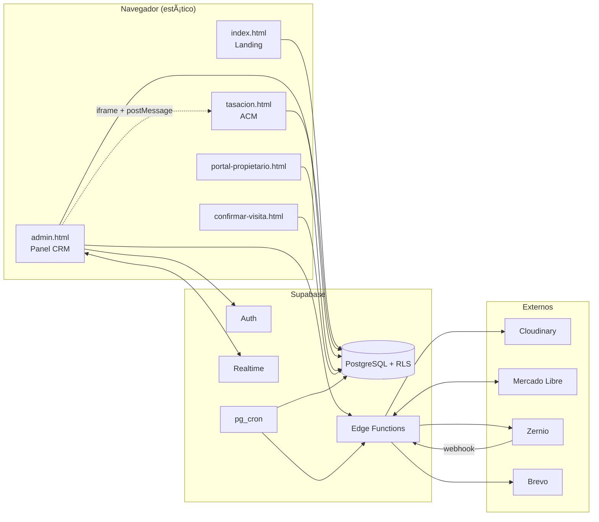
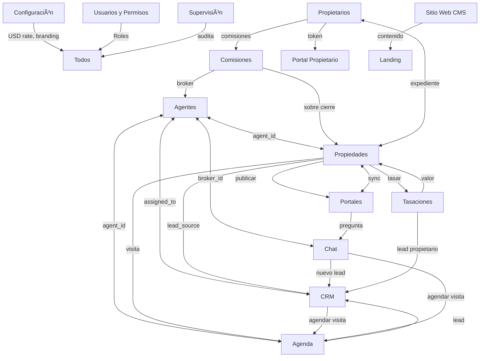

# 🏠 BIENENHAUS PROPIEDADES

**Landing pública + CRM inmobiliario completo para una inmobiliaria premium de Buenos Aires**


🌐 **Sitio:** https://bienenhaus.com.ar

</div>

---

## 📑 Índice

1. [Descripción y alcance](#-descripción-y-alcance)
2. [Funcionalidades del sistema](#-funcionalidades-del-sistema)
3. [Stack tecnológico](#-stack-tecnológico)
4. [Arquitectura](#-arquitectura)
5. [Páginas y URLs](#-páginas-y-urls)
6. [Estructura del proyecto](#-estructura-del-proyecto)
7. [Instalación y puesta en marcha](#-instalación-y-puesta-en-marcha)
8. [Base de datos](#-base-de-datos)
9. [Roles y permisos](#-roles-y-permisos)
10. [Seguridad](#-seguridad)
11. [Panel administrativo (14 módulos)](#-panel-administrativo-14-módulos)
12. [Landing pública](#-landing-pública)
13. [Portal del Propietario](#-portal-del-propietario)
14. [Confirmación de visitas](#-confirmación-de-visitas)
15. [Tasaciones (ACM)](#-tasaciones-acm)
16. [Comisiones y liquidaciones](#-comisiones-y-liquidaciones)
17. [Integración Mercado Libre](#-integración-mercado-libre)
18. [Chat omnicanal (Zernio)](#-chat-omnicanal-zernio)
19. [Centro de Supervisión](#-centro-de-supervisión)
20. [Edge Functions](#-edge-functions)
21. [Migraciones](#-migraciones)
22. [Flujos end-to-end](#-flujos-end-to-end)
23. [Patrones técnicos](#-patrones-técnicos)
24. [Deploy](#-deploy)
25. [Testing y CI](#-testing-y-ci)
26. [Convenciones de desarrollo](#-convenciones-de-desarrollo)
27. [Deudas técnicas y roadmap](#-deudas-técnicas-y-roadmap)
28. [ADRs](#-adrs-architecture-decision-records)
29. [Documentación complementaria](#-documentación-complementaria)
30. [Changelog](#-changelog)

---

## 📌 Descripción y alcance

**BIENENHAUS PROPIEDADES** es un sistema web integral para una inmobiliaria. Combina en un solo repositorio:

| Componente | Descripción |
|---|---|
| **Landing pública** | Sitio comercial con catálogo dinámico de propiedades, servicios, equipo, proceso, estadísticas y formulario de contacto que genera leads. |
| **Panel administrativo / CRM** | SPA de 14 módulos para gestionar propiedades, leads, visitas, propietarios, agentes, tasaciones, comisiones, portales, chat y supervisión. |
| **Portal del Propietario** | Acceso por token (sin login) donde el dueño ve sus propiedades, documentos, comisiones y liquidaciones. |
| **Confirmación de visita** | Página pública por token para que el cliente confirme o cancele una visita. |
| **Herramienta de tasación (ACM)** | Análisis Comparativo de Mercado con comparables, mapa, coeficientes y gráficos. |
| **Integraciones** | Mercado Libre (publicación y sync), Zernio (WhatsApp/Instagram/Facebook/Web), Cloudinary (imágenes), Brevo (emails). |

### Alcance funcional

- ✅ Gestión completa del ciclo comercial: **captación → tasación → publicación → lead → visita → cierre → comisión**.
- ✅ Multi-rol (`super_admin`, `broker`, `agente`) con seguridad a nivel de fila (RLS).
- ✅ CMS integrado: el contenido del landing se edita desde el panel sin tocar código.
- ✅ Publicación y sincronización bidireccional con Mercado Libre.
- ✅ Inbox unificado de mensajería (WhatsApp, Instagram, Facebook, Web).
- ✅ Auditoría, detección de anomalías y scoring de riesgo por usuario.
- ✅ Sin build step: se despliega como sitio estático.

### Fuera de alcance (actual)

- ❌ Envío saliente de mensajes por Zernio (pendiente de API key real; la recepción sí funciona).
- ❌ Notificaciones push reales (Web Push/VAPID, requiere Service Worker).
- ❌ Uso del `usd_rate` en las tarjetas del catálogo del landing.

---

## ⚙️ Funcionalidades del sistema

### 🌐 Público (sin login)
- Catálogo dinámico con filtros server-side (tipo, zona, precio, dormitorios), orden, paginación y *virtual scroller*.
- Galería de imágenes por propiedad.
- Formulario de contacto → inserta un `lead` (origen `landing_page` / `newsletter`).
- Botón flotante de WhatsApp.
- SEO: meta tags, Open Graph, `schema.org/RealEstateAgent`, `sitemap.xml`, `robots.txt`.
- Confirmar / cancelar visita por token.
- Portal del propietario por token.

### 🔐 Administración
| Área | Funciones |
|---|---|
| **Dashboard** | KPIs (volumen venta USD, volumen alquiler ARS, propiedades activas, leads, visitas), gráficos y acciones rápidas. |
| **Propiedades** | CRUD, borradores, reordenamiento, soft-delete, publicación a ML, paginación server-side, validación Zod, precios ARS/USD, superficie cubierta/terreno. |
| **Leads & CRM** | Pipeline Kanban, tags, scoring, exportación CSV, agendado directo de visitas. |
| **Agenda** | Calendario mensual + tabla, check-in/check-out, export CSV/ICS, recordatorios. |
| **Tasaciones** | ACM embebido en iframe + listado de tasaciones. |
| **Propietarios** | Expedientes, documentos con vencimiento/verificación, timeline, export CSV/PDF, link de portal. |
| **Sitio Web (CMS)** | 11 sub-tabs: Hero, Catálogo, Servicios, Equipo, Stats, Proceso, Contacto, Formulario, Navbar, Footer, SEO. |
| **Portales & APIs** | OAuth ML, configuración por portal, sync, dead-letter, importación desde ML. |
| **Agentes & Brokers** | CRUD, matrícula, comisiones de venta/alquiler, soft-delete, vínculo con `profiles`. |
| **Chat Redes** | Inbox unificado, crear lead, agendar visita, asignar broker. |
| **Ficha HTML** | Generador de fichas visuales por propiedad (compartir, PDF, HTML autocontenido). |
| **Usuarios & Permisos** | Alta, edición, roles y cambio de contraseña vía Edge Function. |
| **Configuración** | Identidad corporativa, contacto, redes, tipo de cambio USD, estado de integraciones. |
| **Supervisión** | Reglas, alertas, anomalías, ranking de riesgo, métricas ML. |

### 🛠️ Transversales
- Búsqueda global (`Ctrl+K`) con navegación por teclado.
- Notificaciones con badges por tab y contador en favicon.
- Realtime multi-tab en tablas core.
- Auditoría de escrituras y acciones sensibles.
- Rate limiting en Edge Functions.

---

## 🧰 Stack tecnológico

| Capa | Tecnología |
|---|---|
| **Frontend** | Vanilla JS (scripts clásicos con IIFE y globals `window.*`, **sin ES Modules ni bundler**), CSS custom properties, Font Awesome 6.5.1, Zod 3 (solo admin) |
| **Backend** | Supabase: PostgreSQL + Auth (email/contraseña) + Row Level Security + Realtime + Edge Functions (Deno) |
| **Imágenes** | Cloudinary (uploads firmados server-side, `f_auto,q_auto`, WebP) |
| **Portales** | Mercado Libre (OAuth 2.0, cron sync, webhooks, auto-reply) |
| **Mapas y gráficos** | Leaflet 1.9.4 + Chart.js 4.4.0 (CDN, en `tasacion.html`) |
| **Email** | Brevo (SMTP) para resúmenes de supervisión |
| **Chat** | Zernio (WhatsApp, Instagram, Facebook, Web) |
| **Deploy** | Cloudflare Pages (estático) + Supabase Edge Functions |
| **Testing** | Playwright (E2E) + `node --check` |
| **CI/CD** | GitHub Actions |

---

## 🏗️ Arquitectura

### Principios

1. **Vanilla JS sin build step**: deploy directo de estáticos, cache busters `?v=N`.
2. **Supabase como backend único**: Auth, DB, Realtime y Edge Functions.
3. **RLS como seguridad principal**: todas las tablas tienen RLS; el frontend nunca ve secretos.
4. **Realtime para reactividad**: `setupCoreRealtime` suscribe las tablas core.
5. **Configuración centralizada**: `app_settings` + `site_content` como fuente de verdad.
6. **Secretos solo en Edge Functions**: tokens ML/Zernio, Cloudinary, Brevo y service role nunca llegan al navegador.
7. **IDs de responsable unificados**: `properties.agent_id`, `leads.assigned_to`, `visits.agent_id` y `zernio_conversations.broker_id` apuntan a `agents.id`.
8. **Auditoría y supervisión integradas**.

### Diagrama de arquitectura



### Grafo de módulos



### Entidades compartidas

| Entidad | Tabla | Módulos que la usan |
|---|---|---|
| Usuario/Perfil | `profiles` | Todos |
| Broker | `agents` | Propiedades, CRM, Agenda, Chat, Comisiones |
| Propiedad | `properties` | Propiedades, CRM, Agenda, Portales, Tasaciones, Portal Propietario |
| Lead | `leads` | CRM, Agenda, Chat, Landing |
| Visita | `visits` | Agenda, CRM, Confirmar Visita |
| Conversación | `zernio_conversations` | Chat, CRM |
| Propietario | `owners` | Propietarios, Portal, Comisiones |
| Tasación | `tasaciones` | Tasaciones, Portal |
| Comisión | `commissions` / `commission_liquidations` | Comisiones, Portal |
| Publicación ML | `ml_listings` | Portales, Propiedades |
| Config/Contenido | `app_settings`, `site_content` | Config, CMS, Landing |

---

## 🔗 Páginas y URLs

| Archivo | URL / Acceso | Propósito |
|---|---|---|
| `index.html` | https://bienenhaus.com.ar | Landing: hero, catálogo, servicios, equipo, proceso, stats, contacto |
| `admin.html` | `/admin.html` | Panel administrativo SPA (14 tabs, hash routing) |
| `tasacion.html` | `/tasacion.html?id=<uuid>` | ACM; se abre embebido en iframe desde `tab-tasaciones` |
| `portal-propietario.html` | `/portal-propietario.html?token=<uuid>` | Portal del propietario por token |
| `confirmar-visita.html` | `/confirmar-visita.html?token=<uuid>` | Confirmación/cancelación de visita |

---

## 📁 Estructura del proyecto

```
BH-OFICIAL/
├── index.html                    # Landing pública
├── admin.html                    # Panel administrativo (SPA por tabs)
├── tasacion.html                 # ACM de tasación (autónomo, embebible)
├── portal-propietario.html       # Portal del propietario (token)
├── confirmar-visita.html         # Confirmación de visita (token)
├── CNAME                         # Dominio custom (Cloudflare Pages)
├── favicon.ico · robots.txt · sitemap.xml · .nojekyll
├── deno-stubs.d.ts               # Tipos auxiliares para Edge Functions
├── playwright.config.js          # Configuración E2E
├── package.json · package-lock.json
│
├── assets/
│   ├── css/
│   │   ├── landing.css           # Design system del landing
│   │   └── admin.css             # Estilos del panel (incluye calendario)
│   ├── js/
│   │   ├── config.js             # window.BH_CONFIG (Supabase URL + anon key)
│   │   ├── supabase-client.js    # Init de window.supabaseClient
│   │   ├── utils.js              # BHUtils: esc, escAttr, safeUrl, safeImageUrl, safeCssUrl
│   │   ├── cloudinary.js         # Upload firmado (window.BH_Cloudinary)
│   │   ├── zod.umd.js            # Zod 3 (solo admin)
│   │   ├── landing-app.js        # Catálogo, filtros, CMS, contacto → leads
│   │   └── admin-app.js          # Panel completo (~14k líneas)
│   ├── images/                   # favicon, hero-bg.webp, pwa-512x512.png
│   └── img/                      # logo-bh.png
│
├── supabase/
│   ├── functions/                # Edge Functions (Deno) + _shared/
│   └── migrations/               # Migraciones SQL versionadas
│
├── tests/                        # Suite E2E Playwright
├── scripts/                      # Scripts auxiliares
├── fichas/                       # Fichas HTML de propiedades
├── docs/integrations/            # Documentación de integraciones
├── .well-known/                  # Archivos de verificación de dominio
├── .github/workflows/            # CI (deploy.yml)
│
└── *.md                          # AUDITORIA_MODULOS, AUDIT_FINDINGS, AUDIT_INVENTORY,
                                  # CLOUDFLARE_SETUP, CONECTAR_ZERNIO_CHAT,
                                  # REMEDIATION_PLAN, XSS_REVIEW
```

> Carpetas de tooling que **no** se versionan: `.codegraph/`, `.omo/`, `.playwright-mcp/`, `supabase/.temp/`, `node_modules/`, `*.log`, `.env.local`, `test-results/`, `playwright-report/`.

---

## 🚀 Instalación y puesta en marcha

### Requisitos

- Cualquier servidor estático (Python, `npx serve`, etc.)
- Node.js ≥ 18 (solo para lint y tests)
- [Supabase CLI](https://supabase.com/docs/guides/cli) (solo para migraciones y Edge Functions)

### Local

```bash
# 1. Clonar
git clone https://github.com/facuherrera23/BH-OFICIAL.git
cd BH-OFICIAL

# 2. Servir estáticamente (no hay build)
python -m http.server 8788

# 3. Abrir
#   Landing → http://localhost:8788/index.html
#   Admin   → http://localhost:8788/admin.html
```

### Herramientas de desarrollo (opcional)

```bash
npm install                        # Playwright y supabase-js (devDependencies)
npx playwright install chromium    # navegador para E2E
npm run lint                       # node --check de admin-app.js y landing-app.js
npm test                           # suite E2E
```

### Configuración del frontend

`assets/js/config.js`:

```js
window.BH_CONFIG = {
  SUPABASE_URL: 'https://<tu-proyecto>.supabase.co',
  SUPABASE_ANON_KEY: '<anon-key>'   // clave pública por diseño: la seguridad la da RLS
};
```

- `supabase-client.js` crea `window.supabaseClient` con el CDN `@supabase/supabase-js@2`. Sin CDN o sin `BH_CONFIG`, loguea el error y **no** expone el cliente (*fail-closed*).
- `utils.js` expone `window.BHUtils` (solo helpers de seguridad/URL) y se carga **antes** que `landing-app.js` / `admin-app.js`.
- `cloudinary.js` expone `window.BH_Cloudinary = { uploadImage, uploadImages }` (firma vía Edge Function `cloudinary-sign`).

### Usuarios

Los usuarios se crean desde el propio panel (**Usuarios & Permisos**) mediante la Edge Function `manage-users`. El rol se guarda en `profiles.role`.

### Variables de entorno de Edge Functions (secrets de Supabase)

| Variable | Uso |
|---|---|
| `SUPABASE_SERVICE_ROLE_KEY` | Operaciones privilegiadas |
| `CRYPTO_SECRET` | Derivación PBKDF2 para AES-256-GCM (tokens ML) |
| Credenciales Cloudinary | Firma de uploads |
| Credenciales Mercado Libre | OAuth y API |
| API key + webhook secret Zernio | Guardados en `zernio_config` |
| Credenciales Brevo | Envío de digest |

> Nunca se commitean: se cargan con `supabase secrets set`.

---

## 🗄️ Base de datos

PostgreSQL gestionado por Supabase. **37 tablas en el esquema `public`, todas con RLS activada** (verificado contra producción el 2026-08-28).

### Diagrama entidad-relación (núcleo de negocio)

> Se muestran las relaciones y los campos documentados en el proyecto. Los campos completos están en `supabase/migrations/`.

```mermaid
erDiagram
    AUTH_USERS ||--o| PROFILES : "id"
    PROFILES ||--o| AGENTS : "profile_id"
    AGENTS ||--o{ PROPERTIES : "agent_id"
    AGENTS ||--o{ LEADS : "assigned_to"
    AGENTS ||--o{ VISITS : "agent_id"
    AGENTS ||--o{ ZERNIO_CONVERSATIONS : "broker_id"
    AGENTS ||--o{ COMMISSIONS : "broker"

    OWNERS ||--o{ PROPERTIES : "owner_id"
    OWNERS ||--o{ OWNER_PORTAL_TOKENS : "acceso"
    OWNERS ||--o{ OWNER_TIMELINE_ENTRIES : "eventos"

    PROPERTIES ||--o{ VISITS : "property_id"
    PROPERTIES ||--o| ML_LISTINGS : "publicación"
    PROPERTIES ||--o{ TASACIONES : "valoración"
    PROPERTIES ||--o{ COMMISSIONS : "cierre"

    LEADS ||--o{ VISITS : "lead_id"
    ZERNIO_ACCOUNTS ||--o{ ZERNIO_CONVERSATIONS : "cuenta"
    ZERNIO_CONVERSATIONS ||--o{ ZERNIO_MESSAGES : "mensajes"

    COMMISSION_LIQUIDATIONS ||--o{ COMMISSIONS : "agrupa"
    COMMISSIONS ||--o{ COMMISSION_PAYMENTS : "pagos"

    PROFILES {
        uuid id PK
        user_role role "super_admin | broker | agente"
    }
    AGENTS {
        uuid id PK
        uuid profile_id FK
        text matricula
        numeric commission_sale
        numeric commission_rent
        timestamptz deleted_at "soft-delete"
    }
    PROPERTIES {
        uuid id PK
        text code "secuencial (property_sequences)"
        text status "draft|publicada|vendida|alquilada|pausada"
        uuid agent_id FK
        uuid owner_id FK
        jsonb images
        numeric price_ars "generated column"
        jsonb portal_settings
        timestamptz deleted_at "soft-delete"
    }
    OWNERS {
        uuid id PK
        text dni_cuit
        jsonb documents "expiración y verificación"
    }
    LEADS {
        uuid id PK
        text source "landing_page|newsletter|ml|chat|..."
        text stage "nuevo|contactado|visita|oferta|..."
        text_array tags
        int score
        uuid assigned_to FK
    }
    VISITS {
        uuid id PK
        uuid lead_id FK
        uuid property_id FK
        uuid agent_id FK
        text status "pendiente|confirmada|completada|cancelada"
        uuid confirmation_token UK
        timestamptz confirmed_at
        text cancel_reason
    }
    TASACIONES {
        uuid id PK
        jsonb data "ACM completo"
        text status "borrador|en_revision|entregada|vencida"
    }
    COMMISSIONS {
        uuid id PK
        text status "pendiente|liquidada|pagada"
    }
    ZERNIO_CONVERSATIONS {
        uuid id PK
        text platform "IG|FB|WA|Web"
        uuid broker_id FK "auto-asignado por trigger"
    }
```



### Tablas por dominio

#### 🏢 Núcleo de negocio

| Tabla | Descripción |
|---|---|
| `properties` | Propiedades (draft/publicada/vendida/alquilada/pausada), imágenes JSONB, `agent_id`, `owner_id`, `portal_settings`, `price_ars` generada |
| `agents` | Asesores/brokers: matrícula, `commission_sale`/`commission_rent`, `profile_id`, soft-delete `deleted_at` |
| `owners` | Propietarios: DNI/CUIT, documentos JSONB (vencimiento y verificación) |
| `leads` | Pipeline CRM: `source`, `stage`, `tags`, `score`, `assigned_to` |
| `visits` | Visitas: estados, `agent_id`, `confirmation_token`, check-in/out |
| `tasaciones` | ACM: `data` JSONB, valoración USD/ARS, estado borrador/en_revision/entregada/vencida |
| `commissions` | Comisiones por cierre (pendiente/liquidada/pagada) |
| `commission_liquidations` | Liquidaciones mensuales |
| `commission_payments` | Pagos registrados |
| `ml_listings` | Publicaciones Mercado Libre (sync, dedup) |
| `property_sequences` | Secuencia de códigos de propiedad (solo `service_role`) |

#### 🎨 CMS y configuración

| Tabla | Descripción |
|---|---|
| `site_content` | Contenido por sección del landing: hero, services, team, process, stats, contact, footer, social |
| `portal_settings` | CMS en vivo del landing (hero, servicios, stats, testimonios). Lectura solo autenticada |
| `app_settings` | Ajustes globales key/value JSONB: `preferences` (incl. `usd_rate`), `features`, `integrations` |
| `profiles` | Perfiles vinculados a `auth.users` con campo `role` |

#### 💬 Chat Zernio

| Tabla | Descripción |
|---|---|
| `zernio_config` | Secretos del módulo (API key, webhook secret). RLS sin policies: solo `service_role` |
| `zernio_accounts` | Espejo de cuentas sociales conectadas |
| `zernio_conversations` | Hilos DM unificados (IG/FB/WA/Web); `broker_id` auto-asignado por trigger |
| `zernio_messages` | Mensajes; escritura solo vía Edge Functions |
| `zernio_webhook_events` | Deduplicación de eventos (`payload.id` único) |

#### 🛡️ Supervisión y auditoría

| Tabla | Descripción |
|---|---|
| `audit_log` | Registro de auditoría de escrituras y acciones sensibles (con cadena de integridad) |
| `supervision_rules` | Reglas configurables de detección (solo `super_admin`) |
| `supervision_alerts` | Alertas operativas generadas por reglas |
| `supervision_baselines` | Baselines estadísticos |
| `supervision_anomalies` | Anomalías detectadas (ML/estadística) |
| `supervision_anomaly_config` | Configuración del detector |
| `user_risk_scores` | Score de riesgo por usuario, con factores explicables |
| `user_sessions` | Sesiones registradas |
| `api_key_audit` | Auditoría de uso de API keys |
| `usage_events` | Métricas de uso (append-only) |
| `ml_model_metrics` | Métricas del modelo (precision, recall, F1) |
| `ml_predictions_log` | Log de predicciones |
| `rate_limit_logs` | Sliding window del rate limiter |
| `notification_preferences` | Preferencias por usuario (email/push/slack) |

#### 📂 Portal del Propietario y documentos

| Tabla | Descripción |
|---|---|
| `owner_portal_tokens` | Tokens de acceso al portal (validación + expiración) |
| `document_requirements` | Requisitos documentales por tipo de operación |
| `owner_timeline_entries` | Timeline de comunicaciones y eventos |

### Triggers y lógica en base de datos

| Trigger / Función | Efecto |
|---|---|
| `guard_profiles_self_update` | Impide la auto-elevación de rol |
| `trg_visits_sync_lead_stage` | Crear visita → lead pasa a `visita` |
| `trg_visits_lead_cancel_revert` | Cancelar visita → lead vuelve a `contactado` |
| `trg_visits_lead_completed_auto` | Completar visita → sugiere `oferta` |
| Triggers `BEFORE INSERT` en chat | Auto-asignan `broker_id` |
| `set_property_code` / `generate_property_code` | Código secuencial de propiedad |
| `get_sidebar_badge_counts` (RPC, SECURITY DEFINER) | Contadores del sidebar respetando RLS |
| `count_pending_visits_for_lead`, `is_super_admin` | Helpers de negocio y permisos |

### Vistas (`security_invoker = true`)

`ml_model_performance`, `daily_user_activity`, `daily_module_activity`, `open_alerts_by_user`, `my_assigned_alerts`, `purge_audit_log`, `supervision_anomalies_recent`, `current_user_risk_scores`.

### Políticas RLS destacadas

| Tabla | Política |
|---|---|
| `properties` | Lectura pública de las publicadas (`TO public`); escritura autenticada |
| `leads` | `INSERT` anónimo solo con `source IN ('landing_page','newsletter')` |
| `visits` | `SELECT/UPDATE` anónimo por `confirmation_token`; resto vía JOIN `agents.profile_id = auth.uid()` |
| `owners` | `SELECT` super_admin/broker; `INSERT/UPDATE/DELETE` solo super_admin |
| `tasaciones` | Solo `authenticated` y `service_role` (sin acceso anónimo) |
| `portal_settings` | Lectura solo autenticada (sin fuga de secretos) |
| `zernio_config`, `property_sequences` | Sin policies: solo `service_role` (intencional) |
| `supervision_rules` | Gestión exclusiva de `super_admin` |

---

## 👥 Roles y permisos

El permiso se resuelve con `profiles.role` (enum `user_role`):

| Rol | Alcance |
|---|---|
| `super_admin` | Acceso total, gestión de usuarios, ajustes sensibles y supervisión |
| `broker` | Gestión operativa completa y sus asignaciones (`agents.profile_id = auth.uid()`) |
| `agente` | Solo sus propias asignaciones |

**Chat:** `super_admin` ve todo; `broker` solo las conversaciones donde `broker_id` corresponde a su agente.

---

## 🔒 Seguridad

- **RLS en las 37 tablas**; lectura pública solo donde corresponde.
- **Hardening de funciones**: `search_path` fijo, `REVOKE ALL` a `PUBLIC` y `anon` en 44 funciones, con `GRANT` explícitos.
- **XSS**: `esc()` obligatorio antes de todo `innerHTML`; `safeUrl` / `safeImageUrl` / `safeCssUrl` para atributos. Ver `XSS_REVIEW.md`.
- **CSP** verificada por tests en las 5 páginas.
- **Autenticación por token** en portal y confirmación de visita.
- **Sesión cruzada por iframe**: `postMessage` con `targetOrigin` explícito y verificación de `event.origin`.
- **Edge Functions**: `verify_jwt` según función, chequeo de rol vía service role y rate limiting.
- **Secretos**: solo en Edge Functions (`Deno.env.get`), tokens ML cifrados con AES-256-GCM.
- **Auditoría**: `audit_log` con cadena de integridad + `api_key_audit`.

---

## 🖥️ Panel administrativo (14 módulos)

SPA con hash routing (`#tab-dashboard`) y sidebar en 4 categorías: **Principal**, **Gestión & CRM**, **Red & Difusión** y **Sistema**.

| # | Módulo | Tab ID |
|---|---|---|
| 1 | Dashboard | `tab-dashboard` |
| 2 | Propiedades | `tab-propiedades` |
| 3 | Leads & CRM | `tab-leads` |
| 4 | Agenda de Visitas | `tab-agenda` |
| 5 | Tasaciones | `tab-tasaciones` |
| 6 | Propietarios | `tab-propietarios` |
| 7 | Sitio Web (CMS) | `tab-sitio-web` |
| 8 | Portales & APIs | `tab-portales` |
| 9 | Agentes & Brokers | `tab-agentes` |
| 10 | Chat Redes | `tab-chat-redes` |
| 11 | Ficha HTML | `tab-ficha-html` |
| 12 | Usuarios & Permisos | `tab-usuarios` |
| 13 | Configuración | `tab-configuracion` |
| 14 | Centro de Supervisión | `tab-supervision` |

### API global `window.adminApp`

Expone los handlers al HTML (39 métodos):

- **Entidades:** `edit*` / `delete*` para propiedades, leads, propietarios, visitas y agentes.
- **Propietarios:** `exportOwnersCSV`, `exportOwnersPDF`, `generateOwnerPortalLink`, `deleteOwnerDoc`, `deleteTimelineEntry`.
- **Visitas:** `openVisitModal`, `checkinVisit`, `checkoutVisit`, `exportVisitsCSV`, `exportVisitsICS`.
- **Comisiones:** `markCommissionPaid`, `markLiquidationPaid`, `deletePayment`, `viewCommissionLiquidation`, `viewLiquidationPDF`.
- **Portales/ML:** `mlConnect`, `mlDisconnect`, `mlSaveCredentials`, `mlPublishProperty`, `mlRemoveProperty`, `mlUpdateProperty`, `mlToggleConfig`, `mlImportFromML`, `togglePortal`, `openPortalConfig`.
- **Chat:** `openChatConversation`.
- **Supervisión:** `loadSupervision`, `loadAnomaliesTable`.

### Navegación y estado

- Tabs con hash routing y persistencia en `localStorage`.
- Búsqueda global `Ctrl+K` con resaltado.
- Panel de notificaciones, badges en tabs y contador en favicon.
- Badges del sidebar en vivo vía RPC `get_sidebar_badge_counts`.

### 🧩 Módulo Sitio Web (CMS)

11 sub-tabs (Hero, Catálogo, Servicios, Equipo, Stats, Proceso, Contacto, Formulario, Navbar, Footer, SEO). Guarda en `site_content` y `portal_settings`; el landing re-renderiza con `applySectionContent()` y caché invalidable (`invalidateCmsCache`, `getCachedCMS`).

### 🧩 Módulo Ficha HTML

- Layout de dos columnas: formulario + preview 1:1 (responsive 1200/1024/680px).
- Autocompletado desde el CRM (debounce 250 ms) y drag & drop de fotos.
- Tres exportaciones: `navigator.share`, `window.print` (PDF) y HTML autocontenido descargable.

### 🧩 Módulo Configuración

| Sección | Destino |
|---|---|
| Identidad corporativa | `site_content.footer` (razón social, matrícula, CUIT) |
| Contacto digital | `site_content.contact` (WhatsApp, email, teléfono, dirección, horario) |
| Redes sociales | `site_content.social` (URL vacía = icono oculto) |
| Preferencias | `app_settings.preferences.usd_rate` |
| Sistema e integraciones | Chips de estado: Supabase, Cloudinary, ML, Zernio |
| Sesión activa | Usuario, rol y cierre de sesión |

El guardado valida, hace *deep merge* (preserva claves no editadas) y hace UPDATE/INSERT. Sin `super_admin`, los campos quedan deshabilitados.

---

## 🌍 Landing pública

Consume `site_content` y `portal_settings` desde `landing-app.js`.

- Catálogo dinámico con filtros server-side, orden, paginación y virtual scroller.
- Galería con thumbnails y navegación.
- Formulario de contacto → `leads`, con pills de interés y validación.
- Secciones de stats, equipo, servicios y proceso desde el CMS.
- Imágenes con Cloudinary (`f_auto,q_auto`) y lazy loading.
- Mobile-first con menú móvil y botón flotante de WhatsApp.
- SEO completo (meta, Open Graph, `schema.org`, sitemap, robots).

---

## 🏡 Portal del Propietario

`portal-propietario.html?token=<uuid>` — acceso **sin login**.

- Valida token y expiración (`owner_portal_tokens`); muestra error si es inválido.
- Lista las propiedades del propietario.
- Muestra documentos (`document_requirements` + `owners.documents`).
- Muestra comisiones y liquidaciones (pendiente / liquidada / pagada).
- El link lo genera el admin con `generateOwnerPortalLink`.

---

## ✅ Confirmación de visitas

`confirmar-visita.html?token=<uuid>` usa `visits.confirmation_token`.

| Acción | Resultado |
|---|---|
| **Confirmar** | `status = 'confirmada'`, `confirmed_at = now()` |
| **Cancelar** | `status = 'cancelada'`, `cancel_reason = 'Cancelado por cliente'` |

Muestra cliente, fecha/hora y estado visual (pendiente / confirmada / completada / cancelada).

---

## 📐 Tasaciones (ACM)

`tasacion.html` es una herramienta autónoma de Análisis Comparativo de Mercado:

- **Comparables**: alta manual, extracción por URL, carga y renovación de fotos.
- **Mapa** (Leaflet) con búsqueda por dirección (geocoding).
- **Características** (ambientes, uso de terreno) y **coeficientes** (condiciones, depreciación) con recálculo en vivo.
- **Gráficos** (Chart.js) de análisis comparativo.
- **Guardado** en `tasaciones` (`data` JSONB + estado + valoración USD/ARS).
- **Sesión** recibida del admin vía `postMessage`; notifica con `tasaciones-finalized` y `tasaciones-back`.

---

## 💰 Comisiones y liquidaciones

- Tablas: `commissions`, `commission_liquidations` (mensual), `commission_payments`.
- Edge Functions: `trigger_commission_on_close` (crea la comisión al cerrar la propiedad) y `monthly_commission_liquidation` (cierre mensual).
- Porcentajes por agente: `commission_sale` y `commission_rent`.
- Admin: marcar como pagada, liquidar, ver PDF de liquidación, eliminar pagos, filtrar por broker/estado.
- El Portal del Propietario muestra el estado.

---

## 🛒 Integración Mercado Libre

1. **Conexión OAuth 2.0** → `mlConnect` (tab Portales).
2. **Publicación** → `mlPublishProperty` con validación de campos y fotos.
3. **Sincronización** → Edge Function `ml-sync` (cron, lotes de 50): precio, stock y estado, en ambas direcciones.
4. **Auto-reply** → plantillas por tipo de pregunta con variables.
5. **Webhook** → firmado y con deduplicación; *dead-letter queue* visible.
6. **Importación inversa** → `mlImportFromML` trae publicaciones que existen en ML pero no en el CRM.

Los tokens se guardan cifrados (AES-256-GCM) y nunca llegan al frontend.

---

## 💬 Chat omnicanal (Zernio)

**Estado:** recepción validada en producción (HMAC, dedup, persistencia, auditoría). El envío saliente espera una API key real.

| Componente | Ubicación | Estado |
|---|---|---|
| Webhook receptor | `supabase/functions/zernio-webhook` | ✅ `verify_jwt` OFF |
| Proxy API | `supabase/functions/zernio-proxy` | ✅ `verify_jwt` ON |
| Test de webhook | `supabase/functions/zernio-webhook-test` | ✅ |
| Frontend | tab Chat Redes (`admin-app.js`) | ✅ `super_admin` y `broker` |
| Base de datos | 5 tablas `zernio_*` | ✅ RLS + triggers |
| Guía | `CONECTAR_ZERNIO_CHAT.md` | ✅ |

**Acciones del inbox:** ver contexto lateral (propiedad/lead/visitas), crear lead, agendar visita, asignar broker, marcar leído y enviar mensaje.

---

## 🛡️ Centro de Supervisión

- **Reglas configurables** ejecutadas con `pg_cron` (solo `super_admin`).
- **Alertas** con severidad y asignación.
- **Anomalías** estadísticas/ML (`supervision-ml-anomaly` + baselines).
- **Risk scoring** por usuario con factores explicables.
- **Notificaciones** push/email y **digest diario** vía Brevo.
- **API de consulta** (`supervision-api`, límite 60 req/min).
- **Métricas ML** y de uso.
- **Retención y purga** (`purge_policy`).

---

## âš¡ Edge Functions

### Helpers compartidos (`_shared/`)

| Archivo | Propósito |
|---|---|
| `auth.ts` | `requireAdmin` / `isAdmin`: valida Bearer JWT + rol |
| `cors.ts` · `http.ts` | Headers CORS, `jsonResponse`, `optionsResponse`, allowlist de origins |
| `crypto.ts` | AES-256-GCM (clave PBKDF2 derivada de `CRYPTO_SECRET`) |
| `ml.ts` · `ml.schemas.ts` | Cliente API Mercado Libre + schemas Zod |
| `rate-limit.ts` | Sliding window log en `rate_limit_logs` |
| `audit.ts` | `auditEvent`, `auditSensitiveAction`, `trackToolUsage`, `auditError` |

### Funciones versionadas en el repo

| Función | JWT | Propósito |
|---|---|---|
| `cloudinary-sign` | ON + admin | Firma uploads con allowlist de carpetas |
| `manage-users` | ON + super_admin | `invite`, `create-direct`, `set-role`, `update-user`, `update-self` |
| `ml-sync` | cron | Sync con Mercado Libre |
| `cron_exclusivity_renewals` | cron | Avisos de exclusividades por vencer |
| `monthly_commission_liquidation` | cron | Liquidación mensual |
| `trigger_commission_on_close` | evento | Crea comisión al cerrar |
| `supervision-api` | ON | Consultas del Centro de Supervisión |
| `supervision-digest` | cron | Resumen diario por Brevo |
| `supervision-ml-anomaly` | ON | Detección de anomalías |
| `supervision-notifications` | ON | Push/email de alertas críticas |
| `supervision-notify` | cron | Dispara notificaciones |
| `zernio-proxy` | ON | `send_message`, `mark_read`, `list_accounts`, `backfill_*` |
| `zernio-webhook` | OFF | Recibe webhooks (HMAC, dedup, persistencia) |
| `zernio-webhook-test` | OFF | Test de configuración |

### Desplegadas en producción sin fuente en el repo

`ml-oauth`, `ml-callback`, `ml-auth`, `ml-api`, `ml-config`, `ml-categories`, `ml-listing-types`, `ml-metrics`, `ml-answer-question`, `ml-bulk-enqueue`, `ml-revoke-tokens`, `ml-import-listings`, `ml-sync-import`, `ml-webhook`.

> Las funciones huérfanas `qr-checkin`, `visits-process-reminders`, `admin-user-invite`, `audit-log`, `contact-submit`, `chat-ai`, `chat-upload`, `convert-image` y `process-retention-policies` se eliminaron de producción el 2026-08-30.

---

## 🧬 Migraciones

`supabase/migrations/` (orden cronológico):

| Migración | Contenido |
|---|---|
| `20260824000001_audit_system_foundation` | Base de auditoría (`audit_log`, usuarios, sesiones) |
| `20260824000002_supervision_rules_defaults` | Reglas por defecto |
| `20260824000003_pg_cron_supervision_rules` | Cron de reglas |
| `20260824000004_risk_scoring_system` | `user_risk_scores` |
| `20260824000005_audit_integrity_chain` | Cadena de integridad del log |
| `20260824000006_notification_preferences` | Preferencias de notificación |
| `20260824000007_ml_metrics_dashboard` | Métricas ML |
| `20260824000008_supervision_repair` | Ajustes de supervisión |
| `20260824000009_supervision_alert_assignment` | Asignación de alertas |
| `20260824000010_supervision_notify_integration` | Integración de notificaciones |
| `20260824000011_purge_policy` | Retención y purga |
| `20260824000012_supervision_digest` | Digest diario |
| `20260824000013_supervision_anomaly_detection` (+ part1/part2) | Detección de anomalías |
| `20260824000016_api_key_audit_sessions` | Auditoría de API keys y sesiones |
| `20260826_propietarios_100pct` | Módulo propietarios completo |
| `20260826000001_cms_complete_landing` | CMS del landing |
| `20260827_chat_broker_access` | Acceso de brokers al chat |
| `20260827_fix_visits_rls` | Fix RLS de visitas |
| `20260827_unify_agent_ids` | Unificación de IDs → `agents.id` |
| `20260827_zernio_chat_completo` | Schema Zernio completo |
| `20260828_fix_owners_rls` | RLS de owners |
| `20260830_fix_properties_public_read` | Lectura pública de propiedades |
| `20260901000001_fix_p0_security_and_functional` | Hardening P0 (RLS, REVOKEs, vistas, policies anon) |

```bash
supabase migration list     # ver estado
supabase db push            # aplicar pendientes
```

---

## 🔄 Flujos end-to-end

### 1. Lead → Visita → Cierre

```mermaid
flowchart LR
    A[Landing / ML / Chat] --> B[Lead<br/>stage: nuevo]
    B --> C[Broker asignado<br/>contactado]
    C --> D[Visita agendada<br/>+ confirmation_token]
    D --> E[Cliente confirma<br/>confirmar-visita.html]
    E --> F[Check-in / Check-out]
    F --> G[Completada<br/>lead → oferta]
    G --> H[Cierre:<br/>vendida / alquilada]
    H --> I[Comisión<br/>automática]
```



### 2. Publicación en Mercado Libre

```
Propiedad → mlPublishProperty → validación → ml-sync (cron) → API ML
   → ml_listings → sync bidireccional (precio / stock / estado)
   → Webhook ML → preguntas → notificación al broker
   → Importación inversa: mlImportFromML
```

### 3. Tasación → Captación

```
tab-tasaciones → iframe tasacion.html?id= → ACM (comparables, mapa, coeficientes)
   → guardar en tasaciones → finalizar → postMessage al admin
   → Lead de captación → visita → contrato → propiedad publicada
```

### 4. Chat omnicanal

```
WhatsApp / IG / FB / Web → zernio-webhook (HMAC + dedup)
   → conversación + mensaje → Realtime → Inbox unificado
   → crear lead · agendar visita · asignar broker
```

### 5. Portal del Propietario

```
Admin: Propietarios → generateOwnerPortalLink → owner_portal_tokens
   → Propietario abre ?token= → propiedades, documentos, comisiones
   → Token vencido o inválido → mensaje de error
```

### 6. Supervisión

```
pg_cron → supervision_rules + baselines + ml-anomaly → alertas / anomalías
   → supervision-notify → supervision-notifications (push/email)
   → supervision-digest (Brevo) → tab Supervisión / supervision-api
```

---

## 🧱 Patrones técnicos

### `mutate(table, fn)`

Wrapper de escrituras: ejecuta la mutación, invalida la caché de búsqueda y emite un evento de cambio.

```js
await mutate('properties', () =>
  supabaseClient.from('properties').update(data).eq('id', id)
);
```

### Realtime

`setupCoreRealtime` suscribe `properties`, `leads`, `visits`, `agents`, `owners`, `tasaciones`, `commissions` y las tablas de Zernio para mantener varias pestañas sincronizadas sin polling.

### Helpers de seguridad (`window.BHUtils`)

`esc`, `escAttr`, `safeUrl` (http/https/mailto/tel/relativos), `safeImageUrl`, `safeCssUrl`.

### Validación con Zod

Solo en el admin, para formularios (ej. Agente con `commission_sale` / `commission_rent`).

### Reglas de negocio compartidas

| Regla | Fuente |
|---|---|
| Tipo de cambio USD | `app_settings.preferences.usd_rate` |
| Roles | `profiles.role` + RLS |
| Responsable | `agent_id` / `assigned_to` / `broker_id` → `agents.id` |
| Estados de propiedad | `properties.status` |
| Pipeline | `leads.stage` |
| Estado de visita | `visits.status` |
| Feature flags | `app_settings.features` |

---

## 🌥️ Deploy

### Cloudflare Pages

| Ajuste | Valor |
|---|---|
| Build command | *(vacío)* |
| Output directory | `/` |
| Dominio | `CNAME` → `bienenhaus.com.ar` |

Guía detallada: [`CLOUDFLARE_SETUP.md`](CLOUDFLARE_SETUP.md).

### Cache busters

Al modificar un JS o CSS, subir el `?v=N` en el HTML correspondiente (`admin-app.js`, `landing-app.js`, `admin.css`, `landing.css`, `config.js`, `utils.js`, etc.).

### Edge Functions

```bash
supabase functions deploy <slug>                  # verify_jwt ON (por defecto)
supabase functions deploy <slug> --no-verify-jwt  # webhooks y cron
```

---

## 🧪 Testing y CI

```bash
npm run lint    # node --check sobre admin-app.js y landing-app.js
npm test        # Playwright (19 tests)
```

La suite E2E corre **en modo lectura** contra producción (RLS protege las escrituras) y cubre:

- Catálogo con propiedades publicadas y búsqueda.
- Presencia del formulario de contacto.
- CSP de las 5 páginas.
- Regresión de delegación `data-action`.
- Smoke de tasaciones, portal y confirmar-visita.
- Admin (login, tabs, sesión persistente): **solo** con `BH_TEST_ADMIN_EMAIL` y `BH_TEST_ADMIN_PASSWORD`.

**CI** (`.github/workflows/deploy.yml`): `node --check` + `npm test` con Chromium headless. `html-validate` corre como informativo.

---

## 📏 Convenciones de desarrollo

- Scripts clásicos IIFE + globals (`BH_CONFIG`, `supabaseClient`, `BHUtils`, `BH_Cloudinary`, `adminApp`); sin ES Modules ni bundler.
- **Siempre** `esc()` antes de `innerHTML`; `safeUrl` / `safeImageUrl` en `href` / `src`.
- `async/await` con `try/catch` en cada llamada a Supabase o Edge Functions.
- Escrituras del admin con `mutate()` en lugar de `.insert/.update/.delete` directos.
- Suscripciones Realtime centralizadas en `setupCoreRealtime`.
- Subir el cache buster tras tocar JS/CSS.
- Ejecutar `npm run lint` antes de cada commit.
- Secretos únicamente en Edge Functions.

---

## 🧾 Deudas técnicas y roadmap

| Ítem | Impacto | Estado |
|---|---|---|
| Edge Functions desplegadas sin fuente en el repo (ML OAuth/API, etc.) | Mantenibilidad / drift | Pendiente: sincronizar el código |
| Cambios de `admin-app.js` sin commitear (`loadAnomaliesTable`, `supNewRuleBtn`) | Entrega | Commitear y subir cache buster |
| Commit `ed9c75c` sin pushear | Repo desincronizado | `git push` |
| Leaked Password Protection (Supabase Auth) | Seguridad | Activar en Dashboard → Auth (manual) |
| Zernio sin API key para envíos | Funcionalidad parcial | Falta credencial |
| `usd_rate` sin uso en tarjetas del landing | Feature | Conectar `fmtARS` cuando se necesite |
| Notificaciones push reales (Web Push / VAPID) | Futuro | Service Worker pendiente |
| Advisor: `rls_enabled_no_policy` en `property_sequences` y `zernio_config` | Info | Intencional (solo `service_role`) |
| Advisor: `pg_net` en `public` | Info | Requerida por Edge Functions |
| `admin-app.js` de ~14k líneas | Mantenibilidad | Candidato a dividirse por módulo |

---

## 📚 ADRs (Architecture Decision Records)

| ADR | Decisión | Razón |
|---|---|---|
| 001 | Vanilla JS + scripts clásicos IIFE | Deploy simple, sin build |
| 002 | Supabase como backend único | RLS nativo, DX unificada |
| 003 | `agent_id` en todas las entidades (→ `agents.id`) | Trazabilidad, comisiones, permisos |
| 004 | `source` + `tags` en leads | Flexibilidad de origen |
| 005 | Realtime centralizado | UI instantánea multi-tab |
| 006 | Config en `app_settings` + `site_content` | Fuente única de USD, branding y flags |
| 007 | Edge Functions para secretos | Nada sensible en el frontend |
| 008 | Chat Zernio opcional (feature flag) | No bloquea releases |
| 009 | Soft delete en `properties` y `agents` | Auditoría y recuperación |
| 010 | `price_ars` como columna generada | Consistencia ARS/USD |
| 011 | `confirmation_token` único en `visits` | Confirmación sin login |
| 012 | Idempotency keys en webhooks | Procesamiento exactly-once |
| 013 | Cache busters `?v=N` | Control total de caché |
| 014 | Wrapper `mutate()` | Invalida caché y mantiene Realtime consistente |
| 015 | Zod (UMD) solo en admin | Validación runtime de formularios |
| 016 | Portal/Visita por token URL | Acceso público sin credenciales |

---

## 📖 Documentación complementaria

| Documento | Contenido |
|---|---|
| [`AUDITORIA_MODULOS.md`](AUDITORIA_MODULOS.md) | Auditoría módulo a módulo (P0/P1/P2) |
| [`AUDIT_FINDINGS.md`](AUDIT_FINDINGS.md) · [`AUDIT_INVENTORY.md`](AUDIT_INVENTORY.md) | Hallazgos e inventario de auditoría |
| [`REMEDIATION_PLAN.md`](REMEDIATION_PLAN.md) | Plan de remediación |
| [`XSS_REVIEW.md`](XSS_REVIEW.md) | Revisión de superficie XSS |
| [`CLOUDFLARE_SETUP.md`](CLOUDFLARE_SETUP.md) | Configuración de Cloudflare Pages |
| [`CONECTAR_ZERNIO_CHAT.md`](CONECTAR_ZERNIO_CHAT.md) | Activación del chat Zernio |
| `docs/integrations/` | Documentación de integraciones |

---

## 📝 Changelog

| Fecha | Versión | Cambios |
|---|---|---|
| 2026-09-01 | — | Migración `20260901000001`: hardening P0 aplicado a producción |
| 2026-08-30 | — | Suite E2E Playwright; fix RLS `properties_public_read`; RLS de `tasaciones`; REVOKE en 44 funciones; 8 vistas `security_invoker`; policies anon para `leads` y `visits`; `portal_settings` sin fuga de secretos; 9 Edge Functions huérfanas eliminadas; `acorn` removido |
| 2026-08-28 | — | Limpieza de repo y documentación |
| 2026-08-27 | v2.3.0 | Chat Zernio 100 %; auditoría P0/P1/P2; unificación de IDs de agente; Realtime en tablas core; `mutate()`; split de comisiones venta/alquiler |
| 2026-08-26 | — | Módulo Propietarios y CMS completo |
| 2026-08-25 | v2.2.0 | Fixes visuales del landing, CMS consolidado en un solo tab |
| 2026-08-24 | v2.1.0 | Ficha HTML + Centro de Supervisión + paquete de migraciones de auditoría |

---

<div align="center">

**BIENENHAUS PROPIEDADES** · Mantenedor: [@facuherrera23](https://github.com/facuherrera23)

*Documento vivo: actualizar con cada release.*


